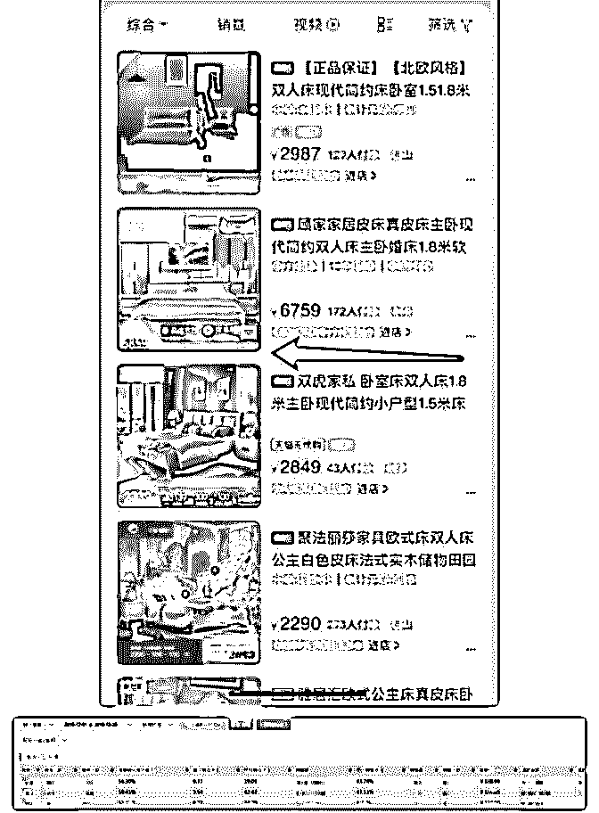

# 分享主题：十年电商

花爷梦呓换酒钱 : 分享主题：十年电商客三个角度解析电商运 营逻辑

分享人：奉孝，坐标浙江温州。电商人，天猫家装行业 top 品 牌联合创始人。电商从业十年。

背景介绍： 电商已经从原先的新兴行业逐步进入到传统行业的模式，原

来做电商属于互联网从业人员，但现在电商只是众多销售渠

道里的一部分，也就意味着，无论你从事什么商业模式，电

商渠道是避不开要去接触并且重视。今天给大家简单介绍一

下电商的运营，没接触过的有个概念，接触过的也可以加深

下印象。因为我原先分享经验不多，然后所在行业是刚需类

目，有不足之处还请包涵。

分享正文： 我们做的类目是家装行业的，然后目前主要操作的品牌分多

类目运作，所有在运作的类目都是行业前十的状态，也是天

猫 TOP 商家行列。

（图 1） 我好像是第一个在大群分享的，本来想着直接拿以前的课程

PPT 给大家逐页讲一讲得了，但考虑到人比较多，还是科普类

的内容会比较适合些。

基于目前整个电商已经走向渠道化方向，我这边就简单对电

商做几个角度的分享：1、电商数据逻辑 2、电商渠道介绍 3、团队案例

1、 电商数据逻辑： 流量*转化率*客单价=销售额，这个公式应该大家都知道了。 但是就像现在电商行业的现状一样，实际上目前的电商公司

运作差异来自于精细化运营，所以我们需要对这个公式进行

数据拆分。

拆分后：（展现量*点击率）*（静默转化率+询单转化率）* 产品线客单价=销售额。

好像看起来细化数据也不多，但是这里面的变量就不一样 了。并且你对于整个数据的思考逻辑也会发生非常多的变 化，今天我们应该都在强调数据的重要性，但是数据为什么 重要，不知道有多少人会去思考这个问题。我个人理解过 来，数据的重要性是因为每个数据背后所代表的底层因素。

即：流量其实=展现量*点击率。 嗯，对，其实流量不重要，展现量及点击率才是重要的。那

么问题来了，展现量、点击率的背后还藏着些什么？

下面的内容主要适用于淘宝天猫平台，因为我们主做就是这 个平台的（不同平台还是有一定数据差异的）展现量其实就 是有多少人有机会去看到你，点击率指的就是在看到你的时 候，有多少人会觉得你是他想要的。听起来很简单。但是从 实际运营角度出发，首先我们得知道平台的展示入口有多少 个，有多少个机会让人看到你

（图 2）

这个图就是流量的属性分类。

（图 3） 然后免费流量分类有这么多

（图 4）

上面这些就是目前淘宝天猫主流流量入口，在合适的环境让 他看到了他想看的东西。

（图 5） 就比如上面这张图，其他产品看起来都是无边框的，但是顾

家这边在图片上在图片基础上增加了一个边框，对于消费者

的视觉吸引就加分了。然后你在每个不同的入口，所处的环

境是不一样的。

数据是具备底层逻辑的数字，否则只是数字而已。然后静默 转化指的就是消费者看到你这个链接，直接进行购买。静默 转化率背后的决定因素就是：主图视频、主图、销售氛围

（成交数量）、评价、问大家、详情。（权重排行为降序。

）也就是你要根据消费者的浏览习惯来决定你在每一个模块

需要给消费者看到什么，才能促使消费者认可你这个产品是

他想要的。

询单转化指的就是看完你的链接后，去咨询客服后成功购买 的几率。这里面考量的是：1、客服能力（产品专业度、引导 能力、权限等）我们公司现在已经对客服岗位做了升级，称 作客户营销员。

客服相关核心数据：如响应时间、问答比、询单转化率、关 联率等。

（图 6） 这是客服数据的一些参考。反正也都是现成软件里的数据。

其实转化率这里延伸出来的内容比较多，太细的话估计也不

是一时半会儿能说清楚的，就简单说下大家有个概念就好。

刚才我们的公式是（展现量*点击率）*（静默转化率+询单转 化率）*产品线客单价=销售额。

最后一个产品线客单价其实就比较好理解，即每个购买消费 者的平均订单金额。主要是由市场分析以及产品结构决定 的。这里不展开细说

2、 电商渠道介绍 其实电商渠道现在也越来越丰富多元化，大家熟知的如淘

宝、天猫、京东、拼多多、苏宁易购、唯品会等是主流渠

道，但其实还有非常多的小众渠道可以挖掘，比如我们家装

类目来说还有土巴兔、齐家网等平台。

下图是我们公司目前合作的一些平台罗列，挺多的（不含跨 境）。而且我们还是家装这种刚需行业，我相信消耗品行业 的平台会更多。

（图 7） 然后还有内容类平台如小红书、抖音、快手等，另外还有自

媒体，比如微信公众号、微博等。

这些渠道其实围绕你的产品特性都可以展开布局，甚至有些 渠道压根不需要占用你多少资金以及精力，只需要布局进去 就马上能产生效益。如 2013 年的唯品会、2017 年的拼多多、 2018 年的抖音。作为电商公司来说，其实多元化、多渠道是 未来的趋势，如果你还是只在单一平台进行销售，未来可能 没那么安稳。

平台规划这一块因为每个公司特性不一样，我这边就不一一 进行介绍了。大家如果有接触电商行业的话，请重视渠道布 局，你需要不断去了解整个行业的动态，早一天布局就早一 天享受红利。毕竟红利不是一直都在的。

最后一块，团队。

（图 8） 我就直接发案例模板了。这是我根据 15 人标准团队设置的基

础架构。属于标准配置。然后这个规模的配置，对应年销售

额为 3000 万以上的销售额。（人均产值 200 万）电商公司架构

其实都是大同小异的，初始并不复杂，做大了可能每个公司

分裂出的模式都会发生变化，没可比性。

总结一下

1、重视底层数据逻辑。换句话说：看问题要看本质。这个也 跟花爷一直在强调的商业逻辑是一个道理，当你学会底层逻 辑的分析方法，你会发现很多不同的行业你都能快速去理解 它。

2、重视渠道布局，电商只是一个销售渠道而已，网购平台等 于是我们的销售网点，把销售网点铺设好，然后去了解每个

销售网点的客群属性，对应客群特征推送他们需要的产品给 他们。线上线下其实本质上是一样的。

Q&A:

最后我简单回答一下昨天几个朋友提出的问题。

1、 做电商用那些手段提升自己店铺的流量？ 奉孝：上面已经提及了，流量=展现量*点击率。我个人经验

来说，先优化点击率，

先优化点击率，先优化点击率。展现量是几个角度去提升： 流量入口多元化、推广力度、链接权重（各平台的权重设置 不同，需要针对性去研究权重逻辑。）

2、 销量不好的商品怎么处理？ 奉孝：这个问题应该首先第一步确认产品本身是不是符合市

场需求，（结合平台市场情况、产品定位、竞品情况）第二

步是针对产品本身进行优化（功能、外观、视觉表达、卖点

提炼等）第三步是运营方法调整，运营方法就比较细了，而

且模式比较多样化，需要逐步尝试，但有一个捷径，去观察

同类目做的比较好的商家的运营数据，可针对性复制他们的

做法。

3、 哪些商品用来做活动吸引流量，选择的策略是什么？ 奉孝：活动的时候吸引流量，核心要点是活动资源的获取能

力，然后爆款的引流能力肯定是最强的。其实做活动是跟做

平台一个道理，你得了解活动入口的规则以及客群情况（比

如淘宝天猫的活动有很多：聚划算、淘抢购、淘金币、天天

特价等等。每个活动入口的客群都不一样）挑选符合客群属 性的产品即可。

4、 家属在中山，那边有很多休闲服装厂，但自己没有开淘宝 店的运营上货等经验，我是想合奉孝：计着让家属自己开个 淘宝店带来一定收入。问题：想问下嘉宾该怎么结合本地资 源，冷启动淘宝店铺？

淘宝店好像并不需要投入什么成本，只是启动的话，随时随 地可以开始。但启动跟做好是两码事。

5、 问题： 在天猫投放的流量越来越贵，价格越来越便宜的 情况下， 你是做到比人家更优秀？ 奉孝：在那些运营方面你 觉得能够给电商人一些启示？

优秀不敢当。我个人感触就是：重视产品本身，先让产品真 的具备竞争力。市场需求永远大于运营手段。

6、 直通车如何拉升搜索权重？ 奉孝：1、关键词库；2、质量得分；3、转化率（刷单）；

4、点击率；5、收藏加购率；依次进行。

7、 开始需不需要限制地域人群等条件来提升点击率？ 奉孝：需要。但目的不是点击率，而是提升质量得分。

8、 嘉宾是如何开车的，最好能罗列第一天第二天一直到爆发 增长稳定期几个阶段的不同开车策略步骤？

奉孝：每个产品的情况不一样，建议可以去听一些专业课 程，然后结合自己行业及产品特征做具体方案。开车基础逻

辑就是：选品、选词、养分、测图、分类计划（精准人 群）、数据优化。

9、请问做淘宝男装，创业 1 年，针对在站外获取流量 有什么 好的思路啊？

奉孝：最好的办法是建设自己的私域流量

10、想请教一下年销售额 2000~3000w 店铺结合你上面的团队 配置：一年纯利率大概多少是合理的？全年推广预算占多 少，店铺会比较健康？如何激励团队里面的 90 后员工？

奉孝：行业不同结果不同。90 后现在好搞，已经开始有生活 压力了，钱能解决大部分问题。难搞的是 95 后，95 后目前还 在迷茫期，公司需要给他们的是：成就感、可预见的发展空 间、定制化的职业规划。

11、电商这种行业，适合上班族作为副业来操作吗？ 奉孝：适合。你真的想做副业，其实都可以尝试。 12、请问如你所说，静默转化率背后的决定因素就是：主图

视频、主图、销售氛围（成交数量）、评价、问大家、详

情。（权重排行为降序。）我想请问下这个权重是手机端的

吗？感觉 pc 上详情不会这么低吧？

奉孝：这个权重指的是消费端决策权重，不是平台权重。是 手机端的，毕竟 90%以上流量属于手机端。

2019-04-11(12 赞)

