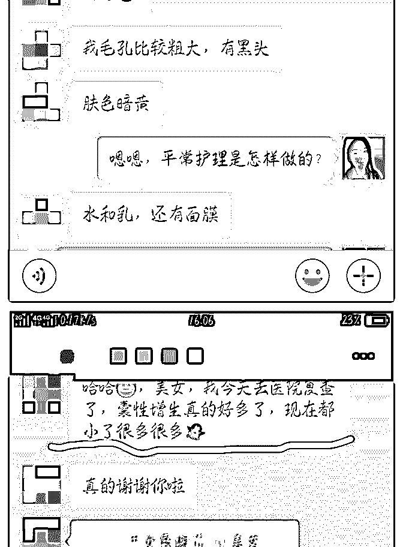
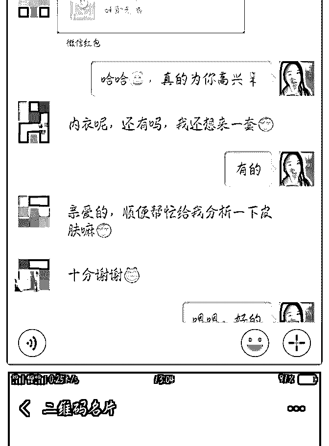

# 玉丫头 :两天赚回学费，每天

两天赚回学费，每天最少一位咨询是怎样做的？

其实刚开始加入泽宇自己都很懵，平常都是老老实实的上 班，什么咨询师职业规划这些啥都不懂，也从来没接触过， 更没有花钱买过什么课程，庆幸第一次买课程就接触这样的 团队。

群里牛人太多，所以一开始我就把自己的姿态放的很低很 低，做什么都以空杯心态去学习。包括我的成果，我也没敢 写出来，因为我怕我嘚瑟[捂脸]，这样我就不能更好的学习。 事实证明，我的问题的确很多，朋友圈的打造，更快的人脉 转化，这些之前我都是不怎么关心的，都是靠的口碑积累， 人脉转介绍。

在进泽宇第一时刻，我完全不知道怎么操作，就问芬芬老 师，该怎样做，芬芬老师说你先听课认真写复盘。所以我每 天都去听课，都去写，其实当时心里没谱，但是听话照做就 可以了，而且当时的想法就是赶紧打卡 10 次，然后去找芬芬 老师一对一。

第二天就有学员加我，然后跟我聊乳腺方面的问题，没想到 她对我非常认可，直接就在我这买了健康内衣，当时我收钱 都很懵，也没跟任何人说，没想到学费就这样回来了。 后面不断有人加我咨询，有问护肤的，有问身体调理方面 的，有问乳腺养护方面的，我很庆幸，我一直在学习，在精 进自己，所以我能非常专业的给予建议，同时也让咨询我的 学员感到我很专业，能把她们的问题一针见血的指出来并建 议怎样进行改善。

是不是很简单？那该怎样做呢？

（1）不断学习提高自己的专业素质，专业能力。 要是学员加我，问我问题，我不能让她信服，没能指出她的

问题，没能解决她的问题，那也是没用的，所以要想让别人

为你的专业买单，首先你得让你的专业更专业，要用实力撑

起你的专业。

（2）认真写复盘。 怎样转化人脉，首先你得在星球里露面。怎样露面，那就是

写复盘啊，好几个加我都是因为我的复盘她们觉得有共鸣，

而且感觉到自己的用心，同频的人同样爱学习的人，自然吸

引同样优秀的人。

你能提供的价值，不是第一天露面了就可以了，随时写复 盘，当然前提是认真的写，用自己的经历写，自然就能看到 你的复盘，然后就看到你的标签，即看到你的价值，需要的 就直接会来找你，不是吗？

（3）随着专业的提高，可以不断的跟新自我介绍，这样又让 别人再次认识你。

（4）在刚进每一个群里，要学会自我介绍，我就是通过自我 介绍就被加好几个精准人脉。

因为之前自己没想往这方面发展，所以自然没上心，所有的 人脉全是靠口碑一天一天积累的，非常平淡无奇，我的分享 可能也很平淡朴素，人脉转化可能相对很多大咖来说不值一 提，但这就是我目前的做法，并得到的收获，想跟我一样什

么都没得的小白一丝分享。

最近我真的非常有成就感，每个人多少都有乳腺疾病方面的 问题，但是通过我的指导，已经有不少学员清楚得感觉到胸 部的变化了，前段时间，更有咨询者去医院检查，惊喜的发 现囊性增生变小了很多，利用自己的专业让她们得到健康， 更少了很多烦恼，内心无比满足，我也会不断精进提炼自己 专业，为更多人带去健康。

我是玉丫头

1 . 解决 700+女性乳腺问题的胸部保养师

2 . 咨询解决 400+美容护理师

如果大家有护肤或者胸部疾病方面的困扰，我很愿意提供帮 助。

2018-12-23(42 赞)

Andrew : Day21

关注公众号"懒人找资源"，星球资源一站式服务

# Day21 201

2018/12/22 泽宇教育杭州线下-第 3 期

时间:13:00-17:30

地点:杭州庆春路嘉里中心 268 号 703 上海信托办公室

复盘笔记 一、破冰小游戏

用 3 个词来形容自己（姓名，来自哪里，兴趣爱好），接龙的 形式直到最后一个人。我们从爱跑步的来自绍兴的大平开 始，到禅修的杭州的魏靖……到最后个人品牌来自上海的波 爸，一圈下来，对每个人的印象更加的深刻，发现越到后 面，记得越牢，推倒了陌生人之间的墙。

二、小凤分享-如何做到 3 个月月入 2 万 1、小凤是一名水利系统员工，爱好美食，是杭州没事节目的 嘉宾，疯狂买了，花了 4 万多块钱，忙碌却无实质性的提升。 爱摄影的她第一次做阿胶糕，po 在了朋友圈，被朋友追问卖 不卖？从此在美食之路上飞奔。 2、小凤以自己的开挂之路为载体，深入分享了走出舒适区， 改变思维，增强行动力的重要性，到树立个人品牌，朋友圈 的打造，成功变现，到要有利他之心，通过为他人提供价 值，自己也能得到快速的成长。凡事要制定目标，并且制定 详细分阶段的可执行计划，一步一步执行下去。

感受: 1、需要停止盲目的屯课模式，不要用上课的忙碌来掩盖以及 内心的焦虑； 2、平时生活就要注重朋友圈的打造，不管是生活还是个人品 牌宣传，都需要有自己的特点，不要跟风，要与众不同； 3、通过小凤的为摄影老师免费运行半年的经历，知道了即使

免费为他人（贵人）提供价值，自己成长的也很快。

三、波力分享-逆袭故事：捕捉、放大价值 1、起初是一个迷茫，疯狂屯课被老板压榨的外企螺丝钉，朝 九晚五，机缘遇到了超跑少年泽宇，找到了热情擅长的事 情，蜕变成现在优秀到极致，宽带年龄段人见人爱的波爸。 商品+有价值的商标⇒放大商品的价值 例如印有 Supreme 商标的砖头，价值上千块

2、捕捉价值

1）目前本身不发光的时候，需要“傍大款”，通过跟着牛人学

习，来成长自己，让牛人把自己平均上去；

2、用一些专用道具（高品质，不常见的，高端的）打造朋友

圈。比如餐厅环境要好，不常见的，还有价格实惠的，以图

文并茂的形式展现；

朋友圈打造宝典：

1）图文并茂：

图:必须要拍的好看，不会拍照的简单的学习一下摄影；

配文：表现生活状态（软广告）

2）具体细则：

高价值潜质：（标题要吸引人）比如在私教的狂虐下，成功

减脂 10 斤；细分领域做到别人做不到的事情；

要从糟糕状态⇒理想状态的转变

加入地标

不要超过 120 个字

镜像理论： 你要啥客户，你就得是什么样的人。就是说你需要按照你自 己的目标，培养潜在客户，比如通过付费学习，请私教健身 营销界的一句话：曾经的我就是现在的你，现在的我就是明 天的你 朋友圈也要分享生活 part，精准描述客户的痛点内容，但是不 要大头照，不要晒娃

3、放大价值

1、知乎写作引流，写的文章要有代入感，让人阅读后深受启

发，或者很想知道你怎么样了？

2、开小号做个人品牌（营销号）

首先要养号：绑定银行卡、手机号，多发朋友圈，

增加流量的方式： 朋友互推引流，你的朋友、贵人之间互相推荐 知乎写文引流

粉丝裂变：通过解决别人的问题，客户的宣传，让别人觉得 你很牛逼

4、营销的本质：信息不对等 感想：

1、目前以及数据一块没有商标砖头，价值不高，下一步要做

的就是怎么找到适合自己的商标，深耕细作；

2、生活、个人品牌的朋友圈打造要刻意，要遵循波力分享的

选择，让别人觉得你是一个很牛逼的人，每天都在进步，都

羡慕你的生活，前提是你必须变得更优秀，不断的学习提高

自己；

3、需要明白以及的目标客户是啥，以及按照这个标准去做，

然后一步一步去执行，最后通过各种引流的方式吸粉；

四、大平分享-视觉笔记 1、在上海服装行业打拼 10 年，回到绍兴工作（需要处理 数），去或留成了她内心深处的一个巨大问号？？？通过张 一楠读书会的一句话，配图表达表现，发现自己视觉性当面 有天赋，学习了思维导图，从此工作逻辑也更清晰了；通过 朋友圈打卡视觉笔记，不断吸粉。 2、如何用视觉化笔记做年度计划？

1）一定要把愿景描绘出来（比如帮助多少人完成减肥梦）， 接下来一系列的计划就会出来，一步步实施。愿景是源头， 流水是执行力。

2、写一封给五年之后自己的信-运用五感写作法（五感；视 觉、嗅觉、味觉、触觉、听觉） 愿景：达到什么什么，帮助多少人完成什么目标等等 例如：做一个 12 月的计划，要完成什么事情，一件一件列出 来 3、用甘特图做出一年的计划，分别是什么时间段做什么事 情，每个月复盘反馈

愿景制定三步走：先定义⇒再计划⇒作目标（遵循 smart 原 则） 4、变现实现最快的方法：前期的积累+独到的方法（可以多 看看变现学员的朋友） 5、比如你是行业 1 的 Top20%，行业 2 的 Top20%，那么两个叠 加起来，你必定是 No1

感受： 1、要精准的认识自己，第一步做一个霍兰德或者 Mbti 等性格 分析测试很重要，深度认识自己，才能精准以及擅长领域定 位 2、做年度计划必须要有愿景（是源头），加上强大的执行力 去完成，充分运用五感去感受，体会不一样的想法 3、要实现变现，前期的积累很重要，技能的累加效应，会让 你在行业领域变的非常强大。

2018-12-22(31 赞)

评论区：

范范 : 好棒好棒

关注公众号"懒人找资源"，星球资源一站式服务