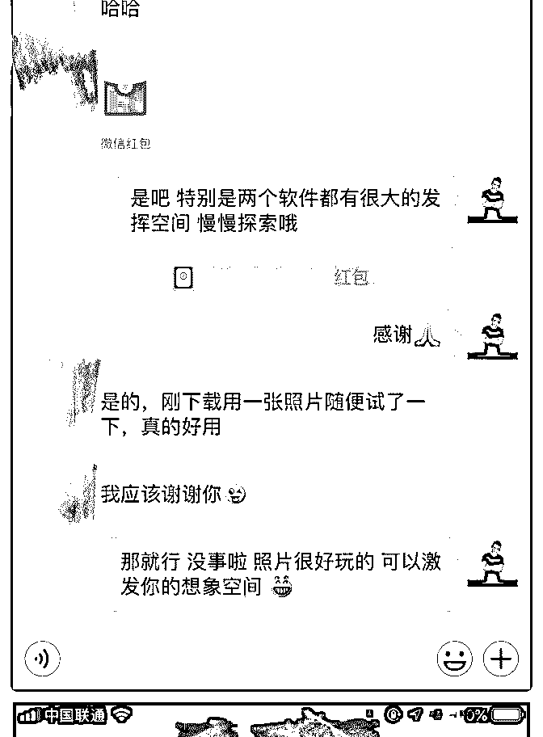
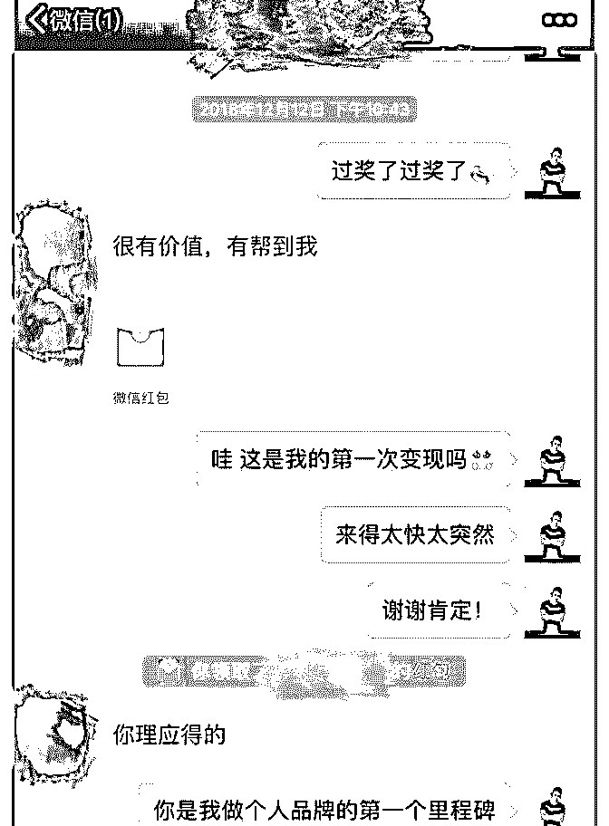

# 《如何拥有创造未来

娜姐 | 情绪管理 :

《如何拥有创造未来的能力》

人生 4 步曲

决定 _ 计划 _ 行动 _ 结果

1.决定

的当下是过去的你的决定造成的。对自己的现状不满时，惯

性思维会拉我们去找理由，找借口，就是为了逃避自己的责

任。但任何一个结果都是曾经自己的决定所累计的。而当下

的你的决定却决定着未来的自己将成为什么样子。

2.计划 我的心里一直有自己的理想生活状态，而且那个画面特别清 晰，可是在实现它的过程中，我发现自己离它越来越远。没 有清晰的目标，更谈不上详细的计划。 也许很多人都和我一样，有梦想，可是没有通向梦想的具体 方法，行动过程中就渐行渐远了。

目标到底是什么？ 计划又到底是什么？

你是什么样的人，想成为什么样的人，拥有什么样的特质。 成功以后在做什么？ 打造自己的核心竞争力，通过学习持续成长，然后设计好怎 么样去做！

3.行动 当然，行动是解决所有问题的唯一途径。 让自己变得更好，是解决一切问题的关键。

4.结果

我们是在原地转圈还是螺旋式上升，不是当下决定的，而是 前三步的累积决定的。

创造未来的能力最核心的是: 用未来的标准要求现在的自己。

我是娜小妞，专注于情绪管理咨询领域，通过一次 1 对 1 沟 通，帮你摆脱负面情绪困扰问题。

2018-12-21(16 赞)

评论区：

涵函 2222 沟通 * : 记住你了，优秀的同行[强][强][强]

明哲 :

关注公众号"懒人找资源"，星球资源一站式服务

# 7 天时间，通过摄影

7 天时间，通过摄影定位打造个人品牌，翻倍赚回学费！

最大的感慨就是，有导师的帮助太重要了，因为很多时候你 自己会忽视做个人品牌该着重强调的点，那些往往是让你事 半功倍的东西。在这里向我华丹女神表白，这几天耐心指导 我，我都觉得自己烦。[捂脸]

当然，一定要行动起来，要去不断输出价值，不管是朋友圈 打造，还是星球分享，还是社群互动，要让大家看到自己积 极的一面。说实话我并没有觉得自己的拍摄有多好，但是好 多朋友给我的评价都非常高，像“真大师级人物”，“每次作品 都让人眼前一亮，让人心动”，“你的价值远大于你现在收费 的价值”，这些话都深深的鼓舞了我。也有新朋友，自己本来 就是大平台的签约摄影师，也来向我学习，这对我来说是莫 大的鼓舞，让我更相信自己，更精准自己的定位，也就更有 信心去做好个人品牌。

十天之后发现自己有很大的潜力，于是毅然决定加入导师计 划，我相信更棒的课程，让我下一个十天，下下个十天，以 后的每个十天，会有更好的结果！

2018-12-21(16 赞)

评论区：

王大人 : 很棒，如果能附上自己的几张作品，就更棒了

关注公众号"懒人找资源"，星球资源一站式服务

# Day-4 复盘

静（Jing） : Day-4 复盘 最前沿的社交资产 听完这一课，发现对于社交，我有好多好多好多的误区和一 些不知从何而来的骄傲和无知。我有好多好多好多想要分 享。这里用故事的形式开始吧。

故事一： 自从来韩国以后，出于某种原因，我故意变得很“骄傲”，举 个例子说，我老觉得很轻易给别人我的微信或者任何社交账 号，就代表我很随便，我很轻浮的感觉，所以我的微信添加 朋友那一块全部都是不可以通过群添加我，因为我觉得这种 线上交友方式很轻浮随便，会在无形中把我拉低，也让我变 成一个随便的人，别人可能会想：啊，你看那个谁谁谁，好 随便，我要她的微信或者电话号码，不费九牛二虎之力“。 一 直以来我都被这种想法左右着，当然我也因此吃过亏，即便 如此，我反而更加坚信自己。据一个特别具体的几个月前发 生的例子来说吧， 我亲自为自己的“骄傲”付出了代价。 事情 的起源是这样的，因为我们学校的外国老师很多，外国学生 也很多，各个国家，所以有一个美国人，是我们学校经营管 理的助教教授，大概 30 多岁，他的办公室在 10 楼，我的办公 室在 13 楼，我们同住在一栋楼里面，我家是 7 楼，所以我偶尔 见过他，刚开始我们只是点头之交，后来有一天在学校，我 走他的后面，穿着高跟鞋吧，声音很大可能，他回头看到是 我，站在前面等我好久然后开始自我介绍，等等，开始询问 我的情况，确定我的职业，跟我要我的电话号码等等。后来 就直接给我了一张自己的名片（这里要解释一下韩国的一个 有趣的现象，就是 kennel 由于历史原因，韩国人很多时候看到 很多美国欧洲等国家来的白人，会莫名的崇拜，想接近又怯 于不会说英语不敢接近，所以他们很喜欢白人，很崇拜白 人）那天好多人听到那个白人递给我自己的名片并且告诉我 说，既然你不给我你的电话号码，这上面是我的电话和 kakao

id , ( 韩国版本的微信)， 你可以联系我，我想跟你一起喝杯咖 啡。当时那个情况，也一直由于又很多说法就是说，亚洲女 生很随便，只要是一个白人跟他们搭讪，打招呼他们都会高 兴的说“yes, ok”. 我当时就觉得既然大家都知道我是个中国人 了，那我应该让他们看看中国女生多么霸气，多么牛逼，你 们羡慕的外国人的联系方式之类的，我完全不放在眼里。 所 以他坐了偶数层电梯走了之后，我因为在等奇数层电梯，所 以我当时奇怪的自尊心作祟，转身就把名片扔进去电梯旁边 不远处的垃圾桶，扔的时候一些韩国学生看到我的时候，都 在而别窃窃私语“哇，大发，很厉害啊，之类的”，当时我就 觉得我完全啪啪打脸了那些不真实的言论，觉得自己好骄傲 自豪， 并且洋洋自得。并且从那以后，我集那面故意不怎么 跟他打招呼，也由于我一直一直没有联系他，所以我们之间 原本的点头之交也变得很尴尬。故事到这里还没结束。。。

两个月后，我自食其果了，事情就恰恰恰恰这么巧，这么 巧，真的有时候上帝故意给你一些小插曲让你明白一些道 理，我就是这样。刚好我在给别人翻译一篇硕士毕业论文的 时候，刚好需要学习了解一些经营管理方面的知识，所以没 办法我只好找到另外一个我的朋友，她一听就说，静，比起 来我，我有一个更好的人寻推荐给你，他一定可以帮助到 你。结果的结果，她就给我介绍了他，我以为是别人，因为 我没记住他的名字，结果那天我们三个人见面了之后，大家 可以想到那种场面，好尴尬好尴尬，后来的后来，他由于大 度帮助了我，可是是我让本来可以成为朋友的人变成这样， 一切都是由于我的所谓的自尊心在作怪。 今天的课听了之后，真的完全颠覆了我的思维，21 世纪的今 天，我应该明白的是不是给别人我的微信号，在线上或者闲 暇跟别人友好打招呼就代表我是个随便轻浮的人， 我随便或 者轻浮，其实跟我给不给别人我的社交账号没任何关系，重 要的是自己应该怎么去做，去交朋友。 二：坚信“我若盛开，蝴蝶自来”是个错误的想法

我是一个坚信“朋友只在乎质量，不在乎数量”和的人，所以 很多时候，我并没有很多很多的好友，并没有那种周末组饭 局可以随便叫来一桌子的好友，因为我老觉得与其叫那么多 志不同道不合的朋友，浪费我的时间，因为社交是很需要时 间精力，和智慧的。 与其做这些，我还不如多点时间做自己 的事情让自己变得更阿訇，所以很多时候我并不会去交那些 跟我表面上看并没有什么相同点的 朋友。因为我总是用我的 表群去要求别人，然后觉得别人是很幼稚，很没想法，没内 涵，没追求，只知道吃喝玩乐。这样判断别人的时候，觉得 好多人都不值得和我做朋友，也就是说，一般人我不会跟他 们做朋友，最多只是点头之交而已，这样下来给别人的印象 就是，我不好接触，我很高冷，也因此自己错过了好多认识 好多好多人的机会。 我执拗的认为，“我若盛开，蝴蝶自 来”，所以别人跟不跟我做朋友没关系，只要我很厉害很厉害 的时候，他们自然会站在远处远远的看我，然后来靠近我， 可是事实是每个人都很忙，没人多少人有时间去关注你， 很 多时候是全部都是自己的想象而已。 还有一个误区就是，我的目光太短浅，目前来看，很多人需 要的是我的帮助，而我并不需要帮助别人，所以我很多时候 觉得没必要花很多时间给他们，所以我根本不会去维护很多 我微信里的好友，不熟悉的人，也不怎么特别爱点赞，不爱 评论，这样下来，好多人在我的微信里每天发好多状态，也 跟我没什么联系。我本能的关了一道门，因为我看不到他们 的价值。我的留学生微信群里好多人，但其实很多时候都是 他们来找我，需要我的帮助，我就觉得我永远不会有求于他 们，因为没看到未来，没看到 5 年后，3 年后，这个我需要好 好好好反思，因为我是在坐井观天。我觉得很多人回国后全 中国到处跑，有可能一辈子都见不到一次， 不要浪费时间了，，，等等之类的。这一刻开始我要开始反 思自己。以后的生活，我怎么改变并且看到未来，不要局限 于当下。 讲到帮助别人不需要回报，很多时间过了以后回报会以另外

一种形式出现，这个我也是很有感触的。我刚来韩国的时 候，因为需要学习韩国语，所以当时凭着不错的英语找到了 成功在我们学校的国际交流处找到了一份实习的工作，其实 主要的事情就是处理好多入学咨询的事情，还有留学生刚来 韩国遇到的很多困难之类的，所以我那时候帮助了很多刚来 韩国的学生，很细心，好多人说要请我吃饭，都被我拒绝， 因为我觉得那就是我份内的工作，虽然很多时候下班了我还 在帮他们，那是因为我一方面想练习我自己刚学习的韩语， 另外一方面我觉得在国外上学很辛苦，能帮一点是一点，没 什么大不了的。后来发生了一件让我很感动很感动的事情， 一年半前我入职以后需要换一个好点的生活环境，于是搬来 了现在的公寓，当时行李很多，租车很贵，也不太方便，所 以我就在微信发了一个状态说“我什么什么时候需要搬家，请 问中国的孩子们谁几点几点有时间可以来帮我一下，最好的 男生，因为需要搬箱子”“当时，过了几个小时，我在收拾行 李的时候，好几个我以前帮过的，但之后没什么联系的男学 生到了我的家楼下给我发短信说：老师，我们现在在楼下， 你不是微信说需要人搬行李嘛“当时真的好感动好感动，有时 候无心之间的帮助，会在很久之后收到回报，也因为这样的 链接，从那次搬家之后我们的关系比以前亲密好多，这样就 陷入了一个良性循环。 所以今晚的讲课让我想了好多，因为这些都是真实的我，很 多时候我听着听着就醍醐灌顶了，其实，可以分享出来我的 社交经历并不是一件简单的事情，因为我不想因为这些影响 别人对我的认知，觉得我这个人怎么这样，怎么这么坏，， 等等之类的，请不要这样觉得，如果你这么觉得，我也可以 理解。可是，之前的我有多么不好，希望在深刻复盘之后， 我可以开始改变，改变自己对于社交的一切错误认识和判 断，以后的我就会有多么好。很棒很棒的分享，谢谢泽宇教 育今天的课程。共勉。

2018-12-17(15 赞)

评论区：

南冥没有喵 : 小姐姐想请问下，是一周只看一个视频然后一周都在复盘这个视频，还是每天看一个视频呀

静（Jing） : 有时间的话，每天看一个也是可以的，全部看完了以后再重复看也 OK

南冥没有喵 : 好的好的！谢谢你～

关注公众号"懒人找资源"，星球资源一站式服务

# Day2――如何拥

怪丫头 : Day2――如何拥有创造未来的能力。 成长无终点，但有里程碑:学到老活到老，所以说，成长是没 有终点的。很多时候我们都没有勇气去接受面对事实，那就 是现状是我们自己造成的，我们总是在怪谁谁谁？其实我们 真正的应该怪自己。我们应该对自己负责，所有的结果都是 自己造成的。昨天的你创造了今天的你，今天的你成就未来 的你。因此，我们更应该对自己的未来负责，因为过去已经 过去了，我们不可能一直陷在过去中，因为时间不可能倒 流，我们只能过好现在，拼命的去抓住未来。 设定目标:计划+行动=结果 目标:小目标、大目标、短期目标、长久目标（一一细化，越 详细，越简单。）

计划：专注和时间―― 第一:专注。你没有三头六臂，你只有全神贯注，专注的去做 好一件事。 有句话是这样说的，复杂的事情简单做，你就是专家；简单 的事情重复做，你就是行家；重复的事情用心做，你就是赢 家。踏踏实实做人，兢兢业业做事。所以专注很重要。 第二：时间。时间就像一个网，你花时间在哪里你就会得到 什么样的结果，你只要长期的去坚持，做认真的做一件事 情，那么剩下的请全部交给时间。时间是检验真理的唯一标 准，时间也是检验结果的唯一途径。 最后：行动――用未来的标准要求现在的自己。我们常说一 句话，天上不会掉馅饼，但是我们往往会犯这样的低级错 误。请不要做语言上的巨人行动上的矮子。[微笑]

2018-12-17(12 赞)

屈源 : 连开 5 单！

关注公众号"懒人找资源"，星球资源一站式服务