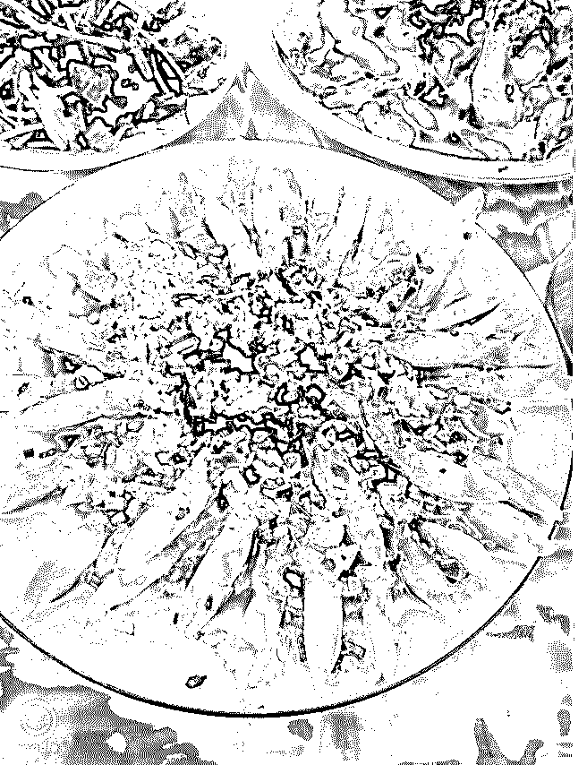

# ＃核心课第 7 课复盘

Abigail * : ＃核心课第 7 课复盘＃“什么时候你觉得自己不能 提升了，那就是你“死”的那一刻”

1

很久以前听过李欣频老师的课，欣频老师说：人要像云一样

活着。因为云自由，整个天空都是它的版图；因为云富于变

化，创造变幻莫测的美。如果云停止了变化，你能想象这是

多么死气沉沉的形态，同样，人没了变化，没有变化的那一

刻，就是你“死去”的那一刻。

在年龄更小一点的时候，我没有体会到“人生是长跑”这句 话，越长大一点越懂得这句话的深意。很多人一直活在童年 或者早年间的辉煌里没有走出来，以至于沉迷过往的成功再 也没有创造新的灿烂，这样的人生，只会走下坡路。 而明白了人生是长跑，从此刻开始，即刻开始就不会晚。

我们在这样的文化背景下其实形成了很多错误的思维形态， 如果不是学泽宇这节课我不会这么认真的去思索这些问题。

2

课程核心内容及个人反思

＃颠覆未来，掌控属于你的人生＃

一.黑客帝国，你一直被洗脑的谎言

• 程序人生：

整个世界是由系统和规则组成的

核心观点：

人生的前 7 年在下载程序

通过观察和模仿搭建操作系统

环境：输入——反馈——输出 穷爸爸富爸爸：穷人越穷富人越富 下载的程序不一样 看到的世界不一样

赚钱是个容易的事，只是一个技能 谈钱不低俗 金钱本身没有正恶之分 不是老人变坏了，而是坏人变老了

在这个课程里面，泽宇简单的把我们认知的世界看成一个下 载程序。这就把问题简化了很多，我们根据下载程序的不同 去认知这个世界。我们缺什么程序，或者一个程序错误，重 新加载一个新的程序即可。 谈钱不低俗，更正确的心态在于坦然的谈钱，它就是一个工 具而已。 认识到了以上观点，我们的生活其实就可以回归到一个比较 简单的状态，也更容易在这种状态中认知自己。

*   回归 easy life 独立思考：学习工作的意义究竟是什么？ 按照自己的想法过一生 为什么按照规划的道路走却没有结果？ 你的生活和人生是否掌握在自己手中？

刚毕业时候的我，从经历一开始的混沌不知做什么，到后来 的各种买付费知识参加各种线下线上平台学习，其实走了很 多的弯路。 买很多课程缓解焦虑反而更焦虑，这是这个时代的通病。 还有一类人，跟大学一样，疯狂考证，巴不得所有的证自己 都拿一个。但是并不知道学习的意义是什么。泽宇老师问一 个学员：你学习是为了干嘛？学员：为了挣钱？泽宇：挣钱 为了干嘛？

学员：为了更多的学习！ 这可能听起来像一个笑话，但就是我们很多人包括我曾经的

状态。学习，大概唯一的好处就是给自己给别人营造一种“努 力生活”的假象，然后学完依旧是内心无尽的虚空。 而所有学习所有挣钱的目的，一定是为了更好的生活。所 以，学习如果不能变成价值，很大程度上无法形成正向反馈 自然也是无法坚持和精进的。

再有，我们大多数人都拿着同样的毕业证，做着类似的工 作，甚至有时候听从别人的安排去做了自己的职业选择。那 么试问？你跟别人都一样你又如何期待能过更体面更不一样 的生活？

比你体面比你过得好的人，一定是付出了更多。 而想要真正的把生活掌控在自己手中，唯一的方法就是打造 自己。

那么如何打造自己呢？！ 市面上的大多数课程只告诉我们一些技能，这些技能比如时 间管理比如文案比如健身再比如办公软件等等，毋庸置疑它 们都可以帮助你变得更好，但是，在没有明确个人标签的情 况下。相信我你一定学起来毫无成就感甚至很容易放弃。 我自己就是这样一路弯路走过来。 我学过英语，文案，也还学的可以，但是当你没有把它作为 标签来打造深耕的时候，没有变现来给你正向反馈的时候， 就是你濒临放弃边缘的时候。

3

核心课程：点石成金 如何过上你最理想的生活

掌控属于你的人生：

情感自由——对生活有掌控能力

财富自由——不再为生活贩卖时间

作为人，其实我们时时刻刻都有些选择的权利。但是很多时 候我们选择放弃了自己的权利。我们大可以勇敢的去选择自 己的圈子和生活方式。当然这一切都是凭空而来，答案就是

财富先自由。 不要觉得这不可能，我现在越来越不给自己设限制，听话照 做，不做“聪明人”。因为比我们厉害很多倍的人正是这样践 行过来的，他们的经验我们直接用就好。

具体途径： 定义你的理想生活——你一直有选择的能力 你不想要的生活状态

你最理想的生活方式 我最理想的生活状态是通过个人品牌能够持续变现最终达到 财富自由。自己受益的同时也帮助别人（这一点目前还没有 非常明晰需要实践中补充）

具体路径： 自我觉醒——认知升级——刻意练习——完成内化 在这一步里面，我们要明确：困难源于缺乏对应程序。审视 自己目前的人生和生活，我发现我缺乏的能力以及对应程序

——

挣钱能力（锻炼挣钱思维并学习多技能，逐步执行），合作

能力（我不善于运营和做团队，没法，也是学），学习能力

需要进一步提升（学阿何的课程或者跟牛人学习），精力不

够好不够专注（需要持续健身以及调理身培养好的生活习

惯）。解锁这些程序后安装到自己身上，然后运行。

学习完核心课，感慨很多。这节课说实话我听得很燃。泽宇 老师说年轻人在你没有挣到一百万的时候，每个月几千块没 啥考虑的全部拿来投资自己，因为只有投资自己才是稳赚不 赔的。这一点特别激励我，也很感激自己找到了定位，不再 像以前无头苍蝇一样东学西学。

那么，导师课见了。 笔盖的导师课复盘不见不散。

笔盖姑娘 vx:echo173707

欢迎与同频的你微信交流。 2018-12-04(24 赞)

评论区：

J。Insist : 很认真的姑娘

Abigail * : 谢谢。

宏灯 : 你是我看过的可以心理学跟自己成长，学习复盘的很清晰的女孩子，文笔真好

Abigail * : 心理学。我其实不懂哈哈哈

玮琪 :

关注公众号"懒人找资源"，星球资源一站式服务