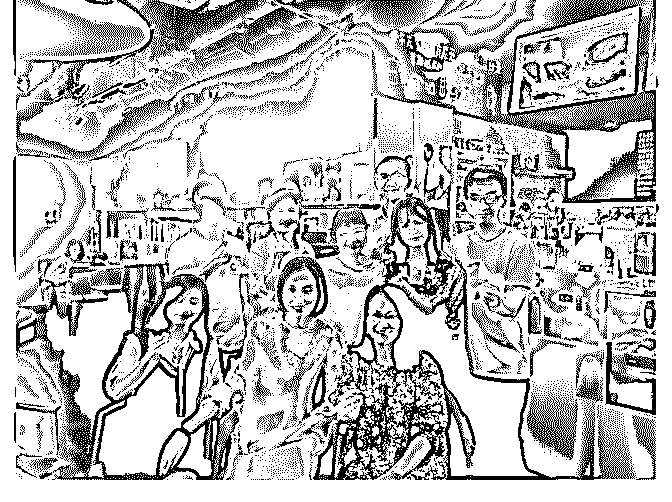
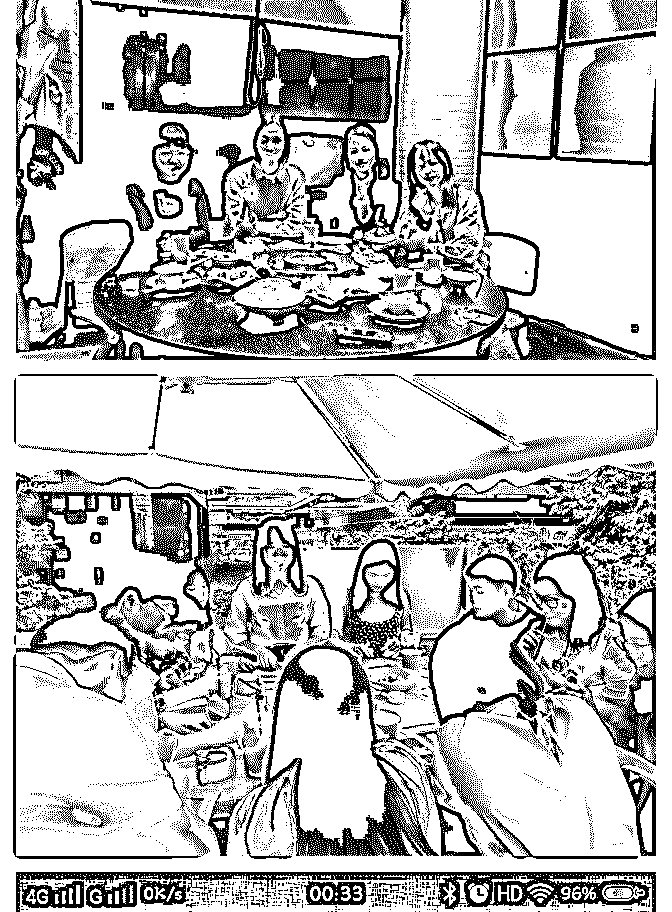

# 我用 43 天，从明确

我用 43 天，从明确定位，到赚取副业第一桶金 500+，赚回了

核心课的学费

2017 年 11 月 14 日，是我加入泽宇教育的时间，但却不是让我 动起来的时间点，我相信有一部分的小伙伴加入泽宇教育之 后，课程可能没看完，也没看多少，甚至还没开始，我也一 样，但通过这两个月的经历，没看完课程真的是你的一大损 失，当你看完之后，就会觉得我说的这句话是对的。

2018 年 10 月 21 日，是我第一次参加泽宇深圳线下聚会，这个 聚会真的参加得超值，现在想来真的挺后悔前三期没有参 加。这个聚会真的是我的一个重大转折点，在这个聚会里我 被璐璐的成长经历震撼到了，让我觉得一切从何时开始都不 晚，你有机会看她的逆袭之路的复盘，你就知道了，我为什 么这样说。通过那次交流，也让我找到了自我的一个定位。 从屏幕到面对面交流的时候，那种真实感和震撼感都是巨大 的，真的再次感谢有泽宇这样一个这么好的平台，可以跟各 路的大神交流，思想碰撞出火花。

2018 年 11 月 4 日，泽宇深圳线下第五期线下聚会。是由我来分 享关于培养财商，玩转现金流这个主题。这个现金流的游戏 活动还是雯雯姐把我推荐给芬芬姐的，也是她鼓励我把现金 流的游戏代入聚会里去，在上一次聚会的时候，我有提到过

《富爸爸穷爸爸》这本书，里面所说的现金流游戏，我刚好 也有，《富爸爸穷爸爸》真的是值得读的一本书，它改变了 我对金钱的看法，让我了解到什么叫财商。我真心感谢雯雯 姐，是她，让我有机会跟大家分享我所学到的东西并带大家 一起感受现金流的魅力。聚会结束后，大家的复盘真的让我

看的很开心，知识点的分享和现金流游戏真的有帮得到大家 进行一个自我财务情况的审视。那天晚上，雯雯姐就想邀请 我，给她的团队分享理财和现金流这一块，其实我当时听到 的时候挺惊讶的。

2018 年 11 月 25 日，是我们深圳泽宇线下聚会第六期，也是通 过这次聚会交流，让我决定加入泽宇导师计划的，那天晚上 我们都在聊如何打造个人品牌，如何变现，那天我的格局又 被芬芬姐打开了。当晚看到泽宇发关于导师计划的朋友圈， 就非常利落的转了学费。

2018 年 12 月 1 日，我进行了自己第一次付费分享，其实那次付 费分享之前没有定价，因为我不知道我真的到时候我能给到 别人的分享是否会真的对他们有帮助，但之后让他们对我这 次分享进行打赏的时候，结果真的出乎我的意料，他们愿意 支付 500，对我这次分享进行一个付费。当时我的心情真的是 不知道如何表述，我分享的东西，真的让别人觉得值这个价 值。通过这次的分享，让我更坚定了信心，我要做出一个带 领小白进入理财门槛的平台，让更多的人摆脱月光族这个局 面。

这个就是我对我这段时间的复盘，我希望有小伙伴能通过我 的成长，也行动起来，行动任何时候都不晚，但请把握好当 下。

2018-12-04(15 赞)

关注公众号"懒人找资源"，星球资源一站式服务