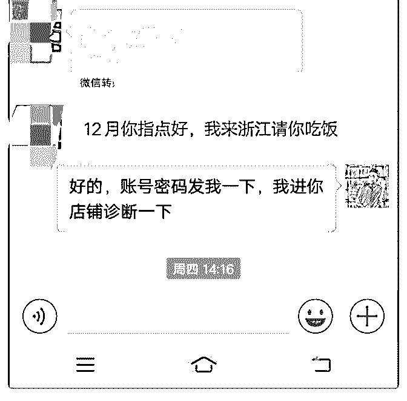

# 听朋友说泽宇教育很

李龙 : 听朋友说泽宇教育很适合我目前的现状，我再三犹豫的 还是加入了泽宇教育，刚开始加入泽宇教育的时候很兴奋， 下班的时候回到家就打开学习，学习过程中有缓缓待进，有 时情不自禁的把微信打开翻了翻看有没有人消息发进来或者 看一下朋友圈有没有自己喜欢的人发朋友圈，想第一时间去 点赞评论。但我又翻想了一下，为什么做一件事情就不能一 心一意的去做呢？偏偏要三心二意的去做呢？于是又把微信 关掉继续学习课程。

我学完第一节序言《如何开启你的新世界大门》之后，第二 天我就就把学费赚了回来，还赚了几百块钱的外快，当时很 兴奋第一时间把截图发给我朋友，我朋友就说：“我没有骗你 吧？只要你去学习新的东西，然后再去实践”，实践是检验真 理的唯一标准。

其实大道理我们都懂，人与人之间的差距，就是因为一 个“懒”而区分开的。学习不一定能改变，但是不学习一定是 改变不了的。

当我打开泽宇老师发我的价值 298《情感自由》手册的我就在 想我一定要去改变，一定要去实现财富自由，过自己想要的 生活。

最让我喜欢的一句话就是：当你打开这本书，你就已经胜过 身边的 80%的人了；读完这本书，你就会超过 90%的人了，读 完还思考了，你就超过了人群的 95%，思考并践行，你就是 那 1%。

第一次复盘打卡，以后再忙也要学习打卡，坚持每天进步一

点点，坚持带来大改变。加油，骚年。也希望群里的资深大 佬多带带我。

2018-12-03(17 赞)

评论区：

HD－个人品牌咨询师 : 哈佛大学研究结论：犹豫不决，是人生失败的首要原因 哈佛大学的乔伊斯玛特勒教授，曾经对人们

贫穷的原因做过漫长的研究，最后他得出 9 个令人变穷的因素，就是“犹豫不决” 凡是犹豫不决的人，他们总会不断把横在面

前的困难放大，抱着能拖一天是一天的心态逃避，他们避免盲目和鲁莽选择的借口背后，其实是内心的恐惧 这种人，害怕

走出舒适区，害怕未知，更没有勇气承担可能失败的后果。在他们得过且过的生活里，充斥着迟迟不行动的犹豫，最后则

变换为口中对生活的抱怨 越犹豫，就会越纠结，就会越迷茫，越迷茫，就会越懒惰，而越懒惰，就会更加陷入消极的循环

里，掉入懊悔过去和幻想未来的重复陷阱中 这类人，其实他们不知道，如果他们敢于往前迈一步，那也比如今的原地踏

步，消磨时间要强很多 20~35 是一个黄金年龄，如果你此时想多学一份技能，那就赶紧行动，如果你想减肥，也赶紧行

动，如果你想多读一本书，也赶紧行动……总之，千万别把这个最好的时光，浪费在无谓的犹豫中

彩梅 : 真的好好改变在改变的同时也要行动，习近平主席曾经说过一句这样的话幸福是拼出来的，只有努力的拼搏的人才

能拥有幸福，华丹老师真的谢谢您的分享，看了您的文章让我深同感受。

关注公众号"懒人找资源"，星球资源一站式服务