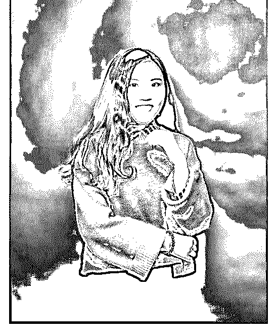
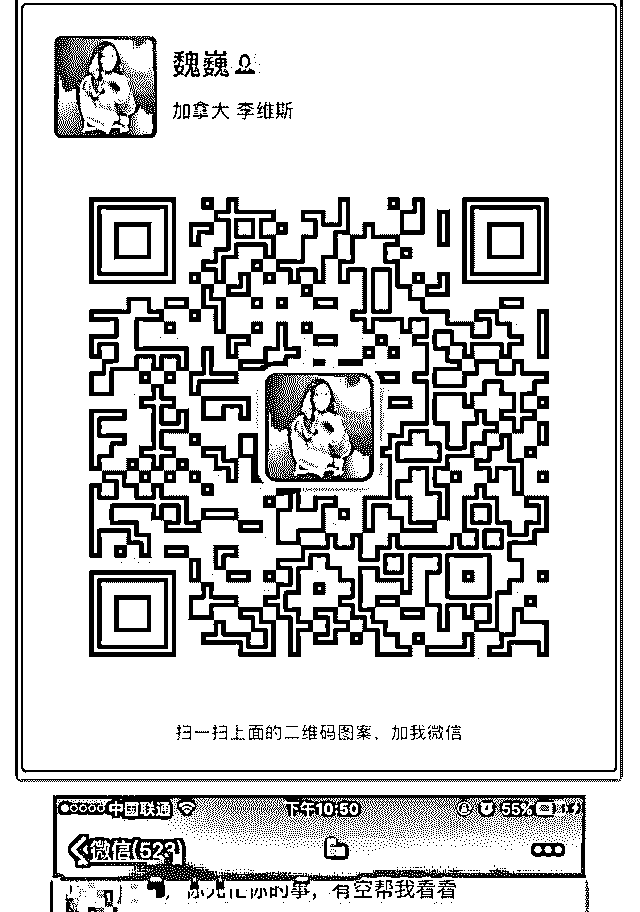
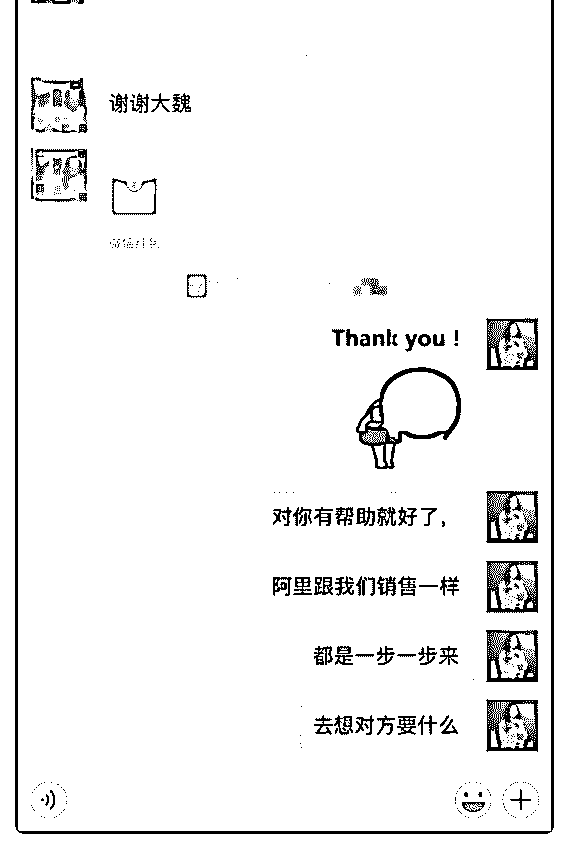

# 感觉好久都没有冒泡

魏巍 : 感觉好久都没有冒泡咯…… 因为闭关修炼去了

11 月总结：

1、通过学习个人品牌，结实了很多同频小伙伴，被 好友

426

输入倒逼输出，不以知识变现的都是耍流氓……

2、通过学习个人品牌过程中也学习到很多销售营销方法，把

学习到的知识用到自己主业拉杆箱上面去，当月收入 5 万 5 千

我们要学习一举多得的能力，很多方法在各个领域是相通

的，我们需要的是综合能力强，而不是只会一个领域的知

识……这样子只会让自己倒退的更快！

3、副业阿里运营咨询，美食、美图等分享收入 1000

时间就是海绵，挤挤总是会有的，不要为你的过程放弃而找

借口！执行力才是你成功的生产力！多听，多看，多做，少

说无用之话，认可想明白就去执行……

12 月已经到来，再过 29 天就要新年了，请撸起袖子加油干

吧，不要给自己留太多的遗憾……

2018-12-02(14 赞)

关注公众号"懒人找资源"，星球资源一站式服务