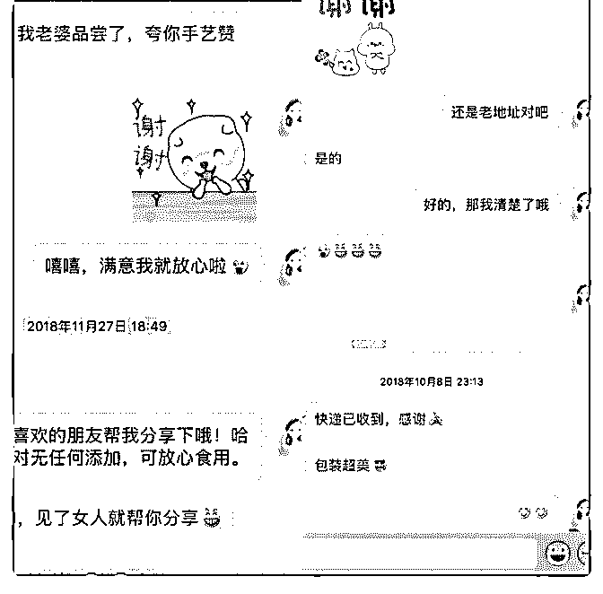

# 找到自己的优势，精

蒙小凤 : 找到自己的优势，精准定位，副业收入成指数增 长，11 月突破两万

时间很快，12 月啦。没有遗憾，只觉得时间走的快，对新的 12 月也充满了期待。如果用一句话来概况自己今年的状态应 该就是：“上半年是低头学习，下半年开始注重实践。”学习 确实有让我心安，但纸上谈兵，让我感觉学到的所有东西都 是虚的，觉得自己什么都懂，但又什么都不会，并没有解决 本质问题，觉得这样不行，开始转变思路，必须要将所学的 东西都落到实处，实践才是检验成果最好的方法。在波力和 C 宾的指导下，我找到了自己的天赋优势，开始了精准定位， 将泽宇在课里讲到的所有知识都落实到具体的行动上，神奇 的是我真的开始发生了很大的变化。我的副业收入有了指数 性增长，三天赚回学费，一个月突破 1 万里程碑，第二个月副 业收入超过 1.5 万，11 月是第三个月，恭喜自己，突破了 2 万。 并带着自己小团队帮助其她伙伴们也赚到了她们的一份副业 收入，其中有两个徒弟加入一个月就分别获得了 6K+ 和 5K+ 的成绩。

平时很忙，趁 12 月的开端，给自己一个安静的夜晚，对 11 月 做个复盘，看看自己的收获，给自己一些鼓励，再找找自己 的不足，争取这个月能做到更好。下面我就自己经历过的一 些心得体会做个总结，也分享给大家，希望对大家有些帮 助。

1，要敢于去行动。 “想都是问题，行动才有答案，”践行出成果，行动可以解决 一切问题，泽宇在课程里多次提到，我们需要去做个行动领 袖，所以要敢于去行动。只有去实践了，才能将所学到的知 识落地，才知道自己擅长什么，哪里有不足，只有不断的去

发现问题，才有可能去解决问题。

2，定目标。 定一个很明确的目标，而不是一个笼统的目标，是能量化的 目标。只有定了目标，我们才能去拆解目标，才有可能达成 目标。例如 11 月初我给自己定的目标是 11 月副业收入达到 2 万。目标不可以定的太高，但也不能过于低，需要综合自己 的实际情况，去定一个合理的目标。目标定的过低即使达成 也会没有成就感，目标定的过高达不到，容易气馁，不容易 坚持，适得其反。最好是能垫点脚尖努努力有可能达成的目 标最好。有了目标我们的行动才会有方向，这样会能更好的 促使我们去行动。有了一个具体而明确的目标后，我们就只 需要去考虑我们怎样做才有可能达到这个目标？这样我们更 多的就是去找方法了，而不是逃避，也不会迷茫。遇到问题 去想办法解决问题就好。 3，一定要有打造个人品牌的意识，专注的坚持输出。 我们经常会有一个误区，不管做什么都喜欢等到准备好的事 情再开始，等自己需要的时候再开始。做微商你说你现在朋 友圈里的人不够，要等好友多些的时候再开始；看中一个不 错的项目，你说你没钱，等手边宽裕的时候再考虑；想减 肥，你说吃完这顿再开始；都说打造个人品牌很关键，你觉 得你现在还用不上，说等你需要的时候再开始。其实我们都 忘了，我们自己才是自己最好的产品，我们自己就是一个行 走的个人品牌。要学会时刻为自己“带盐”。人设这个词大家 都不陌生，你是怎样的人，或者你想成为怎样的人，你一定 要展现出来，让别人知道，这样才能强化你的个人品牌，赢 得信任。做好专注的坚持输出，一天两天是无法看见效果 的，但一定要去坚持，这是一个量变引起质变的过程。对自 己要有耐心，很多时候无法坚持下去，主要是因为人都会高 估短期改变，低估长期成长。即使刚开始做不到完美，也一 定要开始，然后专注的去坚持输出，一定会有惊喜。举个我 自己的例子，我一开始做微商之前，我各种忐忑，我害怕朋

友圈里的好友会嫌弃我，屏蔽我，但我还是开始了，当我开 始后，我不再去纠结别人会不会屏蔽我嫌弃我，我更多的是 去考虑我怎样做，别人才不会屏蔽我，找方法。当我坚持了 三个月之后我惊喜的发现圈里不仅没有人屏蔽我，还有很多 朋友主动把我推荐给他的好友，让她们来欣赏我的朋友圈。 坚持输出，强化你的个人品牌，我从不刷屏，但依旧会坚持 输出有关我个人定位相关的东西。有意思的事情发生了，有 一天我收到三条一模一样的文章，是三个人不约而同的发给 我的，是和我个人品牌内容相关的内容，他们说看到那篇文 章就想到了我，而且是三位男士。有些人虽然平时很少和你 互动给你反馈，但不表示他们没关注，所以请一定要坚持输 出，只有你坚持去做一件事的时候才有可能会赢得信赖。

4，要有利他之心。 我是一个卖产品的，所以对产品看的很重，必须用好的品质 和质量才能赢得信任。所有的工序严格把关，用真材实料货 真价实的产品去说话。将自己当做卖家也要当做买家，我自 己也在食用， 多站在买家的立场去考虑，卖家怎样做我会觉得不错，换位 思考。 面对顾客我是卖家，我需要用信得过的产品去获得信赖。面 对徒弟，我是师父，我需要用心的去帮助团队里的伙伴们， 帮助她们一起能真正的赚到钱。教是最好的学，我用心的去 教她们，成长的是我们彼此。一个人走的很快，一群人才能 走的更远，抱团成长，相互成就。

以上就是我的一些心得和体会，我很感恩我的定位，让我不 光在副业中获得收益，还让我在赚钱的过程中获得了很多的 幸福感，学到了很多知识，认识了很多同频的伙伴，让我变 的更加有行动力。再次感谢泽宇教育，让我的认知有了升 级。成为别人的贵人，也让贵人遇见我自己。

我可以做到，希望你也可以。我们一起加油。

下面是我的自我介绍，有兴趣的朋友欢迎勾搭我哦！

【昵称】蒙小凤

【坐标】浙江杭州

【职业】高端私房纯手工阿胶糕手作者

【标签】会拍照能熬一手好阿胶糕的妹纸

【爱好】做美食、摄影、跑步

【致自己】做个阳光明媚的女子

【有成就感的事儿】：

1 自产自销私房纯手工阿胶糕，副业月收入过 2W，一条朋友

圈 变现 3K+；

2 .带领自己团队的伙伴一起做阿胶糕，帮助她们一起实现副

业收入，其中有两位伙伴加入一个月副业月收入分别过 6k+和

5K+；

3 .唯有美食不可辜负，厨房小白自学变成电视台美食嘉宾；

4 .坚持晨跑 4 年有余，每次 5 公里。每年平均跑 1000 公里左

右。

【我能提供】：

1 擅长纯手工阿胶糕的制作，给你带去健康放心的食品，还

能教你制作和销售；

2 电视台美食嘉宾，喜欢制作中式菜肴，可提供相关菜肴食

谱；

【欢迎来撩我， 一起做朋友呀】

2018-12-02(12 赞)

评论区：

HD－个人品牌咨询师 : 行动力无敌！

关注公众号"懒人找资源"，星球资源一站式服务