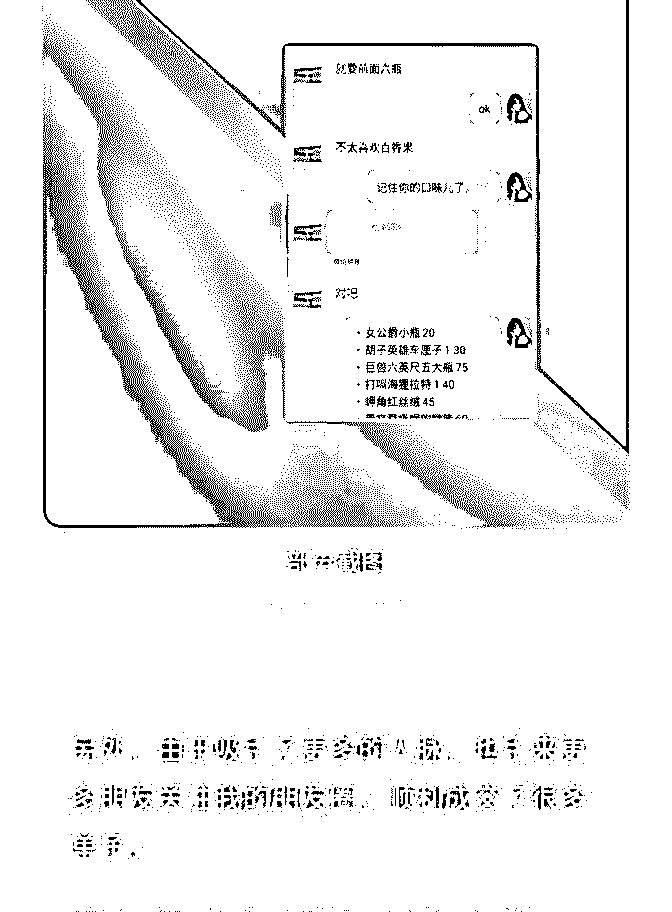
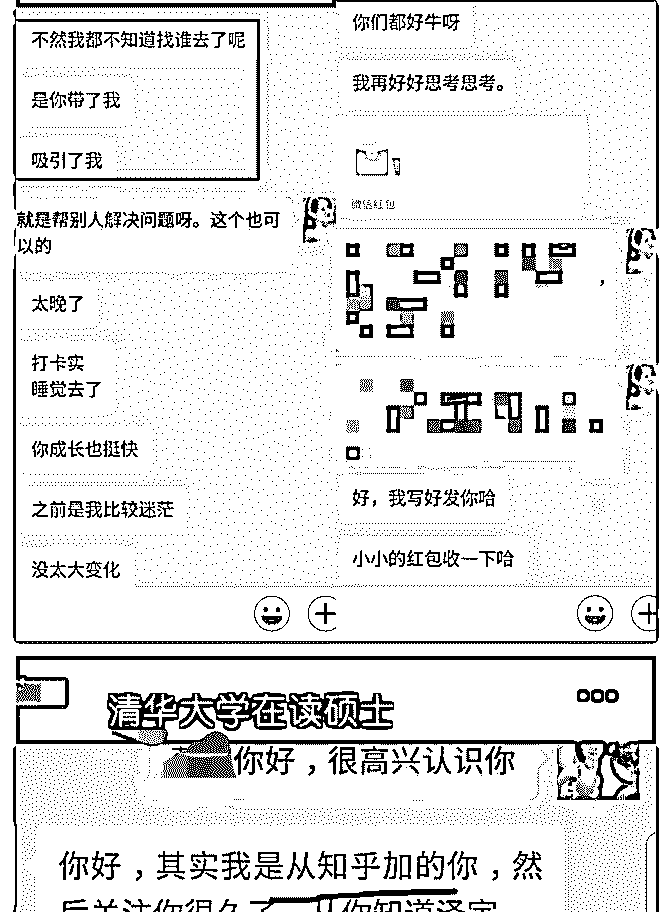

# 课程复盘｜5 天挣回

Abigail * : 课程复盘｜5 天挣回学费，我是怎么做到的 如图

欢迎大家与我链接，我是笔盖姑娘

vx:echo173707 2018-11-30(26 赞)

评论区：

宏灯 : 我也写公众号，[微笑][微笑]

常燕飞~ : day21

关注公众号"懒人找资源"，星球资源一站式服务

# day21 几倍赚

几倍赚回了学费，复盘一下。

①8 月底加入泽宇核心课，9 月份才开始学习，第一个月收入

700＋，第二个月收入 800+，目前总收入 1800+。

②有了 2 种收入渠道。［以前只知道打工混死工资］

③独立策划组织了 3 次瘦身营的优秀学员分享。

④参加知乎写作群。加入研习社。

⑤被邀请去一个价值 2000+的社群做成长分享。

⑥自己的品牌故事文章，被简书［青春］［运动&健身］专题

收录，阅读量超过 2600+。

［去年瞎写了 21w 字，单篇阅读量几乎都是个位数，偶尔几篇

阅读量高，也不过百］

⑦ 曾经的学渣、自嗨学习者［花费千元参加读写社群，却收 获甚微］，如今通过自己的努力，也可以带动小伙伴，甚至 可以影响到清华大学的硕士生。

每个人的成长都不是一帆风顺的。 虽然这两三个月的成长已经比过去一两年的成长都要快。但 我觉得其实应该可以更好的。 因为在学习的过程中，我时不时的就会犯以前的问题。比如 瞎搞、自我怀疑、只顾眼前不顾长远，等等等等。 因此也导致了进步非常的缓慢。 但幸亏有导师的指点，才会很快恢复过来。

从现在开始，我要按照正确的步骤开始成长了。希望能够靠 自己的力量帮助更多的人。

初十七，从流水线员工、囤课无数，一直努力却没有成绩。

零收入两年多，如今从 128 斤瘦到 96 斤，利用 3 个月从什么都 做不了的小白，成长为瘦身营助教，瘦身咨询师。正在帮助 130+小伙伴健康瘦身。

[如果你有减肥的问题，欢迎来咨询。 也欢迎一起来讨论学习，共同成长。](https://www.jianshu.com/p/dc37bd331b75)[肥胖迷茫十多年，我是](https://www.jianshu.com/p/dc37bd331b75)  [如何用三个月逆袭成长的！](https://www.jianshu.com/p/dc37bd331b75)[+-+](https://www.jianshu.com/p/dc37bd331b75)[简书](https://www.jianshu.com/p/dc37bd331b75)

2018-11-20(10 赞)

评论区：

梅飞菲 : 我忘记我什么时候加入，也不知道在哪里学习[流泪][流泪][流泪]

常燕飞~ : 忘记加入了什么？你想学习什么？

正记录 :

关注公众号"懒人找资源"，星球资源一站式服务

# 20181118

20181118 正记录 打卡 D2

前几天，在群里@波力老师的时候，提到我在有了自己知识 星球的一周后，加入了课程，学习课程的过程中，转化了 22 个，然后我还没有开始打卡，很尴尬。

波力老师说，没事，可以补打卡。 我是 2018 年 10 月 8 日晚，在@雪舞梅香和@朱迪辉两位老铁的

推荐下，购买了核心课，之后加了波力老师的微信，被「吓

到」了，以我最近两年买课的经历来说，几百块钱的课程是

不太可能有售后服务的，顶多有个微信群，隔三差五的蹦出

来几条广告。

被吓到的原因是：太专业了，服务太好了，我太喜欢了。 既然今天选择了#庆祝成果#这个标签，就来说一说，我这 41

天的「收益」，共计：1,839.98 元，妥妥的赚回了学费。

微信红包共：397.88，其中最大一笔是 168，最小的 1.68。 恩，两个比较有意思的数字。

知识星球：加入课程之前共 70 人，现在共 92 人，增加了 22 人，星球的价格是 69 元（星球是收取手续费的），65.55*22 = 1,442.1。

在这个过程中，体会过第一次引流，第一次转化，第一次有

人咨询完会给你发大红包，比如昨天，有个朋友发了 88.88 的 红包。这些都是源自于，课程的启发，比如：教我如何写自 我介绍，如何拆解知识点进行刻意练习，如何复盘，等等。

再次感谢遇到雪梅姐、遇到迪辉姐，遇到泽宇这么靠谱课程 和负责任的助教。

今天的自我介绍可以增加一句话，41 天时间赚回 5 倍学费的正 记录，一定可以年入 7 位数的。

就像 2.0 第四周：咨询师，逆袭人生的正确姿势中提到，只要 你能赚 1 元，你就能赚 100 万。

我对打卡的最低要求：给自己 100 次更新自我介绍的机会，今 天是第 2 次。

2018-11-18(29 赞)

崔叶原 : day13

关注公众号"懒人找资源"，星球资源一站式服务

# day13 昨天给一

昨天给一个小伙伴咨询，她是欧美身材与东方面孔的综合 体，一开始我只是随便聊，她不需要服务，但越聊越深，越 是刺激到她的痛点，她想继续听下去，于是主动付费了。最 后帮她找准主导定位问题，得到感谢支持。

今天是来自知乎的小伙伴，因为我在知乎发了篇文章关于男 生学会穿搭后的变化，文字配图比较有视觉冲击，吸引了很 多小伙伴加我咨询，虽然最后只有一个成交。

没关系，虽然只有这个成交，但我在发朋友圈后的五分钟 内，火速成交了另一位新顾客。

我的感悟：

1.没人找你咨询的时候，可以这么做的：寻找优质社群，去相 关社区输出;温习课程，对照自己调整计划;主动添加优质群好 友并用心自作我介绍。

2.社群输出要点：挑选最精彩的 500-700 字分享，文字形式， 直观明了，最后带上自己的话，更真实立体。

3.主动添加你的大多是优质客户，要维护好，观察他们朋友圈 后主动聊天，发掘出他们的深层需求和痛点，然后告诉他你 能提供解决价值，促进成交。

4.别着急，很多时候对方会“让你说说看”，“请你给些建 议”，ok 你给他输出一些干货，刺激他的痛点，痒点，然后用

半步原则戛然而止，让对方主动付费。

5.我切身体会到这个道理：女人的钱好赚，其次是孩子，老 人，最后是男人。

6.按照课程和波力说的做，这是老生常谈了。人很多时候会自 作聪明，但其实可以尝试一下，只要试一下，就能尝到甜 头，就会继续下去。但很多人试都不愿试。

7.虚心向处于上升期的优秀学员请教，他们处于普通向牛逼过 度的阶段，还能站在你的角度给你耐心解答，很能理解你的 处境，等以后变成大神就没时间也没这个心境了。

8.导师计划有关于话术的指导课程，可以避免你丧失优质客 户。

9.控制好你的咨询时间在 1h.时间最值钱，在达到同等效果的 前提下，超出了要反思，要优化，要精简。

10.输出的价值一定要高，给出的建议一定要有针对性，要能 实操落地。这是前面所有建议的前提

分享下这几天的小收获，同时也是告诉自己，你真的可以做 到。

2018-11-08(18 赞)

评论区：

HD－个人品牌咨询师 : 这个复盘厉害了！

崔叶原 : 谢谢美女老师～

关注公众号"懒人找资源"，星球资源一站式服务

# #庆祝成果 加入泽

Judy 指数基金 : #庆祝成果 加入泽宇教育·导师计划短短 2 个多 月，仅仅只用下班后时间赚了¥12199.5。

学习泽宇的课程之前，每天过着朝九晚五的生活，每天都要 去档口卖包，日复一日，年复一年，每天下班后回来就是追 剧，然后买买指数基金赚钱，以为自己的生活就是这样了。

没想到一个偶然的机会在雪梅姐的写作课那里听到了波力老 师的名字，后面也没有再去想了，结果在另一个群里又碰到 了他，第一感觉就是好厉害噢，真是缘分，就这样加入了泽 宇。

短短 2 个多月，用下班后时间赚了¥12199.5 从刚开始的公益咨询到现在的课单价 999， 从 10 月 11 号开始，到 11 月 3 号，23 天时间累计个人品牌定位：

指数基金定投，收费咨询售出 47 单，现在排课已经排到了 12

月份中旬

从迷茫的自己，到现在的每一步都很清晰！感谢老师们谆谆 教导！

1.没有太多的诀窍，就是按照老师说的一步一步去做， 做到了就继续下一步，没有做到效果，那就肯定自己哪里做 的不对，就要去找老师，找同学帮忙

2.老师他们都是过来人，那我们现在遇到的坑，他们应该都知 道，所以只要做老师的好学生就可以了

3.向大家学习，做的好的肯定有好的方法和经验，那就要虚心 去学习，去模仿，直到做好为止

4.认真听课，反复的去听，常听常新，要把每一句话复印在自 己的脑海中，当然我还需要加强，真的很重要，师兄师姐都 这么说，老师也这么说，那我么就去做好！

5.复盘，多做正确的事情，不要做错误的事情。我的 47 位付费 客户都有做好复盘，当然之前的也有做好复盘

6.行动，没有其他的，执行力很重要，我不喜欢把事情留在明 天，我喜欢列清单，完成好的事情就打钩，直到看到一页满 满的√，我就会很有成就感

7.不和别人去比较，就和自己去比，一步一个脚印

8.把目标定高一些，就算没有实现，结果也不会太差，不要自 我设限，说不定真的可以成功

9.一定要花时间学习好自己的专业，做到更加的专业和专注 做自己喜欢的事:买指数基金，稳定的赚取收益，做到极致，

帮助更多的人赚钱！

没有最好只有更好，没有做不到，只有想不到[拳头][拳头][拳

头]

2018-11-08(20 赞)

评论区：

HD－个人品牌咨询师 : 点赞

Judy 指数基金 : 谢谢华丹老师！

晓烨 :

关注公众号"懒人找资源"，星球资源一站式服务