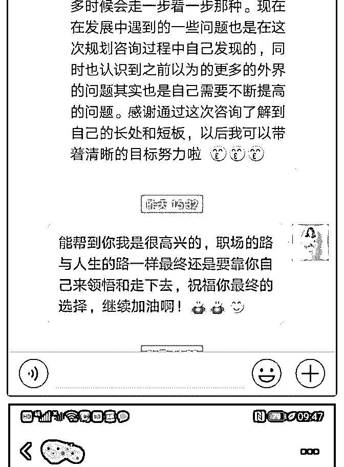

# 加入泽宇后，让我刷

加入泽宇后，让我刷新认识的半个多月

还记得当初加入泽宇，只是因为看到同学芬芬超强的变现能 力很好奇，当时没有想太多，第一时间便交了学费。然后在 加入泽宇的这段时间确实让我收获很大。

半个多月的时间已经几倍轻松赚回了学费，也让我对自己的 能力信心十足，我坚信自己可以为更多的人提供更高的价 值，帮助别人梳理更多的职业和成长困惑。

首先，泽宇是一个很友善的社群，大家都非常的积极向上， 都非常的渴望进步和学习，这种正能量的影响，我承认，对 人是很有带动作用的。 第二，泽宇的模式非常有特色，是终身制，还有专职的导师 为你进行指引和解惑，一笔费用却能够获得终身的服务，确 实非常划算。 第三，泽宇传授的方法，是经得起考验的，尤其是对于本身 有料的人来说，可以说是有如神助，因为如今真的是一个酒 香也怕巷子深的时代，好的人好的产品最需要的就是精心的 运营。就好比所有明星，他的人设以及品牌影响力也全是精 心运营后的结果。 最后，我希望能够继续在这个平台上沉淀，希望与大家共同 进步，链接不同的价值，最终将大家的价值都发挥到极致， 实现大家向往的自由生活。一起加油！

2018-10-29(16 赞)

常燕飞~ : day15

关注公众号"懒人找资源"，星球资源一站式服务

# day15［长线思

［长线思维］［让别人看到你的可能性］

今天重新听第三课，宇哥讲到了如何吸引贵人，让贵人帮助

你。

最后一点讲的是活在未来。举了巴菲特的例子，巴菲特问他

的同学假如回到 20 年前，让你投资一个人，这个人会在未来

给你很大的回报。那么你会选择投资谁呢？

一开始我也想的是一定要投资那个目前学习最好的，或者是 家庭条件最好的人。 但是宇哥的答案是［投资你自己。让别人看到你的可能性， 同样也来投资你。］

这让我想到了贝索斯的长线思维——如果把目光放在眼前， 那么竞争对手会很多，如果放在三年后，竞争对手也很多， 但如果把眼光放在七年以后，那么你的竞争对手就会很少， 因为没有人愿意做那么长远的打算。 正如巴菲特所说，他的投资理论非常简单，但是很少有人效 仿，因为没有人愿意慢慢的变富有。

a2 这个意思就像是核心课第一课所说的，你是谁并不重要，重 要的是你将成为谁。 要相信自己，以后能够达到很高的高度。并且为之不断努 力。

在正确的路上做正确的事。

虽然每天认识新朋友的做法非常必要。 但还需要运用好第四课的内容，不断提升自己的能力，让贵

人主动找到我们。

对自己—— 1.展示自己。

2.做人靠谱。［凡事有回应，件件有交代，事事有着落］

3.有上进心。

4.空杯心态。［承认自己是无知的，谦虚向别人学习］

5.活在未来。

对他人—— 6.有原则有底线。

7.待人真诚。［不吹嘘不欺骗］

8.成为贵人。［无条件帮助别人］

9.乐于求助。

10.心怀感恩。

2018-10-23(10 赞)

评论区：

常燕飞~ : 社交资产 1.活在未来——用长线思维，现在是谁并不重要，重要的是以后将成为谁。 2.让别人看到你的可能，并

且愿意帮助你成功。

关注公众号"懒人找资源"，星球资源一站式服务

# Day1 第一课：

夏雪迎眸 : Day1 第一课：涅槃重生：重塑自我认知和价值观

9 月底加入泽宇教育，但一直以一个旁观者的角度看着这个群 不断壮大，看着微信群中的消息越来越多。小伙伴们学习热 情很令我动容，有问题及时向波力老师及时反馈，有好消息 就和大家一起庆祝成果。我在想：这么努力为自己拼一把是 多少年前的事了？就算是高考那会儿，你有这么拼尽全力 吗？看着小伙伴都开始慢慢进入佳境，我能感受到我是在退 步的，因为没有进步那就是一种退步。9 月初，我到了新的岗 位，面对陌生的环境，花费了一些时间去适应。现在一切步 入正轨，我也该腾出时间好好正视自己，改变自己。 第一课“涅槃重生：重塑自我认知和价值观”，这堂课与我最 近的心境相当契合。这三年来，我一直很压抑自己，从体制 内出来后又把进入深圳的体制内当成头等大事，一切事情都 只能以此为前提。因此我忘记了要去享受生活，享受这份美 好年纪该有的一切，过得并不快乐。这种自我设限，使得很 多方面变得扭曲。3 个月前，我开始解放自己，开始打破阻碍 自己的枷锁。比起以前，我快乐了很多，最主要是因为我的 思维方式转变了。 泽宇老师说得很对，我要以“我将成为谁”为导向，打破阻碍 我的枷锁。在出现自我设限的情况下要提醒自己、暗示自己 转变思维；遇到新鲜事物不去逃避，而是拥抱它，不在舒适 圈里故步自封。 现在我要写下目前困扰我的自我设限，不冲破它们我只会原 地打转，害怕尝试。

【自我设限】 1.拖延症严重。人总倾向做简单又能让自己愉悦的事情，明明 知道应该好好利用下班后的时间提升自己，但是这意味着失

去很多娱乐以及需要忍受孤独。所以总是想休息、娱乐、放 松，从而将学习、提升抛之脑后。 2.有些事情没尝试就认定自己不行。现在是知识付费的时代， 自己因为之前备考多年积攒了一些学习经验，也想尝试这种 新的模式。但总给自己找借口，比如不懂平台运作、文笔 差、技术盲等等，然后一直没尝试。 3.坚持不够、毅力不足、抵抗诱惑能力差。背单词背了一段时 间就没继续坚持，然后就没有然后了；很想练出马甲线，连 续做了几天平板支撑后就想起来才练；规定好学习时间但是 一刷朋友圈、一刷知乎、一看百度新闻、一看综艺节目就停 不下来，时间推后又推后直到睡觉时间。 4.害怕在公众面前讲话，比如演讲、参加比赛。总觉得自己口 才不行，没有满腹经纶、不懂演讲技巧、不懂表演、不会抑 扬顿挫、不会急中生智、不会得心应手。我是一个需要充分 准备，至少比一般人多一倍的准备才有信心面对大家。 5.文笔不好。我一直都很羡慕很会说，很会写，很会看书，很 有自己想法的人。我总有一段时间会很有冲动去看小说，看 完后会想“如果我也能写一本就好啦”之类的想法。但是总觉 得自己语言不优美，积累沉淀的不够多，所以这种想法也很 快成为泡沫。 6.摸手机太多，看的书太少。两年前，静下来看书感觉很多时 候都很美妙。好书，真的是站在巨人的肩膀上，快速汲取养 分。可是，这几年，手机占据了我大部分的时间。各种刷、 各种视频，其实看完后是一阵阵空虚，然后为了填补这种空 虚，我又一遍遍摸着手机，成为那个我讨厌的自己。 7.总做不到早睡。由于工作性质，必须早起。现在不用闹钟六 点多就能自然醒。这就意味着想要以好的状态迎接第二天， 就必须早睡。再者我的体质很爱冒痘，我又很讨厌痘痘就更 不应该放任自己玩手机，不仅影响工作状态还影响颜值，然 后进而影响自己的情绪。 8.有时候在意他人想法。其实，我很清楚说也说了，做也做 了，那么就潇洒一点，不要管他人怎么想了，因为我想的仅

仅也只是我想的，别人可能压根就没放在心上。 9.有时候不够主动。现在虽然比以往好很多了，可是还有待改 进。尤其是情感方面。 10.容易被工作感到心烦。有时候不称心，就容易多想，然后 就很容易将这种情绪夸大。 11.护肤方面，只是思想上的巨人，行动上的矮子。爱美之心 人皆有之，由于痘痘自己也了解不少护肤知识，可是落实到 行动上欠缺的实在太多太多。

【反转】 1.及时行动。计划好当天该做的事，高效执行，不拖拉。（除 非特殊情况不是自我因素） 2.自信，不找借口。想要有所成，那必将经历痛苦的不舒服的 事情，你才能有所蜕变。只要你认定是你想要的，那么就暗 示自己我可以，勇敢地去拥抱新鲜事物，不要总是想着等准 备好再行动。 3.坚持，再坚持，学会抵抗诱惑。经过前面的思考，我发现目 前对我最大的诱惑就是手机，因为它功能强大，我对它产生 了依赖。所以要学会正确使用手机，很多问题也就迎刃而 解。同时，对待认定的、正确的事情要坚持下去，不要急于 求成，只想要一个快速能获得的结果。 4.享受在公众面前说话、演讲、尽力去参加比赛。我不像演说 家那样，技巧娴熟，富有表现力。那么就真诚和大家沟通， 同时掌握一些讲话技巧，将自己的观点更好地传递给听众。 把讲台当成自己训练场，认真对待每一堂课。 5.提升文笔。通过文字，向读者打开一个美好的世界，这种感 觉令人神往。我总想着，好的作者，那该是多么睿智的人 啊。再好的作家也不是生来就会写作，所以请相信你自己， 你还年轻，还有很多的可能性。 6.少摸手机，多看书。生活里手机占用我太多时间，以后给几 个固定的时间玩手机，因为有时候一刷就兴奋得忘记时间， 也不愿去做费脑子的事情。由于工作原因，收到电话、回复

信息还是不能避免。 7.早睡早起。为了健康，为了第二天的状态，为了你的颜值， 请你早睡。明知道早睡早起好处多多，但总是败给手机。你 不是那么在意你的痘痘吗？不早睡在意的都是假的！ 8.活得潇洒点。人生在世，不要过得压抑，洒脱点。不小心说 错话了，做错事了，丢脸了，那又如何？我本来就不是完美 的化身，知道问题所在去改就好了。别太在意别人看法，顶 多给你 10 分钟在意，事情都发生了，想那么多也于事无补， 况且别人真的不会太在意。 9.主动点。我看到你最近在进步，但还需要更大的进步。你自 己最清楚你想要的东西，那就主动点。 10.不浮躁，不玻璃心。不要因为一点点小事就影响自己情 绪，学会控制情绪，不做情绪的奴隶。 11.坚持护肤。不要想的很多，行动很少。想要好好护肤，那 么就要自律。注意饮食、睡眠和锻炼。坚持，坚持，再坚 持。

2018-10-14(25 赞)

评论区：

HD－个人品牌咨询师 : 复盘写的非常用心，接下来就是不断尝试对立面

夏雪迎眸 : 谢谢鼓励，我会努力的~

琉璃苏比 :

关注公众号"懒人找资源"，星球资源一站式服务