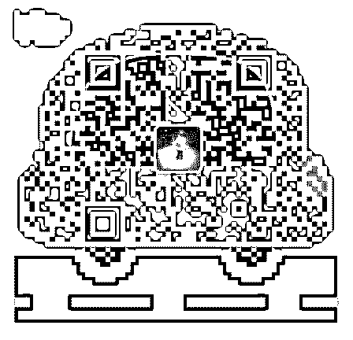

# 琉璃苏比 2.0 版成

琉璃苏比 2.0 版成长复盘：

6 月底加入泽宇核心成员，10 月加入导师计划：共 3 个半月！

从最初的迷茫到如今具备多渠道赚钱能力，感觉自己升级了

几个 levels：

1.成为招生办主任，9 月负责砍柴书院写作营招生，两周内招 满 330 人，月入 10000 元+。

2\. 9 月完成研习社任务，带领 3 名学员加入泽宇教育，奖励

500。7-8 月个人品牌变现 500+。

3\. 9 月自媒体平台写作赚取流量稿费 1000+。

4.8-9 月区块链投资收益 4000+元。（被动）

5.8 月好好学习平台卖 1 元课程，半天内迅速招满 100+人卖 完，赚 500+元。

6.受邀请主讲风靡全球的米菲故事会：2 小时 300 元。并加入研 究会老师团队，研发自己的线下绘本课程！

7.出版了自己的书，成为国际知名 IP 绘本作者，签名团购获得 几十名好友支持！包括国外好朋友！绘本稿费变现 1000+元。

8.近两个月（或者说过去一年）是有生 30 多年来认识大咖最多 的！此处只列出几位有连接的最大的大咖：较熟悉的博士博 士后 2 打以上、美国名牌大学教授、本市教育界名人教授、德 国畅销书作家、教育界区域校长、香港上市公司执行董事、

纸媒大咖、新媒体大咖……

（还有众多精英就不提了…）

9.参加了线下创新教育论坛，刷新了认知，对教育孩子也有了 新的标准和看法！

10.和多平台合作，往作者经纪人方向迈步！ 以上，是 2.0 版本的我，从最初转行的迷茫，苦恼，到今天的

快速成长，我找到了自己的定位和目标，感谢泽宇老师，也

感谢砍柴老师！感谢波力和小星的帮助。

就是陪儿子少了……学习时间管理，希望能平衡工作学习和 生活！

感谢大家的鼓励，我会更努力！

2018-10-12(35 赞)

评论区：

小小羊儿回家了 : 继续加油

琉璃苏比 : 谢谢你。一起加油

茉莉小小 : 太棒了，苏比！榜样

琉璃苏比 : 谢谢，一起加油

阿达↹fool : 太厉害了，默默把你的分享收藏了，时刻看看

追逐年华 : 太厉害了[强][强][强]

关注公众号"懒人找资源"，星球资源一站式服务

# day1 导师计划

刘振 : day1 导师计划 2.0 课程 序言学习

用梦想和目标驱动自己 重要的不是你有没有基础，有没有人脉，有没有资源，重要 的是你有没有改变的决心。

你的标签： 找到自己感兴趣的领域，能给别人提供帮助。

你的定位： 把领域细分市场，你能解决别人什么样的问题， 商业的本质就是解决问题，把兴变成赚钱的事业。

你的品牌： 帮助更多的人，把你的商业行为变成一个机构

在泽宇教育我们能学到一套经过科学验证可行的方法，只要 按照其中的步骤和方法持续行动，就能有所收获。

读万卷书，不如名师指路，思维决定了你的高度，在泽宇教 育能学习到成功人士的思维方式，在泽宇教育能结识志同道 合的战友，鼓励和帮助自己，不用担心想法不被理解，不用 担心失败被嘲笑。

在泽宇教育，遇到不懂的问题，能得到同学的指点，每周有 导师答疑，泽宇教育还考虑到没参加答疑的同学，鼓励参加 过答疑的同学，把答疑总结发出来，分享给其他未能参加答 疑的同学学习。

对自己的人生负责，不要自我设限。在没有获得实质性的回 报时，不要自我感动。不要学了泽宇课程新的思维和方法， 还在用自己旧的方法去做某事。

我们要做正确的事，不要去做不必要、自己却认为重要的 事，不要受到其他想法的干扰。以结果为导向，不达目标， 不实现梦想决不罢休。

以上就是我对导师计划 2.0 序言课程中学习的理解和总结。最 让我欣慰的是，泽宇教育不像其他课程，其他课程只教我们 技能，不会告诉我们怎样把技能转变成收入。泽宇教育拥有 一套完整流程，一步一步教我们如何把兴趣变成赚钱事业。 2018-10-09(5 赞)

冰棍儿 :

关注公众号"懒人找资源"，星球资源一站式服务