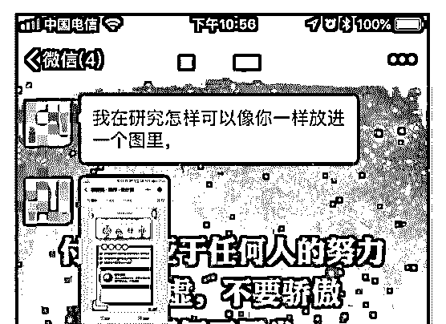
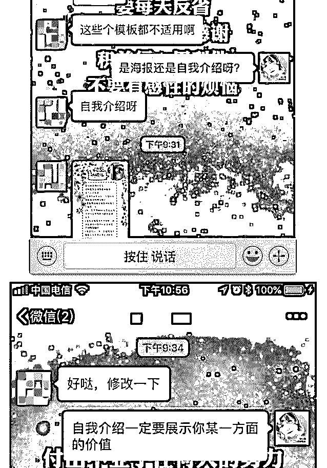
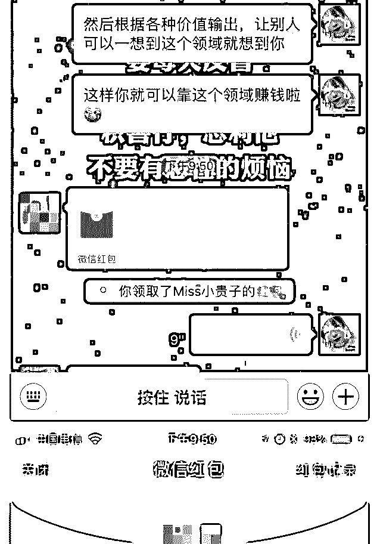
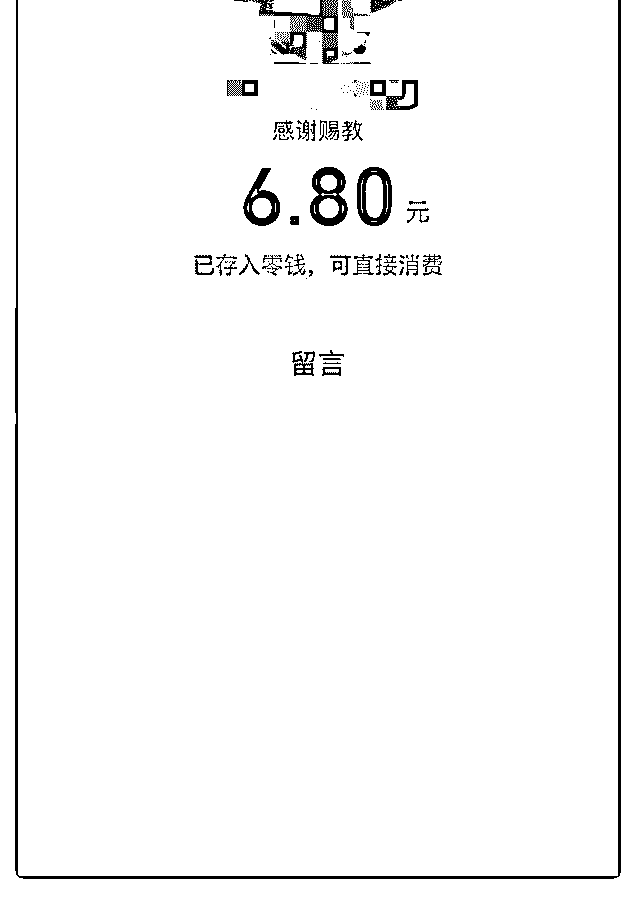

# 前几日在两个群里发

前几日在两个群里发了自我介绍，吸引来一位小伙伴，相谈

甚欢。

今日收到她关于如何制作图片版自我介绍的问题，便回答了 下，顺便给她的自我介绍提了一些小建议，却意外收到了对 方感谢的红包。 真真的惊喜～虽然钱不多，但却代表了我又开辟了一条变现 渠道～

不计回报的付出，反而会得到意想不到的收获。 例行感谢波力和泽宇教育～

2018-10-08(6 赞)

评论区：

博博 : 加油[呲牙]

冰棍儿 : 同加[呲牙]

. : Day5#课程复盘

关注公众号"懒人找资源"，星球资源一站式服务

# Day5#课程复

如何开启你新世界的大门

想想为什么要加入泽宇课程学习，从一开始的犹豫要不要加

入？因为想改变自己实现收入倍增！作为一个没基础、没粉

丝、没人脉的人如何逆袭？到后面泽宇课程给了我全新的认

识。

首先，泽宇教育这种一部手机一部电脑随时随地就可以实现

办公的环境是我心中所向往的。其次，高价值个人品牌的重

要性，提高核心竞争力，也是成为一名顶级咨询师的必要条

件。最后如何做成功一件事情：

1、避免错误的思维模式，只要想到要做就立马行动，不对自

己找借口，不达目的誓不罢休;

2、避免错误的行为，学习新方法后照做以实质性成长为目地,

遇到问题求助或想一切办法解决;

泽宇教育有句话“遇见贵人最好的方式是成为贵人”这句话对 我感触最深，只有帮助别人，为别人提供价值，在某个时刻 自己需要帮助才会有人帮助你，并不是一定要让别人帮你， 起码能帮助到别人自己也就开心了。 还有泽宇教育的高价值学习群，有我们的助教老师跟这么多 小伙伴，遇到问题有老师指点迷津，大家一起讨论，更能快 速帮助我们成长，无论你的曾经是怎样的在这里都有志同道 合的战友一起并肩成长，梦想不会被嘲笑。这一点给了我很 大的安全感跟勇气。不管接下来遇到什么，泽宇教育的做事 思维模式一直是我坚强的后盾。

2018-10-08(7 赞)

弘毅 :

关注公众号"懒人找资源"，星球资源一站式服务