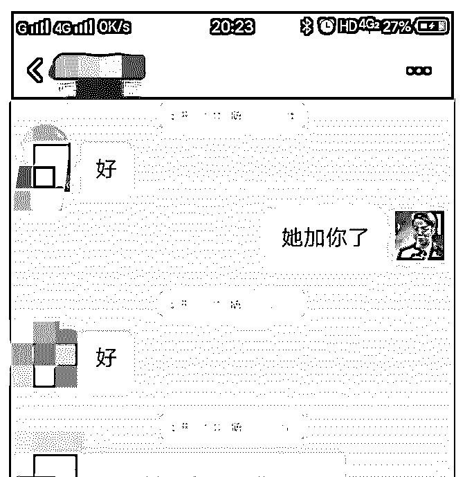
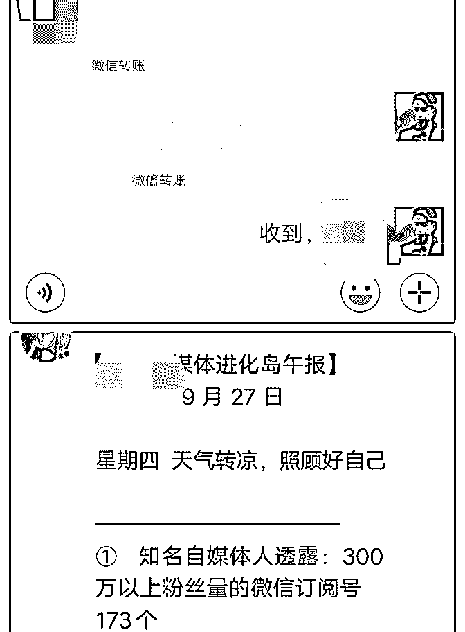
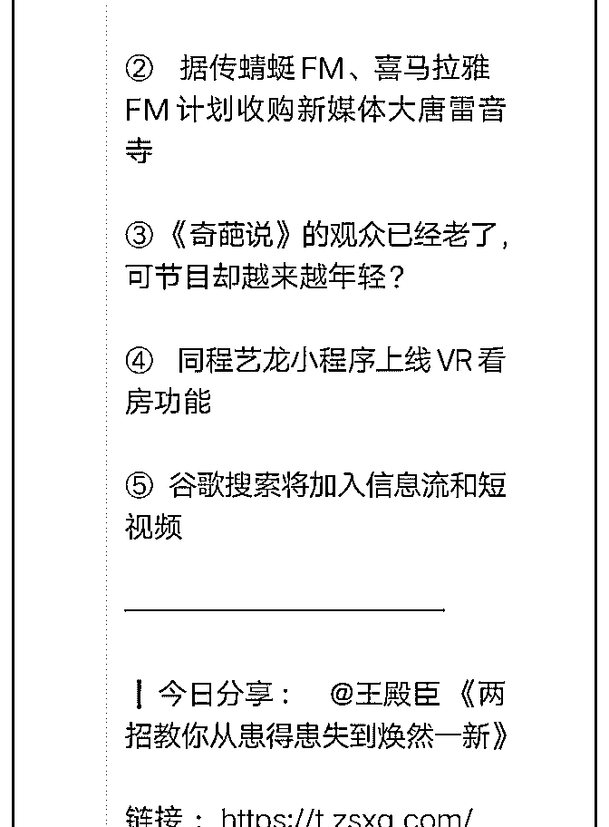
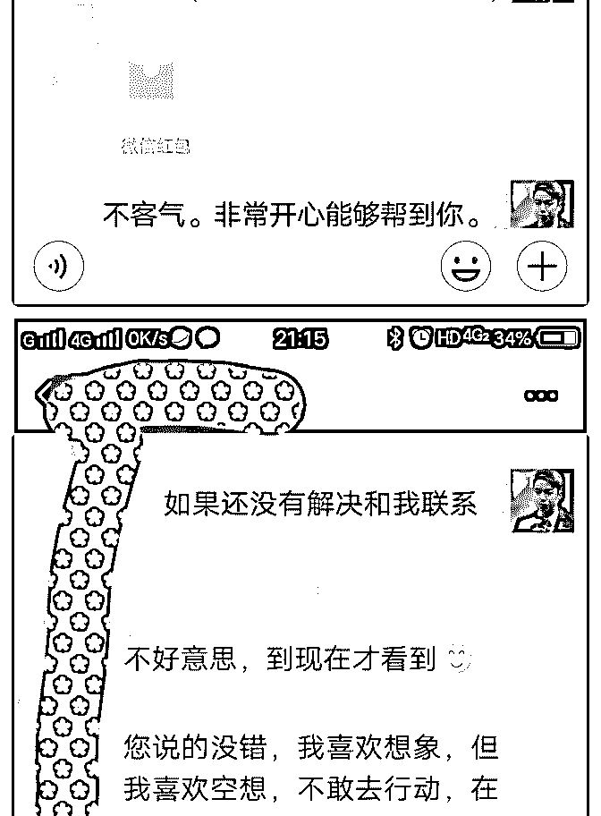
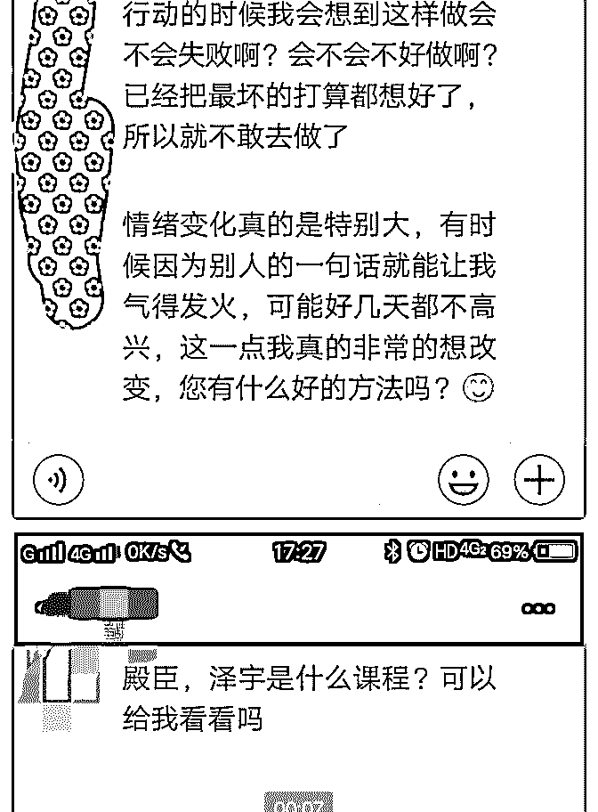
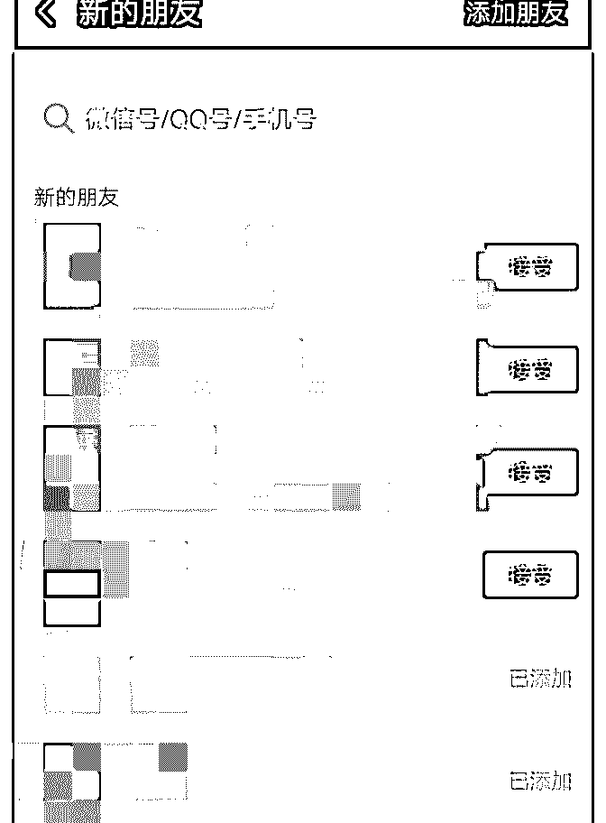

# 很高兴今天参加了线

很高兴今天参加了线下活动，辛苦芬芬了。见到了越来越优 秀的芬芬、璐璐跟伟业，还认识了 2 个非常年轻的新朋友，博 文跟英锋。

虽然交流时间很短只有 2 个多小时，但是依然收获满满。

1.再一次被芬芬的强大行动力震住了，2 天圈粉 100 多，额外收 入 4000+，这个也是自己一直最缺乏的，不过这次活动之后自 己对行动的方向有了更清晰的认识，要马上行动起来把想法 落地。

2.芬芬分享培训的能力梳理表非常棒，可以结合个人定位表使 用，综合市场、客户、利润做个人定位。

3.璐璐的草根逆袭很吸引人，但要有痕迹跟搞事情就是聚集资 源的快速途经这 2 点分享也非常受用，在展示成长的过程中很 自然地吸引粉丝然后通过一起做事情进行资源分享，产生裂 变。

3.伟业的社交分类体系很有价值，自己也可以对目标群体的各 需求进行梳理，进行细分。

4.后续碰到社群运营跟心理学方面的问题跟英锋和博文好好学 习。

最后的总结是今天突然发现 NIKE 的广告语是最动人的，JUST DO IT，不做，想再多都是然并卵。

最后欢迎各位小伙伴们找我沟通交流，很乐意给大家提供我 的价值。

2018-10-07(7 赞)

关注公众号"懒人找资源"，星球资源一站式服务

# Day.9 泽宇说

殿臣 : Day.9 泽宇说的 7 个“执行”颠覆了我的现状。

2018 年 9 月 9 日加入泽宇教育，花 15 天自我认知，并且放空自 我才来学习课程。

9 月 24 日开始正式学习并且复盘输出

9 月 27 日收到第一个认可，并且见证我成长的红包。 从这里开始，一发不可收拾…… 今天是 2018 年 10 月 4 日，加入泽宇教育 26 天，并且成功赚钱

426.26

这是一个三位数，但这是一个成长的轨迹，也是一种巨大的 成功，我迈出了我人生中的第一步，今后我相信小数点会往 后移动。

从 2016 年开始，我一直有一个梦想：成为讲师 这一个梦想和我走了 3 年，频繁换工作，不停尝试，刚开始的

大量阅读，后来的大量囤课，我觉得那是正确的。我在摸索

着属于我的那一片天空。

到了今天我才知道。自我摸索，试错成本不可估量，很快就 让我负债 5 位数，经济压力就让我喘不过气来。

我始终在思考。是什么原因造成这样的结果。

只到我遇到了迪辉姐，他给我泽宇教育的简介是，我看到了 一半，我恍然大悟。我终于知道是什么原因造成了我的停止 不前，并且负债。

“自我认知”我连自己都不了解，我能做好什么事儿，更别提 做出成绩了，俗话说：了解自己很难，了解别人很简单。

一个人玩和一群人玩那是不一样的，如果在有一个厉害的人 带着我们一起玩，那真的很好玩。一群厉害的人再带着一群 人玩，玩着玩着，都成了一群厉害的人。那岂不是真正的好 玩。

所以现在我明白了一个道理：频繁换工作，换不出好平台， 大量阅读不思考，会变成死读书，大量购买课程，会让我焦 虑，俗话说“吃多嚼不烂”

只有大量的“学习思考并且践行”那才是正确的公式

（学习→思考→践行→反馈→思考→践行→结果）不停地执 行。才能得到自己的理想状态

我找到了自我设限，制定了上帝的色子，写下了自己的最低 标准，把他们随身携带，并且贴在了自己的书桌上。每天反 复的念。

李小龙说过：我不怕一个人 1 天踢 1000 次腿，我怕一个人 1 天 踢 1 次腿，踢 1000 天。

是啊，每天认识一个人，和他们不断地互动，接触不一样的 人，一个月下来，自己的交际能力不断地提升了，并且我自

己从中秋节到现在涨粉 59 位。

以前自己不会写东西，不知道写什么东西。哪怕是分享，都 是在抄袭别人的内容，自己从来没有属于的内容输出。

现在我每天把自己学习到的知识内容，在各大社群，星球分 享，并且得到了星球交流总群的推送，点赞数量，从开始的 没有，到 1 个、2 个、10 个。

有人开始在添加我了，这就是一个成长，实质性的成长。 咨询越来越多，每天都非常的充实，特别是帮助到别人成

长，那是一种从心里最深处的开心。

学习泽宇核心课程第三课，我就已经开始有收入进来，一位 做朋友圈诊断的老师说，他看到了我的朋友已经有自己的能 量了。

是啊，很多东西都是在自己做了以后，无意间出现的。 泽宇核心课程我总共听了 8 遍，每一遍都有不一样的收获。从

懵懵懂懂，到一知半解，到能够理解，到现在我都快要会背

了。我就皮一下。哈哈哈

波力老师说，挣钱很简单。 但是我想说的是：挣钱的确很简单，但是你需要有挣钱的思

维认知。

所以到了今天我真正想说的是，打破自我设限，每天自我暗 示，就是思维认知的升华。

有挣钱的能力，有挣钱的思维。还需要有挣钱的行动力！

所以：接下来……你需要 执行、执行、执行、执行、执行、执行、执行

2018-10-04(16 赞)

评论区： 寇洁 : 牛逼 王钢 : 牛

关注公众号"懒人找资源"，星球资源一站式服务