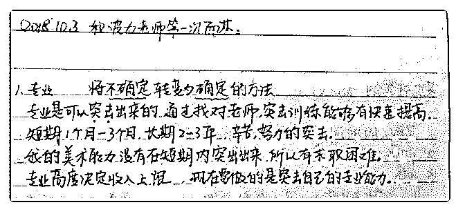
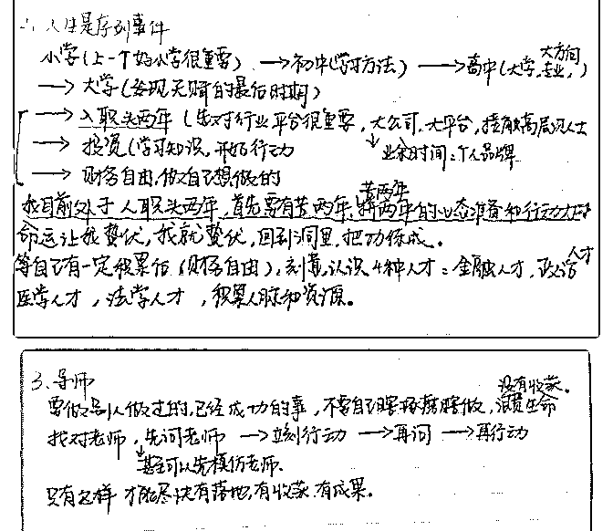
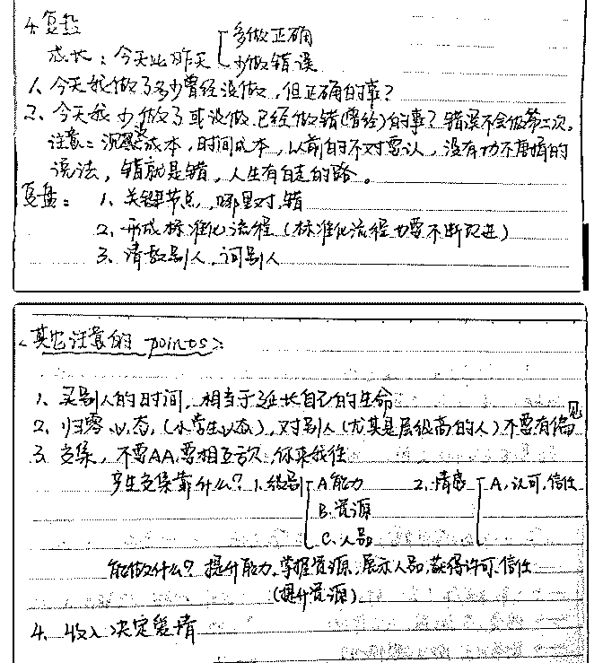

# 第一次和波力老师面

Daisy 是圆圆 : 第一次和波力老师面基 复盘

由于更喜欢纸质版书写，所以面谈结束回来后立刻总结复盘 成纸质版了，看起来有点困难，希望小伙伴们不要介意。 一次思维和认知的升级，收获实在太多了，纸质版只是很简 单的一部分。波力老师在假期依然不停地免费给泽宇学员线 下指导，感冒了声音有些哑也充满热情讲了 2 小时，而且毫无 保留倾其所有，真的很感动。无论是落笔到纸面上的观点， 还是落地到行动的指导建议，还有波力老师的个人魅力，都 对我都很大的启发和帮助，接下来带着波力老师给的建议， 继续努力

2018-10-03(31 赞)

评论区：

常燕飞~ : 字写的很好，观点也很清楚，棒棒的

咖啡不加糖 : 好棒呀

晓曼 : 这么好的字！

心作 : 超级棒呀！笔记是最标准的

冰棍儿 :

关注公众号"懒人找资源"，星球资源一站式服务