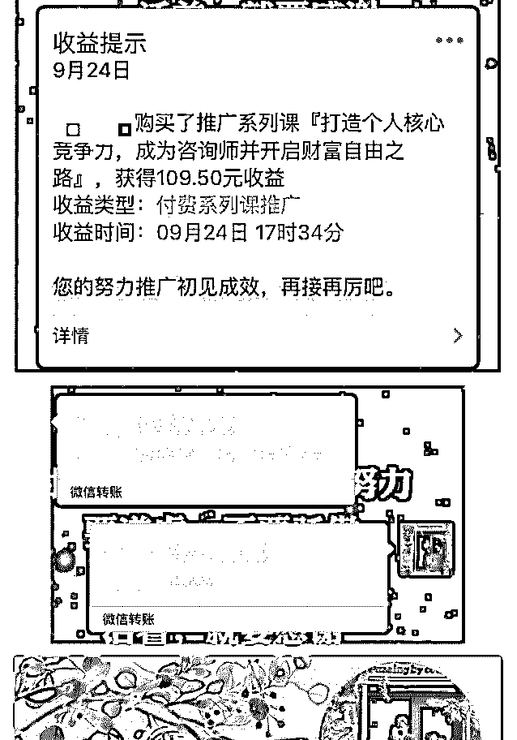
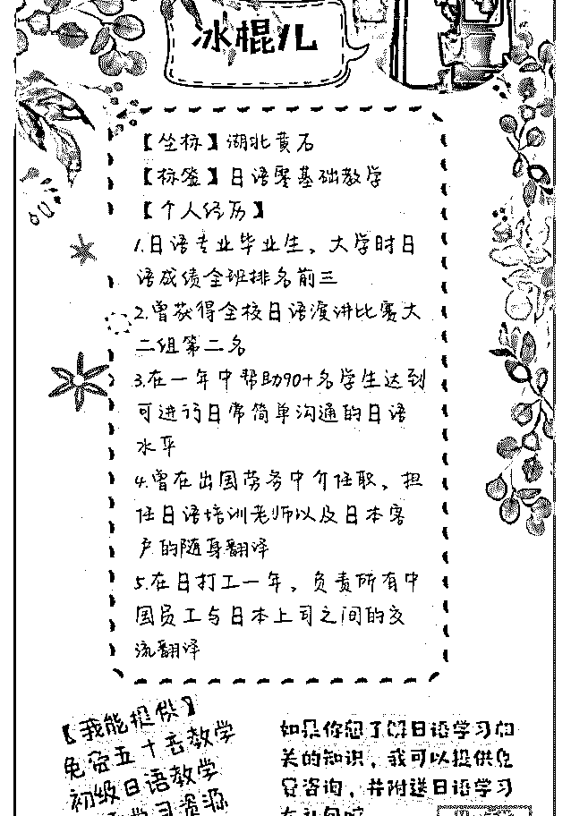
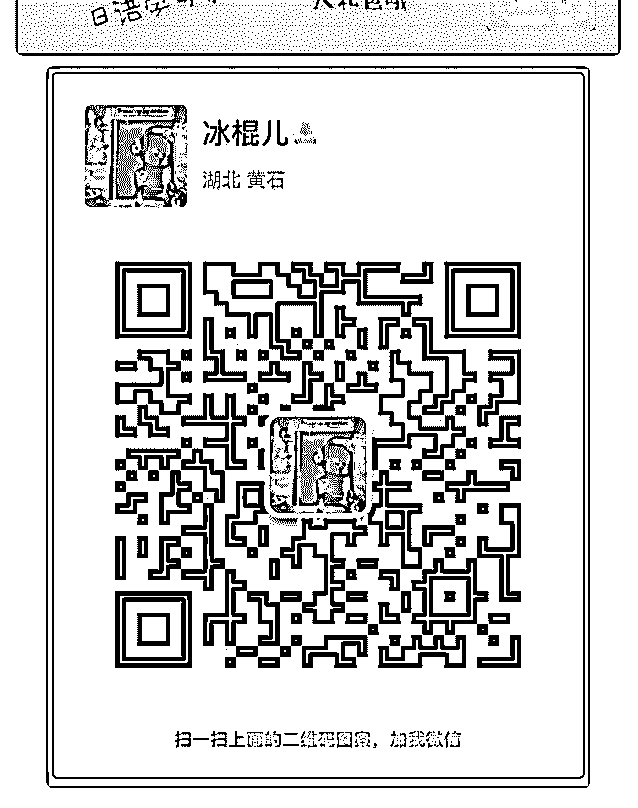

# 一年多前加入泽宇社

一年多前加入泽宇社交课，无学习，无实践，无作为。

一年后重新返回泽宇核心课，在 12 天内实现了从明确定位到

双渠道变现的过程。

9 月 13 日，在波力的指导下定位日语；

9 月 20 日，开始正式在朋友圈输出定位相关信息；

9 月 23 日，在波力的指导下打磨出新的自我介绍；

9 月 24 日，成功转化一位好友成为核心课学员，获得第一笔变

现，进入研习社；

同样是 9 月 24 日，在波力的指导下打磨出新的自我介绍，吸引

两位学员，其中一位正式预约成为付费学员，学费 1399，十

月开课。

10 月 1 日，收到首期分期学费 240 元，正式开启付费教学。

反思：

1.不要自己瞎琢磨，有问题直接找助教。

2.时间很宝贵，要高效学习高质量输出，不要浪费人生。

3.目前定位相关的社群只有一个，需要再多寻找一些。

2018-10-02(12 赞)

评论区：

HD－个人品牌咨询师 : 无学习，无实践，无作为，的确如此，行动才是真理

仰望 : 感觉你们都好优秀啊

冰棍儿 : 进入核心课的人们都很优秀呀，认真学习并实践泽宇核心课，你会更加优秀的[愉快]

关注公众号"懒人找资源"，星球资源一站式服务