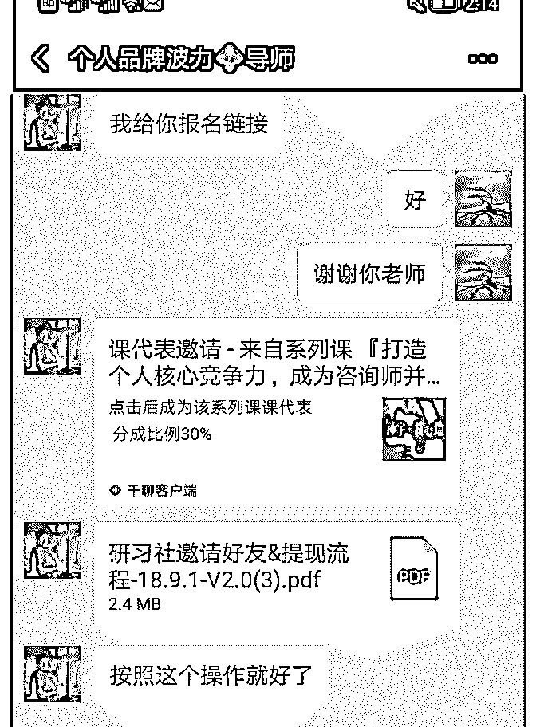
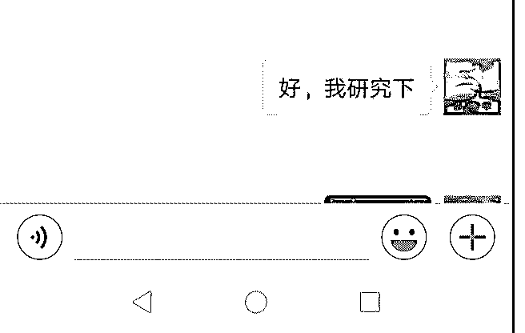

# 数点加入泽宇教育的

邹晓 : 数点加入泽宇教育的成长 感恩迪辉的老师热情的分享，无私的给我分享她知道的，感 恩生命中出现这样一位好朋友。 因这自己的经营个人品牌的需求，迪辉老师介绍我认识到泽 宇教育。 刚开始即使自己感兴趣，还顾虑的原因是，之前自己也学习 了很多的课，但最后对自己都没有实质性的成长。就担心白 花钱，在迪辉老师说波力老师对学员的用心服务，我就果断 加入了。 感恩波力老师细心耐心的指导我，帮我分析，诊断。收获到 自己的定位，自我介绍，自己适合的职业类型。让我越来越 静下心来认知梳理自己，越来越清晰。 感恩加入这三天时间，真正全心学习一天，收获很多，是我 之前花了几千元都不及的落地实用。感恩自己这么好运气遇 见泽宇教育。 感恩波力老师的鼓励，我今天决定无论如何都要达成一名的 分享。就带着自己这两天学习到的内容，和对老师辅导的内 容，很有收获的感受分享了出去。结果就达成了。 也感觉了设定目标，就一定可以达成。每天持续的操练自 己，必越来越好，越来越有信心。 也收获到了只要真心的带着一颗帮助他人的心，对方一定可 以收到的。 今天记录了第一课和第四课的学习，并做了笔记。明天再听 一遍，再总结一遍就发复盘。 今天也学习了泽宇老师分享的情感自由。很多思维上的引 领，受益良多，具体明天再分享！ 加油，持续的重复的去做，一定会达成自己期望的结果！ 2018-09-30(9 赞)

关注公众号"懒人找资源"，星球资源一站式服务