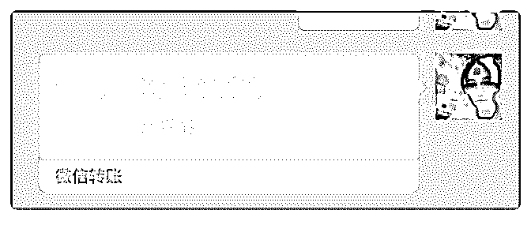
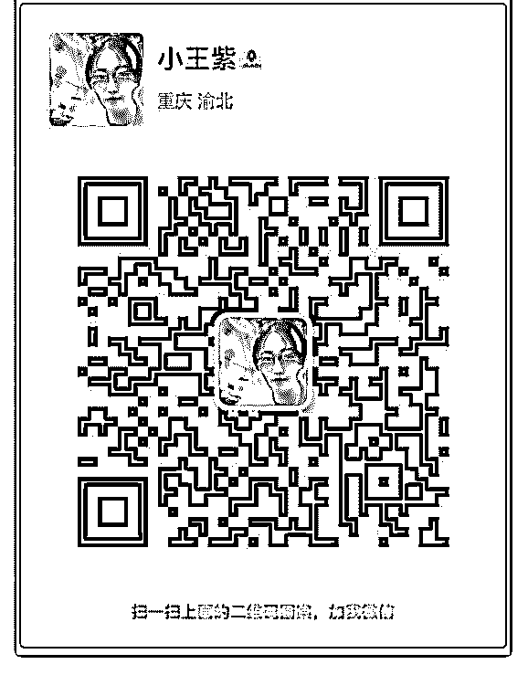

# 今天真的是很开心，

小王梓 : 今天真的是很开心，因为有一位客户在短短不到一周 的时间里面就实现了月入 20000 的目标，今天下午特地跟我打 电话报喜，还发了一个小小的红包给我，他收入了 25800，说 发百分之一的红包给我分享喜悦。

他叫小乔，一直在做手机销售工作，他的方式一直都是哪款 好卖卖哪款，哪个出新就卖哪个。在我和他分析了每个品牌 的利润率和增长点之后，果断专注于一个品牌，并且正巧遇 到苹果发布会，我跟他一起做了两次测评分享，他将测评发 在他的群和朋友圈里面，两天的时间就有 100+加他的微信， 跟他咨询新款和旧款的利弊。在耐心帮助很多朋友解决了疑 问之后，第三天就开始有人找他买手机，而且每天都有几个 意向客户主动询问。

我想说的是，不管你的产品是哪一类，你都可以通过打造个 人品牌来进行销售，而且你的定位越精确，专业度越高，品 牌塑造做得越好，那么你变现的可能就会越大，速度就越 快。

最后，一如既往的自我介绍

【昵称】小王紫

【坐标】重庆

【标签】高级个人品牌咨询师，多家公司合伙人

【个人经历】

①两年间从一个超内向的女孩，到创业，到收入翻倍，能够

与世界常青藤学院高材生合作共事，个人成长迅速。

②留学公司、餐饮公司合伙人，两家公司均已实现盈利。

③泽宇教育重庆城市合伙人。

④半年时间帮助 10 位小伙伴月收入突破 20000。

⑤终身学习者，致力于研究高效学习，个人快速提升以及时 间管理相结合的个人品牌成长体系。

【我能提供】 1、帮助你自我定位，分析并解决个人品牌问题，实现自我跃 迁，并实现变现。 2、英语、留学方面的帮助，包括速成、雅思托福等。

2018-09-25(24 赞)

娜姐 | 情绪管理 :

关注公众号"懒人找资源"，星球资源一站式服务