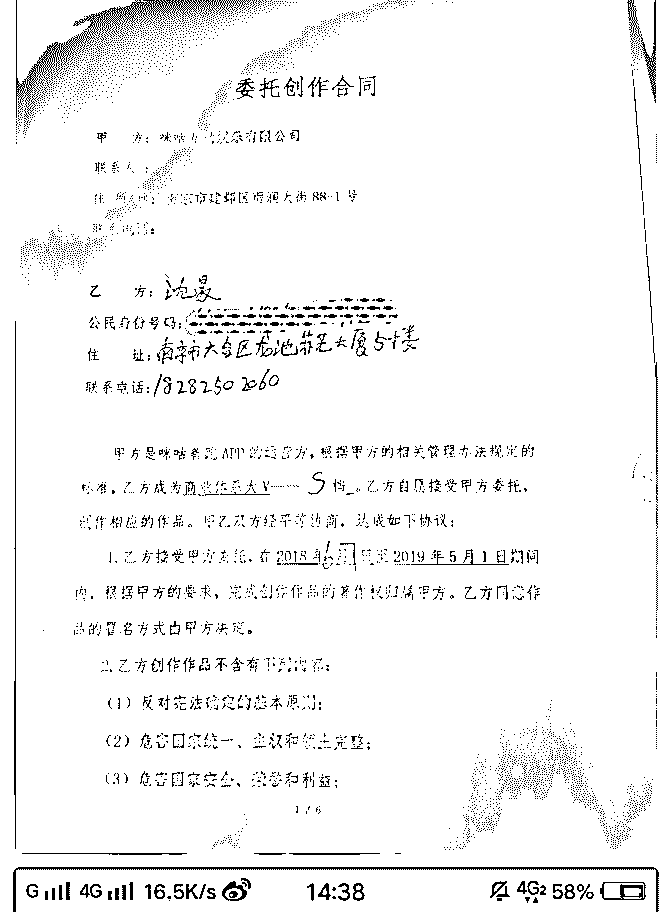

# 加入泽宇导师计划，

沈晨 : 加入泽宇导师计划，我通过个人品牌打造，额外收入

18594！

自从 8 月底加入泽宇的课程后，对于自己个人品牌的建立，以 及自己众多的专业技能，有了很好的定位，先是通过自我介 绍成交一单减肥课程，又通过自我定位确定了接下来工作的 方向。

而朋友圈的打造，让我明白随便发发消息，配几张图片，是 没有办法吸引到别人的。提供有价值的干货，让看了你朋友 圈的人觉得你可以解决他们的一些问题，自然就会来主动咨 询你。很多人都在困惑什么是有价值的干货?我的思路是换位 思考，如果你是客户，别人提供什么样的内容，你会觉得有 用，甚至愿意付费。所以自己的定位决定了你干货的内容。 拿我自己举例，我的定位是健身，以减肥塑形为主，很多人 减肥就关心两个问题，怎么吃，怎么练，如果我写这方面的 内容，他们一定会看，当他们觉得有用的时候，就会持续关 注我，甚至主动问一些问题，这就是好的开始。周末休息， 有一个以前的客户现在在南京做生意，朋友圈给我点赞之 后，第二天突然就带着他儿子来我的健身学院找我，简单问 了下学习内容和学习时间，很爽快的就交了 18000 元现金，我 本来想让微信或支付宝付款，也好截图，可以人家土豪交现 金[呲牙]这一单我也没有想到，成交的原因仅仅是我在朋友圈 里发了一些学生训练的照片，毕业的照片和对比照片，被他 看到了。

再来说说定位问题，很多人不清楚自己定位到底要怎么选。 我的想法是一定要选择你自己熟悉的，或者你自己在某个领 域沉淀了很久来作为自己的定位，然后深耕，做到别人有的

你也有，别人没有的，你也有。这个就需要自己的积累了。 拿减肥来说，都知道管住嘴迈开腿，但是事实确并非如此， 你还要考虑职业，地域，饮食习惯和个人的身体素质等差 异。我自己积累了十二年的经验，13000 多个小时的一对一授 课，不管你在家还是在办公室，自己做饭还是在外面吃，聚 会，烧烤，喝酒可以不需要担心，都可以让客户达到自己的 理想效果，如果另一个教练让客户这也不能吃，那也不能 吃，还要吃健身餐或者水煮的东西，客户当然不愿意付费！ 所以，想想自己的定位到底该怎么选择。我认为一个搞电子 商务的人，定位帮助别人减肥，一定不能成功！

最后再来说说行动力的问题，我认为泽宇的课程是好课程， 但是把课程转化成现金的只是少数，我个人认为是缺乏行动 力造成。多数人缺乏行动力的原因是满足于现状，总想着今 天就算了，明天还有时间，明天完成目标！结果就导致一步 跟不上，步步跟不上。量变产生质变的道理大家都懂，但是 真正行动起来的人却少之又少，就好比减肥，你每天运动 10 分钟，坚持一个月下来，一样可以瘦 3-5 斤，很多人刷抖音， 玩把吃鸡都不止十分钟吧！当然，我自己的行动力也还需要 提高，有时候一忙起来就会把原本的计划打乱，接下来工作 重心是复制自己，到时候分享我的方法，和大家一起交流！

最后在介绍下我自己，我是沈晨，你可以叫我皮老师，目前 在江苏南京从事私人教练的培养工作。是咪咕善跑签约作 者，微博粉丝 49 万人。2006 年进入健身行业至今，累计授私 教课 13000 节以上。现已培养出上百名私人教练，活跃在各大 城市。我能提供有关健身的各方面知识，以减肥塑形，饮食 营养和教练职业规划为主。我现在档期排的比较满，如果你 愿意，我很乐意花时间免费为你 1 对 1 做咨询。由于时间有 限，每周仅限 2 位。

2018-09-24(34 赞)

关注公众号"懒人找资源"，星球资源一站式服务