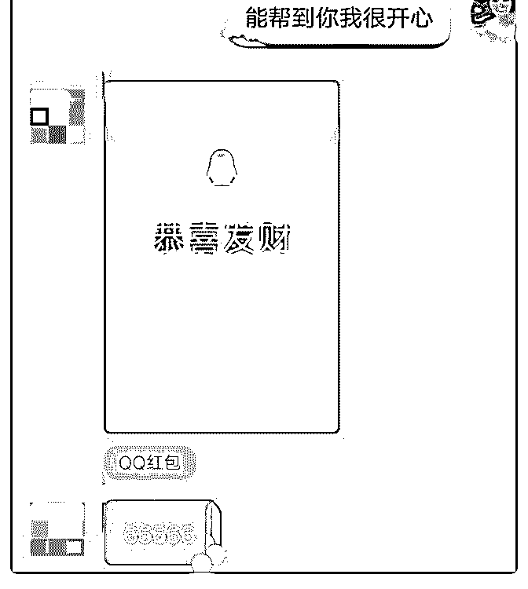
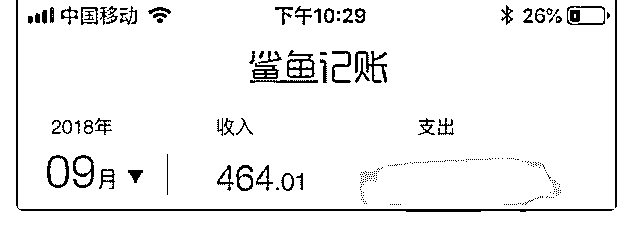

# 加入 1 个月零 13 天

杨培盼 : 加入 1 个月零 13 天。赚了 490（打赏，课程，卖产 品）。

重点说下，这些都没有怎么花我的时间，就是自己的人品攒 起来了，大家都会主动来找你。平时该干嘛干嘛，赚钱是顺 带的事情。

1， 学习的核心课程，我先是将社交课学习一遍，每天交朋 友，在这个过程中，得到了一些朋友的帮助，他们教我如何 写自我介绍，如何发朋友圈。

因此，我能够更好的展现自己，获得更多的朋友。

2，在核心课更新到 2.0 的时候，听了一课，就是不要给自己设 限。现实生活中，我的确有很多给自己设限的地方，也多这 次的专业变现，没有太多信心。

在以后的学习中，群友们也说了很多克服自我设限的案例， 让我觉得，没有什么是完成不了的。所以，每当我遇到困 难，就会在心里给自己打气。

3，以输出倒逼输入。得到了自己的第一笔打赏。有天请教波 力，说我一直都没变现，自己还没有到很精通的地步，更没 法教别人，然后波力就教我输出倒逼输入。

在这个过程中，我巩固了自己的知识之外，还因为帮助别 人，得到了被帮助者的认可。其中一个是深夜 12 点多了，我 帮他解决问题，给我发了个感谢红包。

【图 1】

至从，我收到了第一个红包，也顺利的加入了研习社。

4，在研习社，学到了高效学习，还有怎么发朋友圈，怎么加 群，加人后如何转化。最主要的，我们不要去推销什么，而 是要靠自己的成长和变化去吸引别人，给别人做标杆。

5，昨天跟波力的 1 对 8 解答，我一开始还是挺忐忑的，因为我 感觉自己不是一个好学生，可能很多人都会遇到这种事情， 就是专注力不够。在这个过程中，波力教我要专注在最当 紧、最核心的事情上，其他问题都能迎刃而解。

6，学会买别人的时间，就是在延长自己的生命。所以，我以 后要有什么不懂的地方，要及时的请教老师。

这邀请一个朋友来加入，这是我一个非常非常好的朋友，因 为我加入这个课程有收获，觉得非常棒，就推荐给她，希望 她也能学习有收获。多年积攒下了的人品，以及刚好她也有 需求。（后续佣金退给她，她也没收）

【图 2】

以前积累的人品，所以不用发广告，也是一直在购买。所 以，个人品牌宣传到位之后，是可以实现躺赚的，只是，前 期需要多付出些。

【图 3】【图 4】

2018-09-24(14 赞)

Shiyu Guo. :

关注公众号"懒人找资源"，星球资源一站式服务

# 1.想说一下最近引

1.想说一下最近引流方面的突破

一直在做知乎引流，但效果都不是很好

一个好的知乎答案是什么

是找到痛点

然后猛戳

之前我都是用写文的方式在知乎做引流

转化一下思维改用视频

收到的效果很好

一天下来有 46 个人从知乎加我

大家也可以尝试

2.目前为止九月变现 464RMB

我想攒钱做我去纽约的费用

保持一颗平静心，虽然远远不如大佬

但我能挣到一百就有办法有信心挣到一千

前些时候因为没有成功案例咨询做的不好

有些丧气，甚者别人的咨询也不想回

今天上海九月份第二次聚会和波力奶爸一起交流，不知道是

火锅太好吃还是波爸干货太给力，我能感觉自己在整个交流

过程中眼睛是发光的，整个人也是鲜活的，充满了生命力！

感觉每天都有惊喜 是我喜欢的生活状态！

2018-09-24(12 赞)

关注公众号"懒人找资源"，星球资源一站式服务