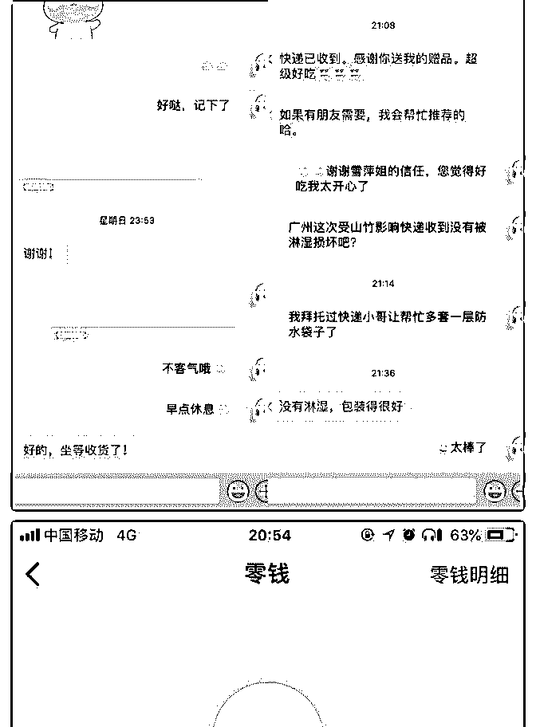

# 三天赚回学费，朝九

蒙小凤 : 三天赚回学费，朝九晚五的我是如何做到的？

加入【导师计划】3 天赚回学费，35 天个人品牌收入已超过本 职工作，把个人爱好和优势成功发展成事业，这是我的故 事：

通过黄老爷的朋友圈知道的泽宇，在网络社群和线上课程泛 滥的时候，一心想改变的我，中了买课的毒，就跟买衣服一 样，看见觉得还不错的就想买买买，于是我买了泽宇的社交 课，4 月份加入的泽宇社交群，看很多人都在知识星球分享关 于自己的内容，后来知道是因为分享多少次就能得到导师免 费一对一的指导。于是我也开始在知识星球分享，但我完全 不知道要分享什么，就一直很佛系的打卡，事实证明，如果 不知道自己要干什么，是很难坚持下去的！我三天打鱼两天 晒网的佛系打卡，用了 3 个多月的时间才打卡了 30 次。我擅长 拍照，不知道分享什么的时候我就分享我拍的照片，倒是吸 引了不少小伙伴来关注我添加我的微信，但几个月过去了我 依旧没有任何的变现，也不知道自己可以靠什么来赚取副业 收入。

真正的改变是在 8 月初的时候，波力老师在我分享的内容下面 给我做了个评论，他说：“我们可以一对一聊下，怎么朋友圈 赚钱，你这个基础很棒的。”当我看见的时候立马就去私聊波 力老师了，我们约了时间，进行了一次深入的探讨，在这里 真的要特别的感谢波力老师，通过他那次一对一约聊帮我梳 理，我真的就豁然开朗了，通过“找到定位表”，我知道了自 己的天赋优势原来是做美食。发现原来以前的很多行为都是 自己的任性所为，自嗨，没有深入的剖析自己，当我对照定 位表，清晰的知道了自己的优势后，我就知道自己要做什么

了，同步我又购买了泽宇的核心课，跟着泽宇教的学，去打 造个人核心竞争力，真正的开始了我的蜕变，购买泽宇核心 课后，我一周就用 8 倍的收入赚回了课程的学费。

波力老师觉得我底子很好，邀请我加入导师计划，我听话照 做，在 8 月 15 日加入了导师计划。环境能影响一个人，你遇见 什么样的人，就会成为什么样的人，物以类聚，人以群分， 每天在群里看着大家积极正向，能量满满的样子，我自己都 不好意思懒惰，觉得比你优秀的人都在努力，我有什么资格 偷懒。反复的将泽宇导师计划里的 2.0 版本 10 节课都反复听了 多遍，认知在刷新，里面的方法都很具体和落地，我跟着 做，照着学，认真的去经营自己的朋友圈，打造我的个人品 牌，我将自己的朋友圈从头到尾梳理过，删除了那些自嗨的 和定位无关的内容，然后坚持每天在朋友圈高质量的分享。 找到了自己的定位，知道了自己要做什么，结合自己优势， 我开始在我的朋友圈卖我自己做的私房阿胶糕，三天赚回了 学费，从选食材，到熬制，包装、拍摄、写文案、做推广， 所有的工序我都是亲力亲为，闺蜜说我一个人成了一支队 伍，我想这就是兴趣吧，做自己真正热爱的事情，你就会去 想方法，而不是找借口，截止今天是我加入泽宇导师计划的 第 35 天，我已经成功变现 1W+，这个月的额外收入第一次超 过了本职收入。

这让我不仅从物质上得到了满足，更重要的是精神上得到了 很大的安慰，更加认可自己，才知道原来之前一直是在自我 设限，原来自己也具备优秀的能力。因为突破了自己，跨过 了自己的第一个里程碑，实现了变现，也因此得到了 C 宾的一 对一指导，通过 C 宾的指导和梳理之后，我更加的清晰了接下 去，我要怎么做了，先有一专再有多长，多维度的去发展， 期待接下去开挂的自己，朝着每个月月入过万的目标迈进！ 再次感谢泽宇教育，感谢 C 宾，感谢波力，感谢自己没有放弃 自己。

想知道我更多故事欢迎添加个人微信：September88wang 2018-09-21(15 赞)

评论区：

波力 : 恭喜了[偷笑][偷笑]

蒙小凤 : 哈哈，谢谢波力的指导，让我开窍了[调皮]

关注公众号"懒人找资源"，星球资源一站式服务