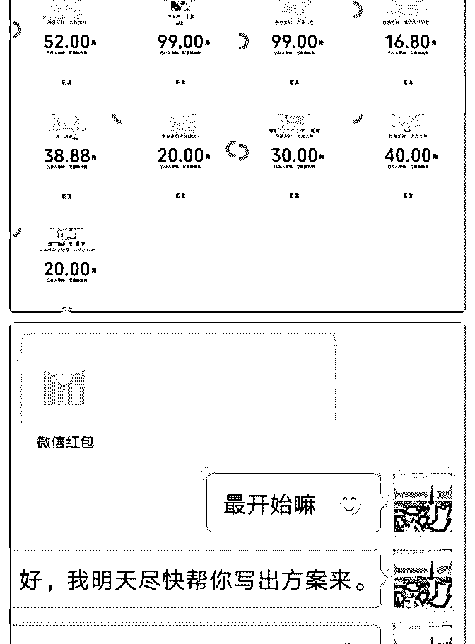
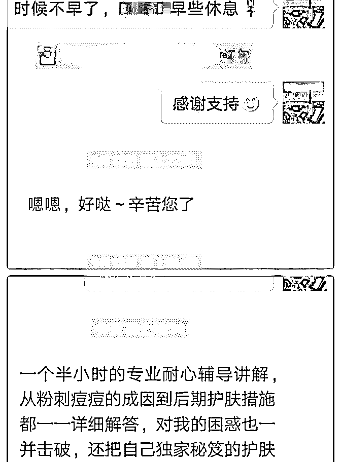
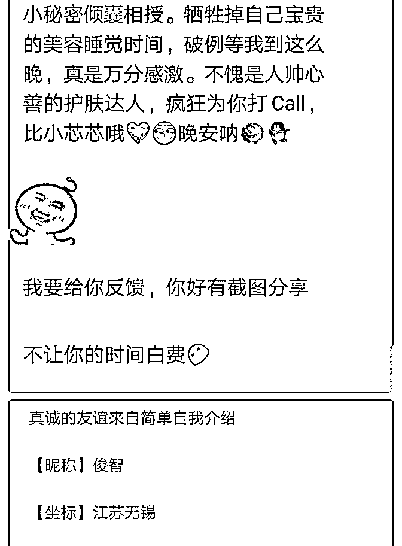
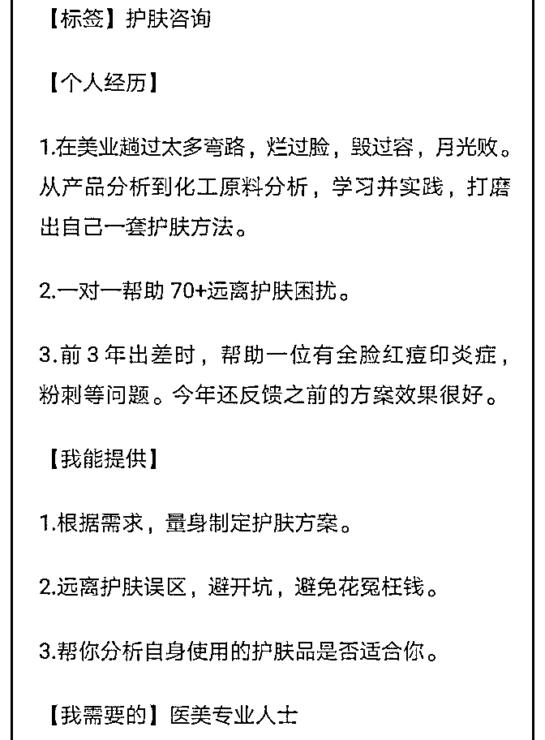
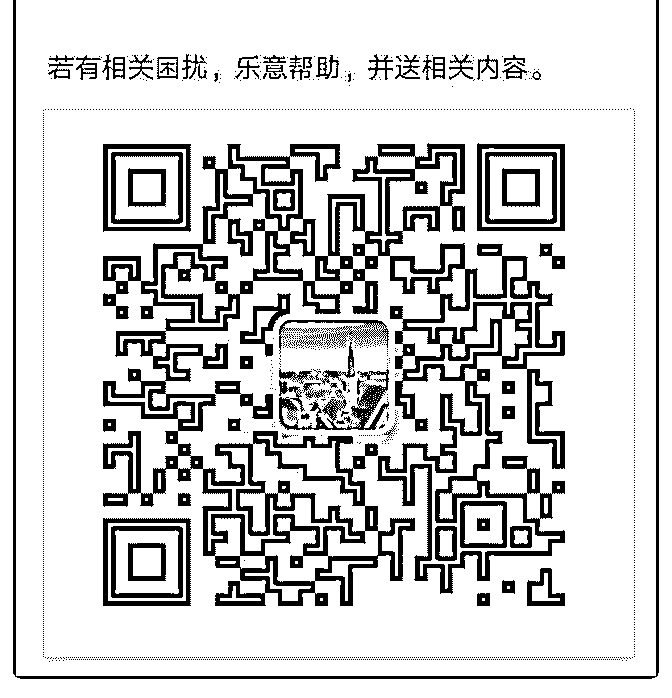
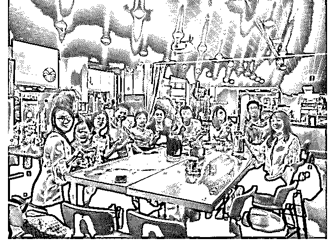
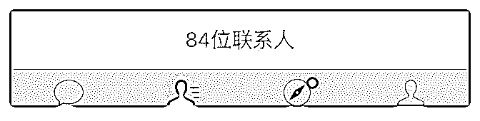
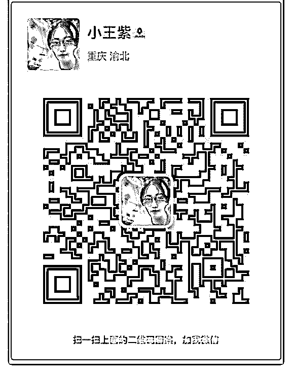

# 俊智打卡第 14 天

俊智 : 俊智打卡第 14 天 复盘成果 只要你愿意改变，所有的痛苦就是浴火重生的开始——俊智 1.加入泽宇大家庭一月零四天，赚 415.68。 （图 1-2）

2.我在绝望边缘走过，十分痛苦！我的经历和蜕变全部都在这 里。[玫瑰]

如果你也和我一样，这里说不定可以让你得到启发[玫瑰] 3.我按照泽宇课程，自己的导师去执行，我完成了赚回学费。

我分享了自己的成功案例复盘，希望你从中得到启发。[玫瑰]

我的经历

没有加入泽宇大家庭之前，我的生活布满阴霾。 中学被学校 以不收外地为由劝退，从小家庭给予了不少痛苦，现实中自 己没朋友。是一个三无青年，无论爱情、婚姻，事业，内心 深处一片迷茫。

上年 10 月 23 号我加入泽宇课程，当时我确实真正开心过。 但好景不长，由于处于阴霾的环境，伤害再次来临，内心难

受没有一个人可以诉说，我害怕找高人，很在乎被看不起。

躲在被窝颓废着砸钱玩游戏才感到一丝的好受，放下游戏准

备入睡的时候，急剧的痛苦只有安眠药才可以入睡。

直到有一天，终于！我得到了熊凯、千老师都帮助，他们像 一束阳光，驱散我内心世界的乌云！波力老师，然果的指导 使我看到阳光下还有彩虹。

[太阳]我的改变 加入泽宇大家庭使我明白：

游戏就像小型宇宙空间，把一个人的时间，精力，人生全部 剥夺。

包括商业的运营模式，比如打工 ，连锁加盟，它们都有个共 性就是让你投入他们的品牌中，恰恰你却失去了自己的核心 竞争力。

古代的帝王就是拿重金买他人精力和时间，甚至人生，来完 成自己想要做的事情。你得到的只是钱，而他得到的是天 下。

由此可见，个人品牌的重要性！就像：“你做的拉面是世界第 一，别人想起拉面就会想起你”。 这就是你的个人品牌，而不 是某某饭店埋头苦干的大厨，谁家的饭好吃，只会记得饭店 招牌，而不是厨师。

我的感受： 新的开始，重新回到泽宇大家庭一月零四天，赚回来学费

（图 1-2）

我以前爱玩游戏，现在觉得人生才是真正的游戏！ 我通过输出每天早上打开手机就有人加我，然后问我问题，

通过输出赚回学费，感到特别开心！！！

玩个游戏牛逼了，在现实中不好炫耀，而人生是世界上每个 人都需要的，都要去经营的。 学习定位过程特别另我开心！实现自我价值！内心富有自 信，充满阳光！比玩游戏过瘾 N 倍！

我如何做到的[玫瑰] 第一步：先找到自己定位。

1.天赋：就是别人做起来困难，你做起来轻松事情就是你的核 心竞争力。

2.定位自己的价值：就像在欧洲有中餐馆一样。客户需求比 如：老外想吃特别的美食；华人在国外想吃家乡菜一样，正 好我可以给他们。

第二步：输出自己的定位。输出高价值自然会吸引有需求的 小伙伴。

注意：不要在泽宇社群，星球输出与学习无关的内容。

1.高价值结果：有需求的小伙伴看的是理想结果，所以，作为

咨询师必须要可以给予对方想要的结果，因为她们要的就是 理想结果。

2.后置回报：作为咨询师，是要给对方提供价值，那么首选了 解对方的需要，了解对方的苦恼，然后再输出高价值，对方 自然会因为你感到开心。（图 3）

3.输入再输出，最后复盘：不断学习定位内容专业知识，然后 去输出高价值，自然就可以吸引很多小伙伴。很多小伙伴有 需求都会付费了解你的专业知识。

可能你会说：“百度可以查相关资料”。我相信百度有，搜索 出来的大量信息，这些你需要判断哪些对，哪些错的，零散 的信息还要花很多时间去弄。

而作为咨询师是提供别人价值就是包装好的高价值，直接就 可以拿来执行去做就好了。

第三步：遇到问题要知道求助 当你遇到困难认知有限，你很难走出阴霾，就像我的经历一

样，这个时候就需要高人懂指点。

我父亲最近听一首歌单歌词：“还没刚刚学会包容就老了，还 没刚刚学会成熟就老了”。

这歌词就是说的一个人的格局，你一个很难走出。而高人指 路就不用到老了才明白。

2018-09-18(10 赞)

评论区： 咖啡不加糖 : 受启发

姚沛淳 : 2018.9.15 日下午

关注公众号"懒人找资源"，星球资源一站式服务

# 2018.9.15

很感恩缘分，让原本是水平线的我们有了交集，感恩泽宇教 育这个平台，让大家在这里相聚❤

九月匆匆而过，我们定了本周日下午相聚于茉莉空间，露露 同学来的最早，每个人都在这我们这个小集体奉献着光和 热，露露很细心，准备签到的东西，又把大家照顾的都很 好。

人陆续的到来，心作 陈辉 梦希 丽新 月月 墨兴 苏柏 倪倪

每个平凡的背后都有着自己生命的非凡，也都在谱写着属于 自己的故事，自我介绍完大家聊的巨火热 真的是同频相 聚。 在大家的集思广益下，我们日后会有很多丰富的活动，例如 每个月的吃货小分队，把赚钱作为最好的修行， 练习吐字清 晰的小群等等

这个世界上没有一个让每个人都会满载而归的平台，但我相 信，我们在任何一个平台上的收获完全取决于我们自己的投 入度和参与程度，学习社交的第一步，先把自己从家里拉出 来，跟人在一起，阅无数人，被无数人阅，我们方可成长成 为自己想要的样子，下一期，期待有你❤

2018-09-18(12 赞)

关注公众号"懒人找资源"，星球资源一站式服务

# D6 学习泽宇课

小王梓 : D6 学习泽宇课程十天，新开微信号好友从 0 到 80+

我不是一个很喜欢社交的人，甚至比较自闭，后来又因为创 业太忙，我一度停止了许多无效社交。刚来泽宇学习的时 候，我内心其实是很怀疑的，不相信自己能够快速收获很多 能够共同学习进步的朋友。在听完了泽宇课程和波力的课程 之后，我开始一步一步地践行，刚开始加群的时候遇到了很 大的问题，总觉得群不够活跃，人不够多。这两天在波力的 帮助和鼓励下，在目前所有的群里面进行价值输出，吸引了 很多朋友。波力为了给我们新人信心，自己跑去一个只有 61 人而且已经作死的群里面进行价值输出，获得别人的关注。

所以我想说的是，学习了课程之后，最重要的是践行，按照 步骤去做，相信都会实现自己的价值。

大家好 良好的沟通来自真诚的自我介绍

【昵称】小王紫

【坐标】重庆

【标签】高级个人品牌咨询师，多家公司合伙人

【个人经历】

①两年间从一个超内向的女孩，到创业，到收入翻倍，能够

与世界常青藤学院高材生合作共事，个人成长迅速。

②留学公司、餐饮公司合伙人，两家公司均已实现盈利。

③泽宇教育重庆城市合伙人。

④半年时间帮助 10 位小伙伴月收入突破 20000。

⑤终身学习者，致力于研究高效学习，个人快速提升以及时

间管理相结合的个人品牌成长体系。

【我能提供】

1、帮助你自我定位，分析并解决个人品牌问题，实现自我跃

迁，并实现变现。

2、英语、留学方面的帮助，包括速成、雅思托福等。

若能提供帮助，很愿意提供一对一免费咨询，并分享个人品 牌变现方法。

2018-09-14(7 赞)

关注公众号"懒人找资源"，星球资源一站式服务