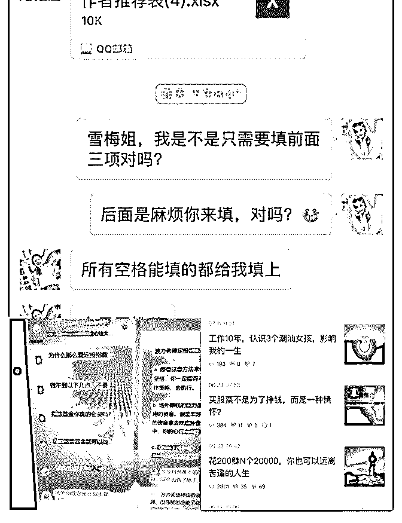
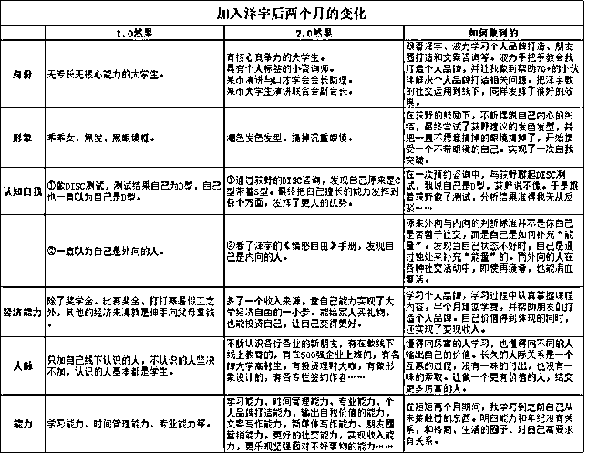

# 课程复盘# 打卡

Judy 指数基金 : 课程复盘# 打卡 day9 波力老师说课程有更新了，要赶紧去听下，果不其然，听后 获益匪浅

2.0 第四周：咨询师，逆袭人生的正确姿势 听的过程中，自己时不时会觉得：噢，原来是这样，应该是 要这要做

很庆幸自己正在一步一步按照这个步骤来实现 特别是对自己定位不是很清晰的伙伴更要花时间去听下这节 课程

你会很快找道自己的定位的 课程中给我印象最深刻的地方： 1.如何快速定位

2.如何高效学习

3.如何刻意练习

4.如何输出价值

5.如何写自我介绍模板

6.如何加入社群

7.你现在所处于的阶段

8.最终愿景：只要你能赚到 1 元，你就能赚到 100 万

这都是我之前学习所遇到的问题，一直不是很清晰的地方，

在这节课全部可以一一找到答案，赶紧行动吧！

加入泽宇一个月不到，我的转变，应该说是蜕变，身边的 人：

我妈说：是不是着魔了，每天写写写 我老公说：我媳妇这么努力赚钱，我好有压力呀[偷笑] 我宝宝说：妈妈每天学习，我也要好好看书 是的，加入泽宇我每天都在进步： 1.微信好友从 1700 位到现在的 2092 位，其中大部分是价值输出

吸引而来 2.每天都有价值输出，每天都有小伙伴来咨询，收红包收到手 软 3.每天都有写文章，简书 18 篇文章，其中 16 篇为指数基金专业 文章，单篇浏览量到 2800+ 还不包括打卡的输出，这就是所谓的输出倒逼着输入 4.还意外收到雪梅姐通知我可以申请为随手记的签约作者，希 望能通过 5.微信朋友圈的文案信手拈来，这个转变很大，以前想半天写 不出两句[坏笑] 6.现在可以很轻松的解决小伙伴提出的关于指数基金的问题， 全部都有对应的文章解答， 波力老师让我着手开始做自己收费的知识星球 7.每天早上 6 点起来坚持学习指数基金专业知识至少一个小 时，每天晚上回来提供咨询，整理文章，让自己变得更专业 8.8 月收益总结：其中一只指数基金收益 1609.33，开始尝试股 票投资一只获得收益 558.92，p2p 理财收益其中一笔到账 986.82，理财通已获得收益：4942.56 总计 8097.3 纳指和标普

500 获益 15%的收益（只记得大概的金额了）算了，不计算在 内，其实还有基金和股票的分红

记得 Lorna 老师说过，只管站在别人看的见的地方输出自己的 价值 记得波力老师说过：多维度提升自己 N 倍附加值的第五种人： 不断提升自己专业的能力+学习外语+学习摄影+学会写作+会 多渠道投资

看样子我还有很多需要学习的地方[奋斗] 特别感谢波力老师和雪梅姐，感谢一起给我鼓励和加油共同 成长的伙伴们

之前打卡特别期待有人给我点赞和鼓励 现在想想，成长是一场和自己的比赛，不要担心别人会做的 比你好，你只需要每天都在做得比前一天好就可以了

这一生我们能力有限，但努力没有极限。

2018-09-12(24 赞)

评论区：

HD－个人品牌咨询师 : 太棒啦，一直在看你一步步的成长，行动力真的强

Judy 指数基金 : 谢谢鼓励[拥抱][拥抱][拥抱]

雪舞梅香 : 小仙女，你真棒！后悔没早点让你加入泽宇群

Judy 指数基金 : 谢谢我雪梅姐❤ ❤ ❤

Echo : 佩服，向你学习

blue :

DAY6 打卡

关注公众号"懒人找资源"，星球资源一站式服务

# DAY6 打卡第三

第三周的课程内容：下半节

听课时说每周课程要用一周时间去实践，加入时已经更新四

节了，现在把每周的课程都听完，做好笔记，慢慢跟着去实

践，我知道不能急，把每周的课程，一步一步去实践，不能

跳步去学习的，但是今天我要复盘第三周下半节的课程，把

核心课程都认真过一边，大概知道内容，心里有底去学习。

1，学习理财的人都知道复利这个词，但是还真的不知道人脉 也有复利这一说法的，当你认识的人多，时间久了显示出来 了。

人脉＝初始人脉（1＋新朋友数量）天数 这里主意一点就是我们社交的同时也要提升自身价值，让自 己有核心竞争力。

接下来重点。 泽宇老师说，这十个点自己反复去研究想想自己哪里没有做 到的，写下来，然后去实践，再去复盘，利用一个月去做， 肯定有变化的。

1.展示自己 这个以前我还真的不会去展示自己，朋友圈空空如也，没有 什么看头，别人看我朋友圈不会知道我是一个怎么样的人， 我的生活怎么样，所以我现在就要学会如何去打造自己朋友 圈，大胆去展示自己，不要去怕别人说自己怎么样，道不同 不相为谋吧

2.为人靠谱

凡事有交代，件件有着落，事事有回音 这方面有做得很好，没有什么给人不好印象。

3.成为贵人 以前还真的觉得自己不厉害，怎么去提供价值给别人，还不 求回报，觉得厉害的人才会成为贵人的，去帮助弱小的人， 看来想法错了。接下来，我要去提供价值，利他，不求回 报，不计较得失，这样才会慢慢遇到自己贵人。

4.心怀感恩 这个必需去做的，人家帮过你，你要懂得感恩，可以去提供 帮助，能力虽小，至少你去做了。

5.待人真诚 你能做到的事就是这样，不要夸大事实，不要去说慌，谎言 总有一天会揭穿的，所以我们用实事求是去做人。

6.有上进心 这个我觉得自己有三分钟热度的人，做事容易半途而废，遇 到困难会去逃避它，懒惰，拖延症全都有，所以才会导致生 活事业遇到瓶颈期。加入泽宇就是要改变，要去行动，其实 进来后看到小伙伴那么优秀，行动力杠杠，自己心里挺着急 的，想快速成长，但是我知道，急是不行，要一步一步跟着 课程来，去实践。

7.乐于助人 这个真的说得容易，做得难，以前的我会很怕麻烦别人，怕 自己会给人带来不好的印象，都是自卑导致的，活在别人说 话里，泽宇老师说，自信是不需要任何东西左右，自信是以 自己为中心的。所以你不说出来，什么都不提，人家还真的 不知道你发生什么事，你自己想的太多，没有人知道的。所 以希望自己可以做出改变，做真正的自己

8.空杯心态 承认自己的无知

每个人身上都有自己的优点，有想要学习的地方，相互学 习，相互利用，互换价值。所以真诚对待每一个人，发现身 边人的闪光点。

9.坚持原则 做人就是要自己底线，有原则去做事，不但得到别人的尊 重，也拒绝好多不必要的麻烦，不同频道的人，道不同不相 为谋吧

10.活在未来 让别人看到你的可能性

想要成功现在就要开始，不要老说等我成为谁才说，先去做 才有可能成功，要做一个做得多，想得少的人，现在马上去 行动

2018-09-12(7 赞)

评论区：

HD－个人品牌咨询师 : 打卡非常赞，看的是真的认真学习课程内容，加油，看好你

HD－个人品牌咨询师 : 已加精，可以发群里和大家分享哦

blue : 谢谢华丹老师，我昨晚分享了[愉快]

健康管理——吴琼 : 2018-09-12(3 赞)

关注公众号"懒人找资源"，星球资源一站式服务

常燕飞~ : day04

开了第一单

关注公众号"懒人找资源"，星球资源一站式服务

# day04 开了第

成为小星助教一个月了，终于可以使用这个标签啦。

在同一个付费社群认识的好友，因为产后身材一直恢复不

了，看到我在朋友圈展示的健身成果，非常心动。

但可能之前花了很多的冤枉钱，没有什么效果。担心对自己

无效，一直在观望中，前后通了 3 到 4 次话。

之前由于我不懂的怎么了解对方的需求，说话又抓不住重

点，总是说自己的想法，又没有了解对方意思，谈话多次中

断。

后来经过小星的指点反馈，加上波力在研习社分享的如何练

成金手指的内容。

让自己慢下来，不要自以为是的总说自己的想法，而是多思

考对方背后想要达到的真正目标。

最后一次因为朋友圈的展示，对方主动找我咨询，最终付费

成交。

2018-09-11(7 赞)

关注公众号"懒人找资源"，星球资源一站式服务

# #两个月复盘从来没

然果. : #两个月复盘 从来没想过当初犹犹豫豫加入泽宇，却给自己的生活带来了 翻天覆地的变化。对自己的第一笔投资就投资对了！

深夜认真做了两个月的复盘，发现两个月里自己成长了很 多！

（图一详细列举了各种大变化！）

两个月的时间，身份、形象、自我认知、经济能力、人脉和 能力发生了大改变。让我更加确信，能力和年纪没有关系， 和格局、生活的圈子，对自己的高要求有关。

感谢各位导师助教们的用心指导， 也感谢能在泽宇教育与大家一同成长。 未来，让我们拥抱更好的自己！

2018-09-11(24 赞)

评论区： 寇洁 : 榜样~

然果. : 谢谢语嫣[愉快]成长不是一个人做到的，感谢你的鼓励！ sing : 厉害的大学生啊

关注公众号"懒人找资源"，星球资源一站式服务

# #泽宇教育·深圳第

芬芬 : #泽宇教育·深圳第一期聚会复盘#芬芬

期待 N 久的第一次泽宇线下聚会，从下午 2 点聊到 6 点，大家都 还舍不得走，那一刻应该都希望时间能停止一下，线下活动 真的想象中更有吸引力和魅力，也是很多人尝试突破自己的 第一步。

有时候会感慨这个世界很微妙，比如这个平凡但是又不同寻 常的下午，认识了思维导图高手周老师，社交达人也是潜力 无限伟业，转攻财务领域的一米阳光，甜品糕点大师德能， 会演讲有逻辑的 IT 咨询师，腼腆却闪光审计师澈澈，幽默有 才定位做定位的文才哥。

模具设计师理工女小玲，企业高管逻辑超强雯领导，擅长 PPT 和理财的甜美美女豆子，积极主动阳光开朗阿朱，不动声响 学完课程把好友从 600 裂变到 2000 多的美女 sisi,还有我，职业 生涯咨询师，擅长挖掘优势和赋能。

庆幸自己的不设限，才能成为泽宇教育深圳合伙人，才能遇 见这么多有趣有料的人。也感谢大家的如约而至，期待大家 的复盘和反馈，也更期待第二期聚会。笔芯。

2018-09-09(8 赞)

小春 :

【小春 _Day29】

关注公众号"懒人找资源"，星球资源一站式服务