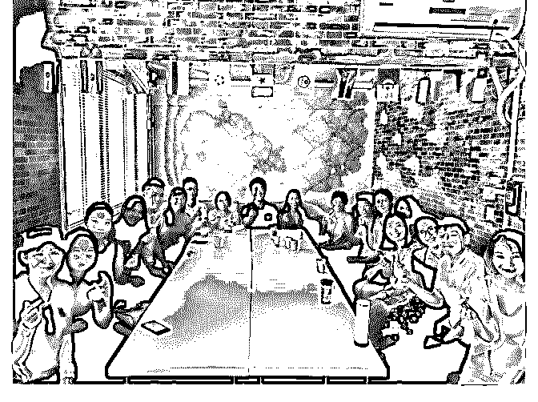
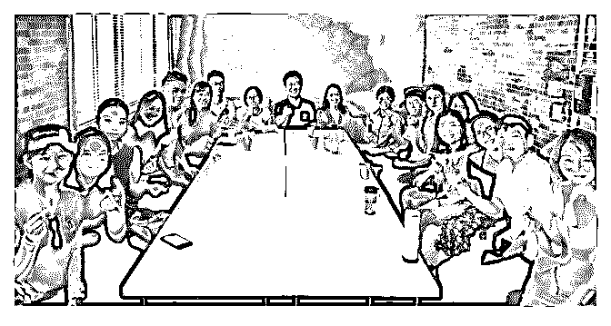
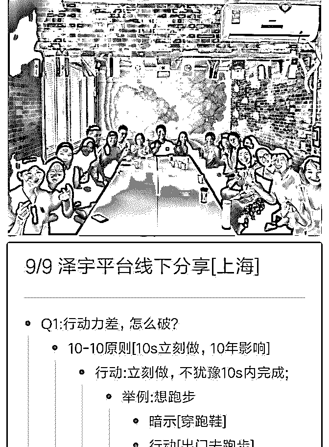
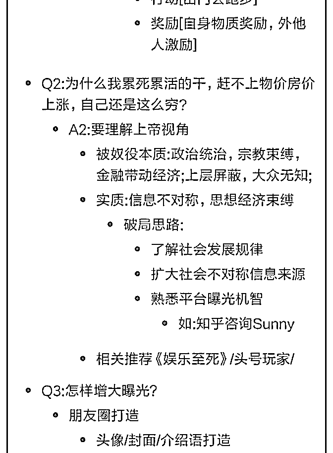
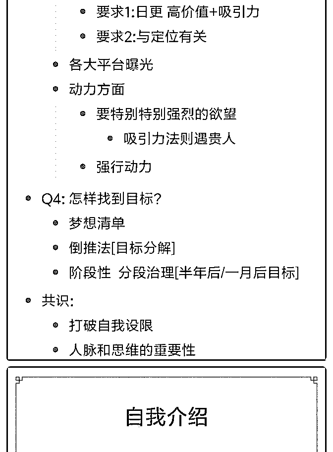
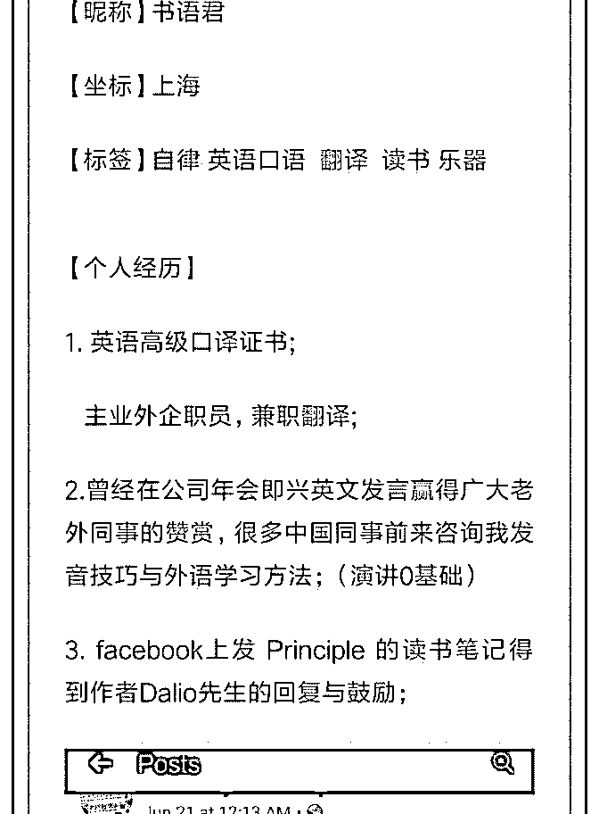
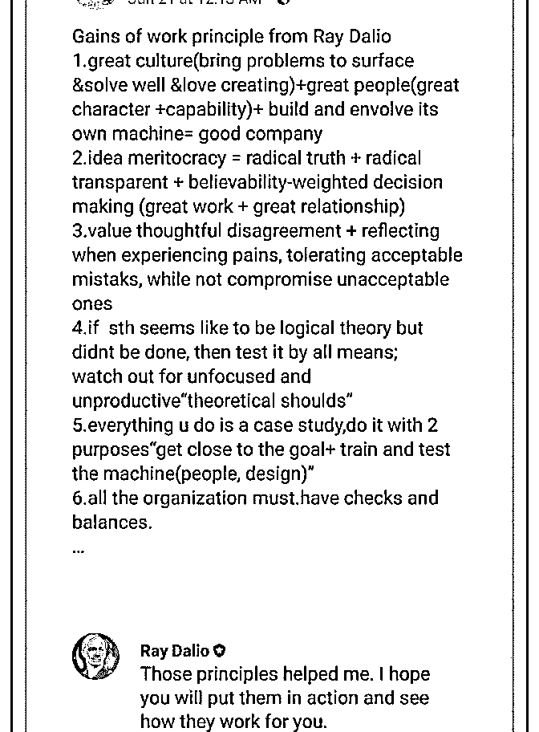
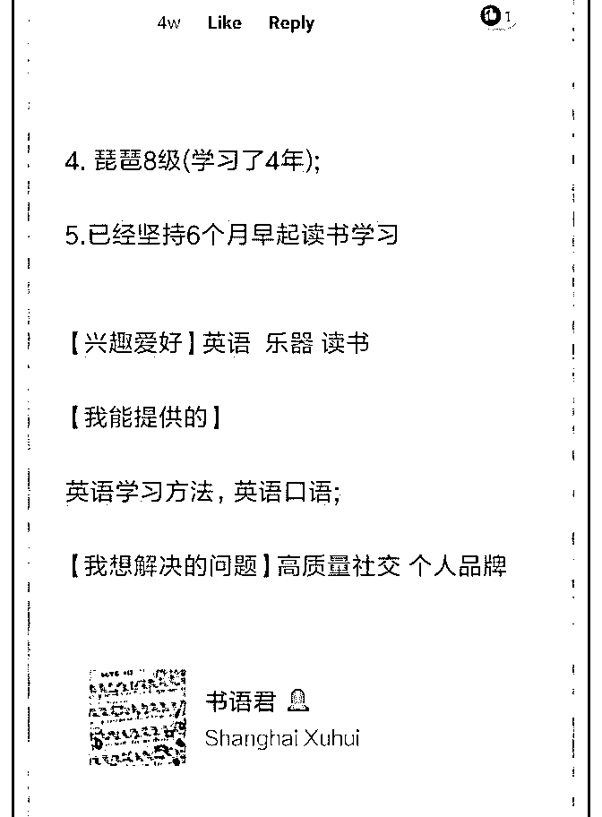

# 【小春 _Day29

9 月 9 号泽宇教育上海地区线下聚会

==============分割线==============

平时自己的交际圈比较窄，也没什么朋友，同事好几次让我 跟他们一起去体育馆打羽毛球，篮球，我都拒绝了，一直在 自己的社交舒适圈，日复一日，年复一年，我的生活无趣而 安逸。

此次得知上海地区泽宇教育可以参加聚会，像聚会什么的， 我从来都是想逃避的，记得上次公司生日会，我就差点没 去，学过泽宇讲的社交课，这是我的自我设限。

这次泽宇教育的线下聚会，正是突破我自我设限和舒适圈的 机会，我以前有社交恐惧，别人日常的交流说笑，对我来说 都是很有挑战的，始终放不开自己，但已经是以前了，不代 表我以后都不善社交。

今天还没遇到泽宇教育的学员们前，我的心一直是砰砰跳 的，带着紧张和不安，不过见到波力、黄老爷，熊凯，Lorna 和学员们，大家都非常的平易近人，感觉还是非常的舒适 的。

波力讲的关于行动力的我印象还算比较深刻的，如果你想跑 步，不要多想，10 秒之内，穿上跑鞋，换上衣服，立刻跑出 去。

首先感谢黄老爷找的场地和组织上海地区学员参加聚会，黄 老爷今天推荐的“娱乐至死”和“头号玩家”，我要去看看，黄老 爷的 DISC 运用的也是炉火纯青了，从短短的自我介绍就能分 析出各位的性格。

熊凯的逻辑和条理还是那么的清楚，擅长逆向分析，我就是 通过熊凯的推荐加入到泽宇教育的，加入泽宇教育我才链接 了很多的朋友，我的微信好友也增长了 10 倍，链接了很多正 能量又很上进的小伙伴，朋友圈也丰富起来了，感谢熊凯。

Lorna 线下一见，果然是气质美女，正能量与责任心兼 顾，Lorna 今天分享了她的自我设限，怕开车的故事印象深 刻，最终突破这个心理学会开车，是一次很大的挑战和成 长，通过 Lorna 的分享，我觉得人只要遇到问题和困难才会成 长，舒适圈里是感受不到痛苦的，身为内向的人应该去做一 些外向人做的事情，来一个角色互换。

2018-09-09(11 赞)

评论区：

胡小枫 : 这样你团体我要来

雅星 : Day57:

关注公众号"懒人找资源"，星球资源一站式服务

# Day57:终于见

终于见到了心心念念的 Lorna 姐，同时还认识了波力、黄老爷

和很多超厉害的小伙伴，这次在上海的见面会真的很开心

总结三点:

1.不要自我设限，相信一切都有可能，吸引力法则会带来你想

要的

2.每天认识一个新朋友，扩大社交圈

3.准确的自我定位，能事半功倍

有梦想就去追求，不要管别人怎么说，做自己喜欢和开心的

事情，保护好自己的梦想，因为他是属于你的

2018-09-09(8 赞)

评论区：

然果. : 雅星美美哒~

雅星 : 谢谢然果

关注公众号"懒人找资源"，星球资源一站式服务

# D11 泽宇教育上海

书语君 : D11 泽宇教育上海线下聚会 期待已久的线下聚会终于如期而至[色] 今天见到了

优雅 闯劲十足的娜姐

[感谢娜姐-"你一定要特别特别想才会吸引贵人"这句我要用践

行]

睿智勤奋 的奶爸波力

[感谢波力之前帮我找到定位 走出迷茫]

自律博学的黄老爷

[感谢黄老爷 给我提供各种思路 ]

深沉语出惊人 的熊凯

[感谢熊凯 深沉的思考者]

还有来自各行各业拼搏上进的伙伴们

收获颇多，详见如下 笔记分享

简言之:

提升思维 了解上帝视角 信息不对称源头

不自我设限 多元 发现自己天赋

了解平台曝光 朋友圈打造

人脉与向高人学习的重要性

感谢各位助教与小伙伴的分享

下月再见，期待那时我们又上一台阶!

2018-09-09(15 赞)

评论区：

书语君 : 谢谢大家！[呲牙]

关注公众号"懒人找资源"，星球资源一站式服务

# #城市见面 上海

欧皓陈 : #城市见面 上海 欲穷千里目，更上一层楼。

这是我第一次在知识星球发文，也是第一次参加这种线下见 面会。说实话，自己并不是一个善于交际的人，也不是表面 看起来那样的乐观，参加泽宇教育的课程也是一个偶然。今 天的见面交流会更大程度上是一种尝试，尝试一种新的社交 方式，尝试不再把自己禁锢在某一个圈子里。 很多道理大家心里都懂，不要自我设限呀，要有执行力呀等 等。当真正去做的时候很多人又开始犹豫，这样做对不对？ 会不会有个好结果？自制力差坚持不下去怎么办？ 我想说的是，改变和成长都是一点一点累积的，没有哪个胖 子跑一次步就能瘦下来，也没有哪个瘦子吃一顿火锅就胖 了。真的只要每天多做一点点，一点点的累积，总会有爆发 的一天。（比如我两个半月减了 10KG+） 当我意识到自己的眼界不够开阔，思维太过于局限的那一 刻，我便已经下定决心去提升自己。一个人不怕平庸，可怕 的是意识不到自己的平庸。感谢能遇到泽宇教育这群优秀的 伙伴，衷心希望大家在这里都能有所收获，也希望自己能有 新的成长和突破。

2018-09-09(8 赞)

关注公众号"懒人找资源"，星球资源一站式服务