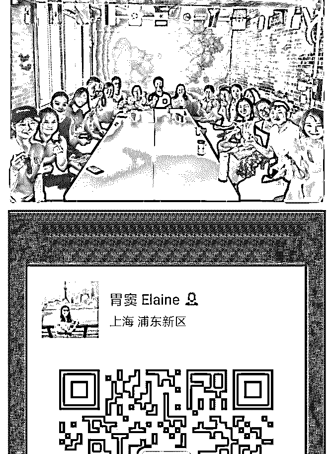
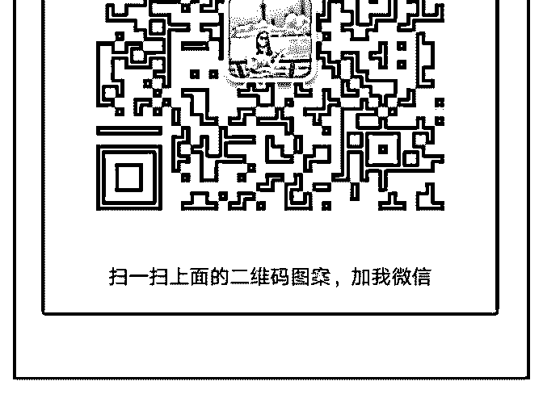
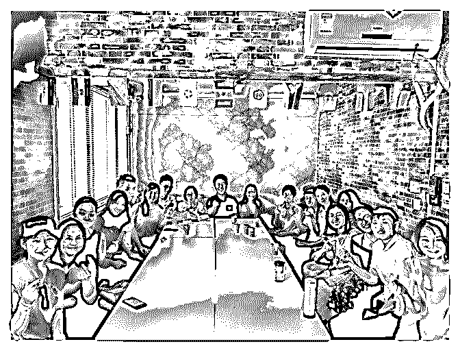
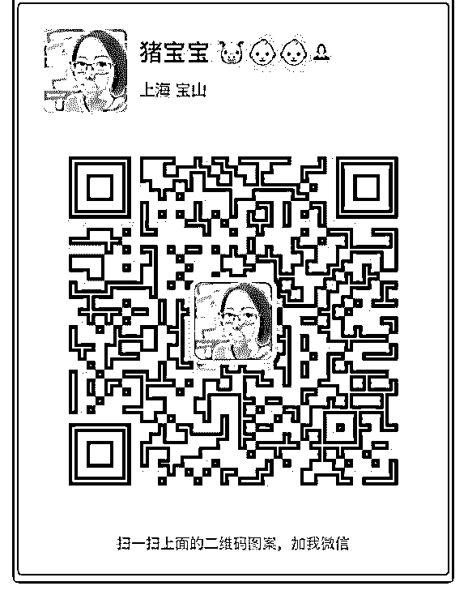
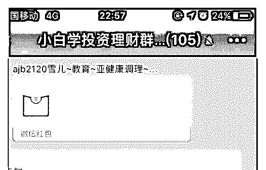
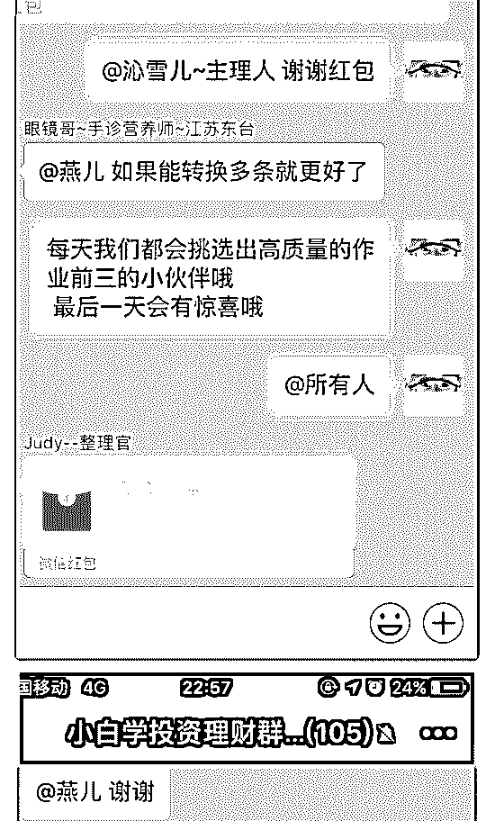
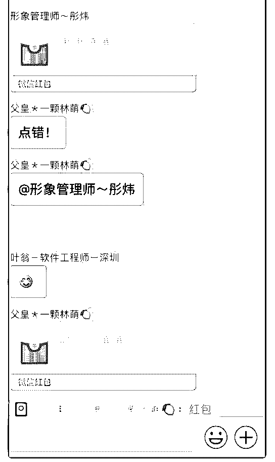
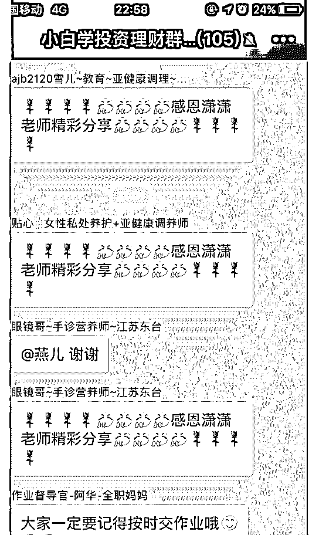
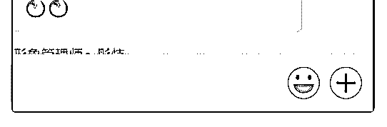

# 走出迷茫其实不需要

胃窦 ｜个人品牌专栏* : 走出迷茫其实不需要太大的勇气，只 需要你多往前走一步。 泽宇社交的第一次上海线下见面，来自各行各业的小伙伴在 一起分享他们的故事。 人是一定是离不开社交的，当你迷茫时，就应该走出舒适 区，去看看外面的世界，听听不同人的声音，你才不会沉溺 在一个人的世界里，郁郁寡欢。 在见面之前，在地铁上遇到了两位福建老乡，听到他们熟悉 的闽南语，要是之前我可能不会上前打招呼，但今天，听到 他们的话，我立刻用一句闽南语就拉进了彼此的距离，还成 功拿到对方的微信号，说好了可以约起来。 波力说到的 10 秒效应很重要，不要去考虑别人会不会拒绝， 只要想想自己是不是愿意认识对方。突破自我的设限，今天 的感受很真实，也足以改变我以后的人生。加油(ง •̀_•́)ง

2018-09-09(14 赞)

评论区：

猪宝宝 : 你好棒

胃窦 ｜个人品牌专栏* : [害羞][害羞][害羞]

猪宝宝 :

#心得分享

关注公众号"懒人找资源"，星球资源一站式服务

# #心得分享 9 月

9 月 9 日泽宇教育上海聚会心得分享

这是第一次参加泽宇线下聚会，此时有太多感触想写出来。

首先，谈一下各位泽宇教育的前辈给我的力量。

1、泽宇助教 Lorna，是我老乡，她的故事感动了我，今天见

到女神是这么的有气质，有亲和力，Lorna 今天输出价值非常

高，没有一句废话，帮助每位小伙伴解决困扰，让我受益匪

浅；

2、泽宇研习社负责人波力，在研习社帮助我很多次，今天见

到本人也是和线上沟通一样很随和，他讲的社会谎言着实扎

心，要想改变命运先改变思维；

3、泽宇上海地区合伙人黄老爷，首先感谢黄老爷组织找场

地，我跟黄老爷之前是零接触，但是他的故事我听过很多，

今天黄老爷表达自己不多，但是做的人格测试总结着实让我

感觉到我性格的缺陷，我要继续学习弥补；

4、泽宇助教熊凯：在加入泽宇之前就加了微信，公众号免费

的课程也有听过，但是没有交集，今天第一次和这样思考型

人格的人见面，虽然内向，但是感觉得到他的进步也是非常

大，特别善于思考，这是我缺乏的，后续要多链接；

除了泽宇教育的前辈们，所有的小伙伴都让我佩服，我是这

次线下聚会年龄最大的一个，我佩服小伙伴在大学或者刚毕

业就有如此超前的意识和行动力，每个小伙伴的经历都是一

个励志故事在影响着我。

其次，就是这次线下聚会的收获：

1、思维视角：社会谎言的真相；学会购买别人的时间；斜杠

青年；10X 法则；

2、方法：看书；复盘；高价值输出；

3、执行力：10 秒法则，想到即行动，找到方法就去做；

最后，遇到泽宇之后的 2 个月自我突破很多，但是还远远不 够，接下来我需要改善： 1、目标的设定，10 倍扩大自己的目标，不要自我设限；

2、执行力要跟上，不逼自己一把永远不会成长；

3、社交思维，多和不同的人链接，吸收价值的同时输出高价

值，提升人脉圈；

4、微商和个人品牌要严格区分，决定开小号；

2018-09-09(15 赞)

潇潇 : Day4

关注公众号"懒人找资源"，星球资源一站式服务

# Day4 今日内

今日内容复盘与心得：

1，完成演讲稿内容一篇

2, 在自己百人的社群里第一次分享指数基金内容

3，写心得稿一篇

心得：

1，

1 在写稿子的时候，对着自己曾经听课的知识大框架去扩展

我自己理解的知识点。在这个期间发现，大框架里的小分支

框架内容，也就是自己在听课的时候记录的重点知识缺斤少

两的，对于自己在备课的时候，发现部分课程笔记里的思维

逻辑，完全不搭边，就是不知道如何衔接知识点。因此，翻

出课程重新听，重新记录，感觉还是衔接不上，我只能听完

了每一课，根据我自己的印象去扩展我的稿子！

2 在写稿子的时候，也发现了，我对很小一部分的知识点理

解错了，比如，笔记里的现金流覆盖家庭开支，理解成了日

常工资覆盖，而不是资产收益的覆盖！全是完全不一样的概

念，还好自查出来！

虽然今晚的分享很顺利，除了有一点小紧张，其他对于在分

享中的事没什么问题！通过这事，我才发现，我在思维导图

方面有能力不足的地方，需要向波哥请教！

2，今晚的课程分享，内容很顺利，在课后互动环节，学员们 问的基本都是后期需要讲到的课程。在课程分享之前，我的 主理人还再三提醒我，一定要多讲大白话，多举例子！我在 最后半小时又加了小例子进去！ 课后，听到有的朋友通过我身边的好朋友，悄悄私底下说听

不懂我的课程！我就在想，到底原因出在哪里？为什么我说 的大白话没人听的懂。后来我也发现，原来是因为他们真的 是什么都不懂的小白，我的课程是说指数基金，即使我已经 对课程中的一些专业词进行了解释，但依然覆盖不了全部， 因为会涉及到一些词汇，比如：股票型基金，我才发现，如 果从来没有炒股过的人，他是不了解股票的，股票和基金， 都是投资工具，两个词一合并，我只解释了基金是啥，没解 释股票是啥，对于不懂的人来说，那肯定就是听天书了，因 此我明白了，这一点细节，我没有做好！原因是因为时间太 少，备课太急，没有站在别人的角度思考问题，明天备课， 我肯定会注意这点！

3，今晚复盘，也总结了自己所有在操作过程中是怎么发现问 题，自己我的思考过程，感觉，思路也清晰了，知道自己的 问题出在哪里，阻碍我前进的，我要抓紧解决它！

我是潇潇 欢迎勾搭！敲门暗号：波哥很帅！ 问题是：真的很帅！

2018-09-07(9 赞)

关注公众号"懒人找资源"，星球资源一站式服务