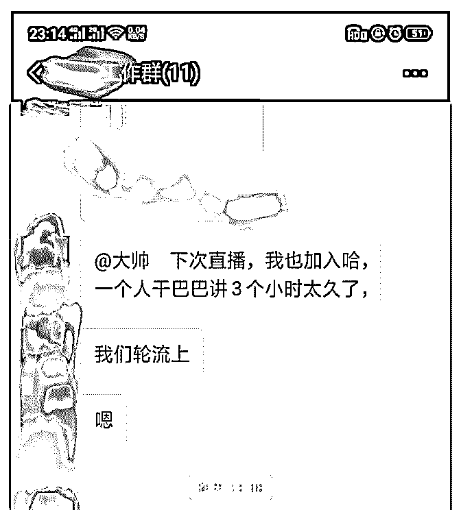
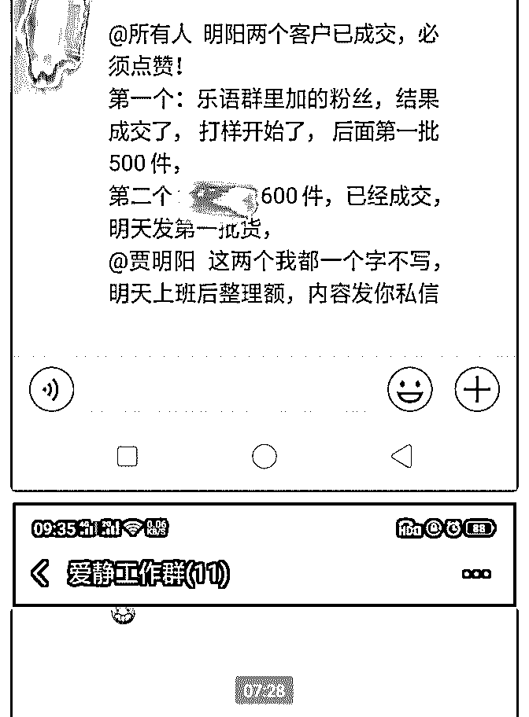
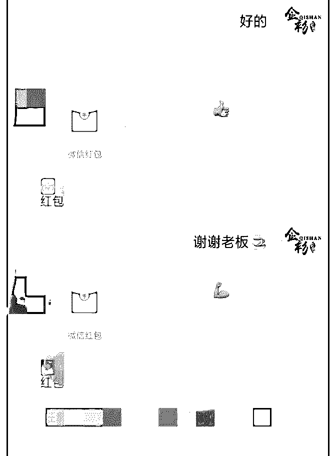
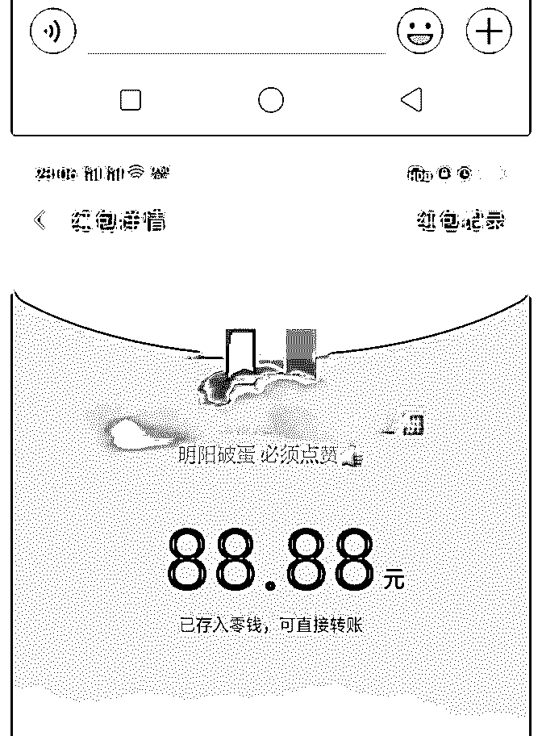
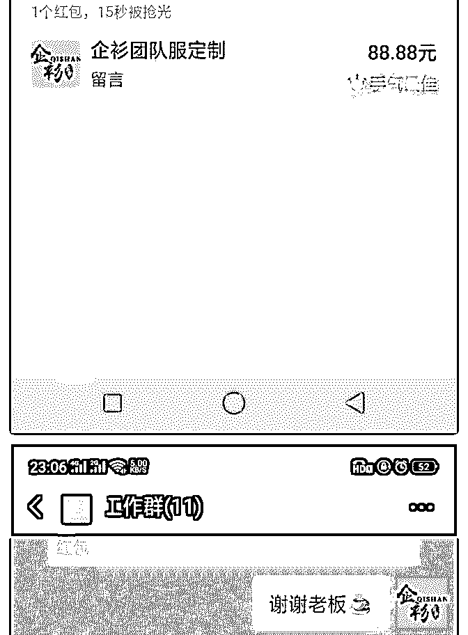
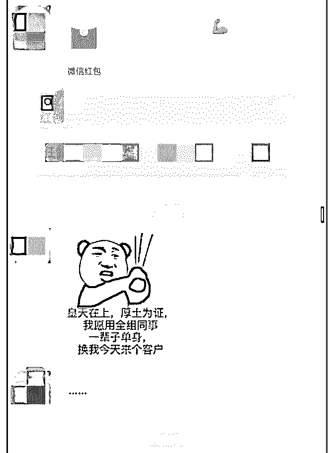
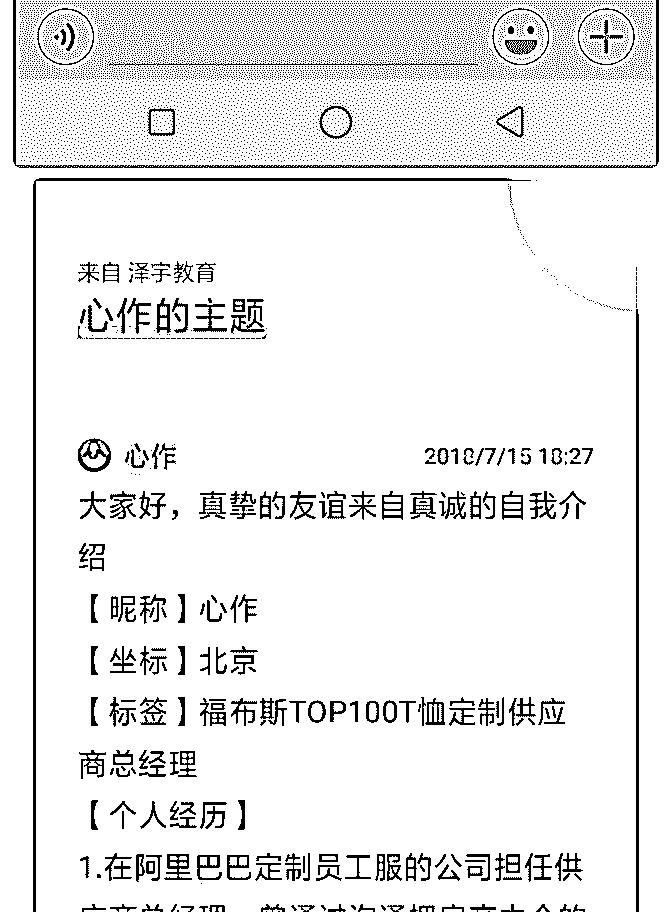
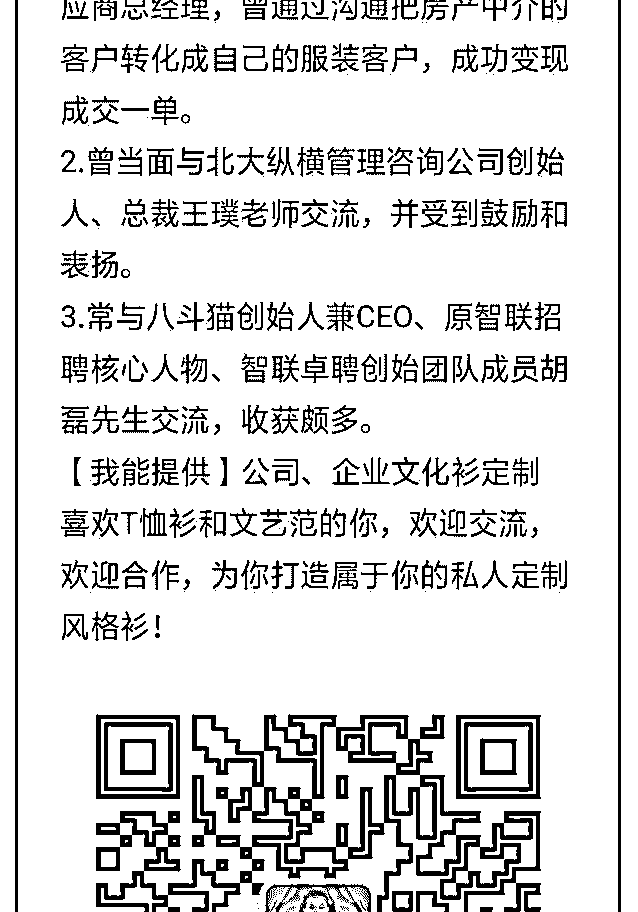
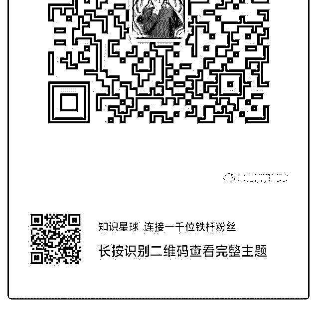

# 共计 1100 件的服

心作 : 共计 1100 件的服装订单

人的状态是会被感染到的，通过凯哥的正确、精准地指导， 状态发生改变，好事一件连着一件。当然还有然果、范范的 意见对我来说也特别特别的重要，感觉说谢字有点轻了，但 还是特别感谢！

客户是我链接上的，单是老板谈成的，应该也算一种成果 吧？

1.500 件的舞蹈服订单：我的客户（乐语易购学习群第二期的 同学群里来的，并没有在现实生活中认识，说过话，加了好 友后，聊过十几句话就来我们公司了，我用心了，这个客户 可能感觉我比较有心吧！），演出服供应商的四件样衣，正 在打样。老板说没问题，那就是没问题了，客户都能来公司 了，铁板钉丁了。客户销售的客单价很高，今天老板说好像 是三千块钱一件，还是一千块钱一件，走的线下渠道。总之 就是客单价灰常贵！公司的利润应该也蛮高。

2.600 件 POLO 衫的订单：一个印花厂的客户（阿里巴巴店铺 咨询来的），今天已经发走 110 件，走的线下渠道。下班后， 跟老板一起走出楼下，问我有没有逃跑的想法，我说我就是 思想有点乱。她说你肯定有，然后说你在咱们家干不下去， 去别的地方还是从新开始，在咱们这好好干，你做到，我不 会亏待你。

3.老板给我在工作群里发了一个 88 元的专享红包，我直接点开 了！不再自我设限，让我想起了我在上一家公司的老板，经

常给我发红包，好几百的，她说我需要钱。让我收，还说不 收就不跟我说话了，我看到她给我发了红包，马上就把她的 红包给删除了，我怕点错了会直接点开！我都没好意思收， 这也是自我设限。不过她给了我一个手机，和一副防辐射眼 镜，我收下了。（偷着给我的，没让别人看见）

2018-09-07(8 赞)

关注公众号"懒人找资源"，星球资源一站式服务