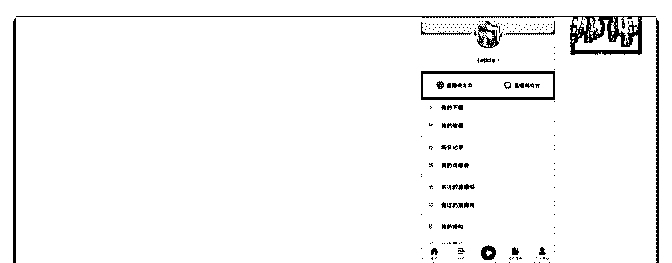
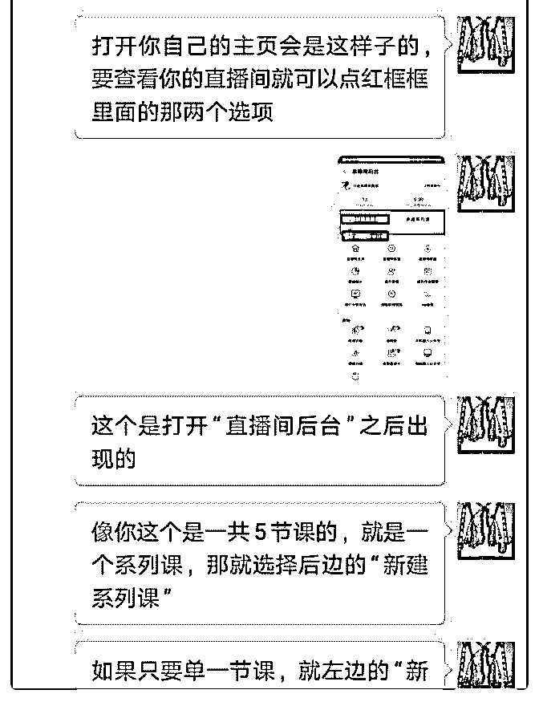
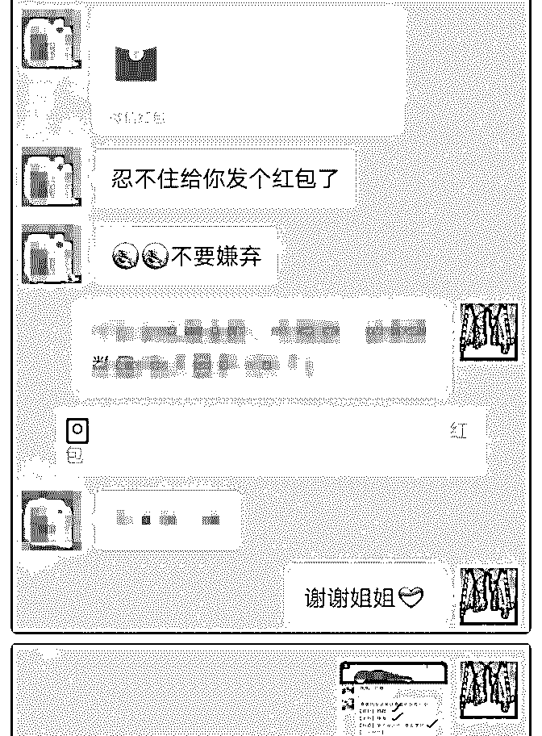
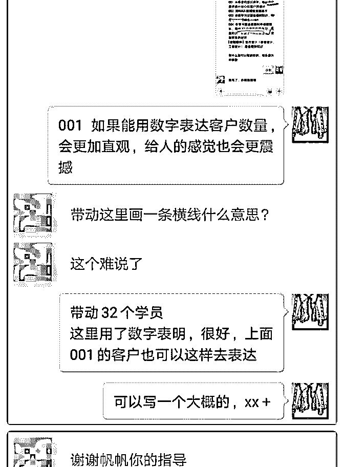
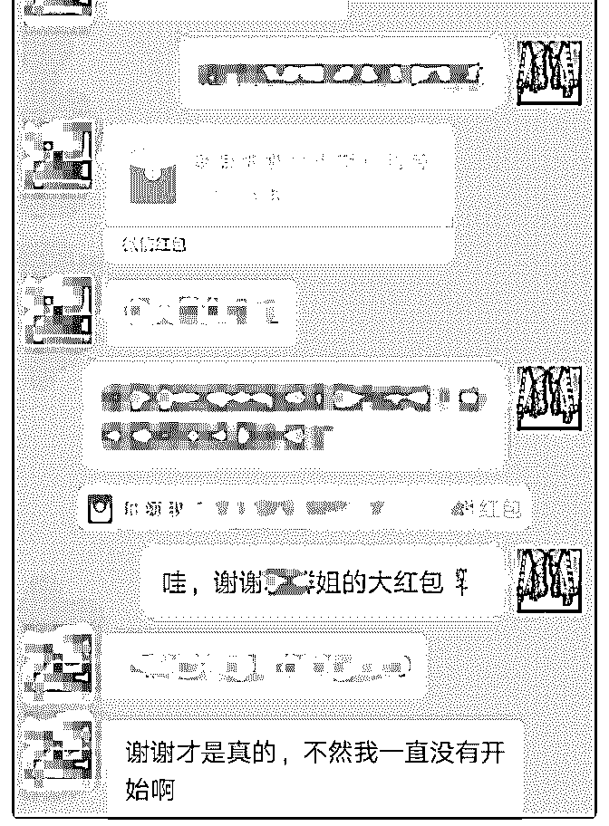
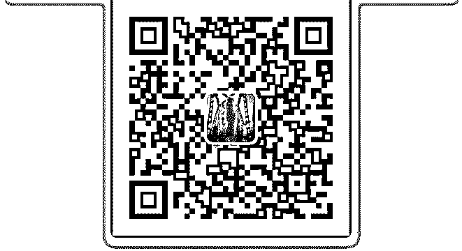

# 打卡 Day53 通过

Leti 茜雅—西语零* : 打卡 Day53 通过帮助群里的小伙伴获得了红包[红包]

001 小姐姐知道我在千聊开了课，她也要开课，就来找我帮 忙看看。我将每个步骤截图、标注出来，最后将自己的课程 送给她

002 新加的一个姐姐，得知她还没有自我介绍之后，帮她完 成了第一份自我介绍，同时将四篇打造朋友圈的文章分享给 她，接下来就是打造朋友圈

自我介绍求精不求多 不少人希望将自己的所有事迹都写在自我介绍里，担心别人 看不到自己的闪光点，但这是不对的地方 自我介绍里面的【个人经历】应该写与自己定位相关的内 容。过多过泛与定位不相关的东西，会让人觉得你不够专 业，信服力也就会降低

2018-09-07(4 赞)

Shiyu Guo. :

关注公众号"懒人找资源"，星球资源一站式服务