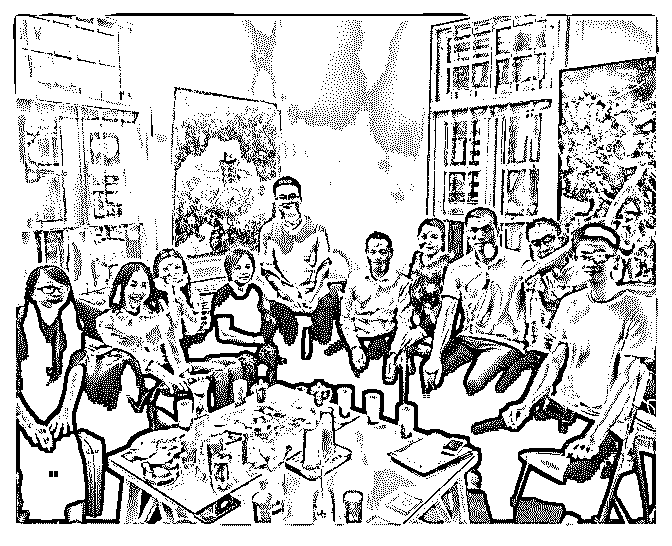
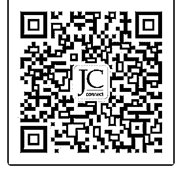
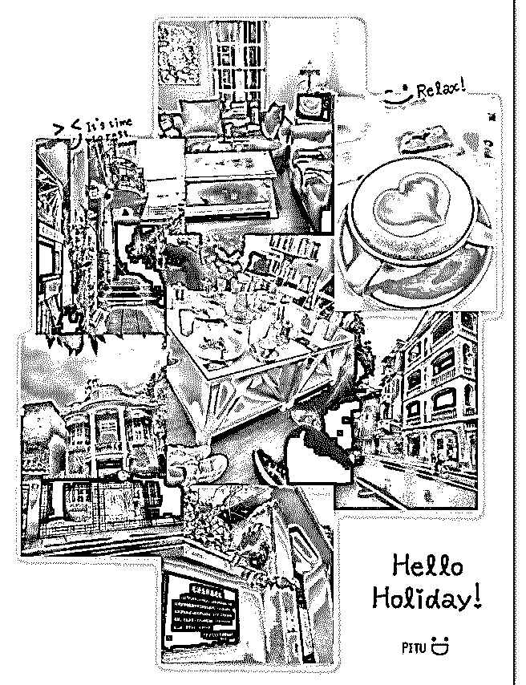
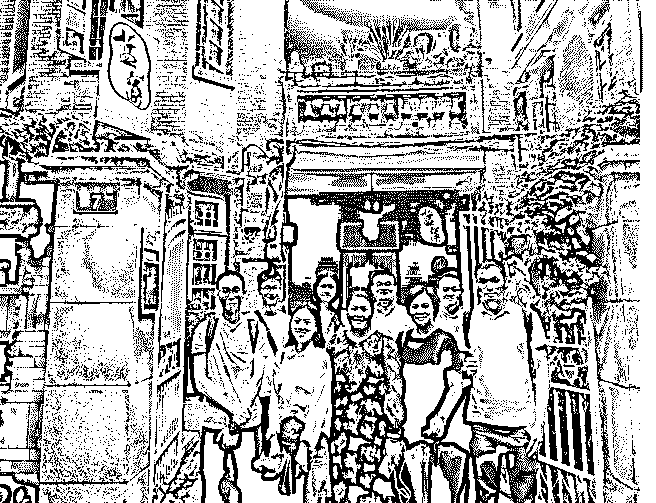
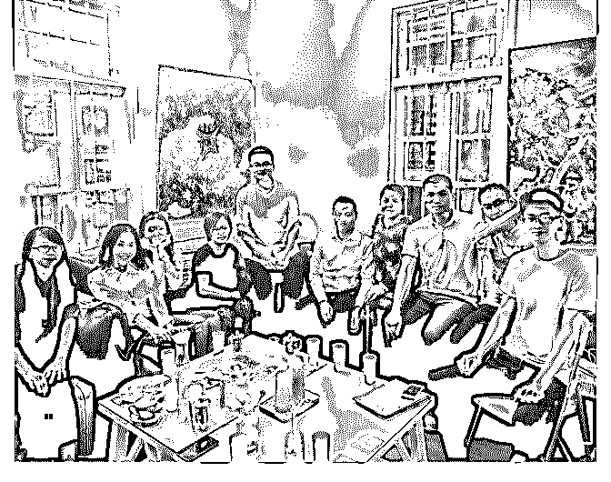
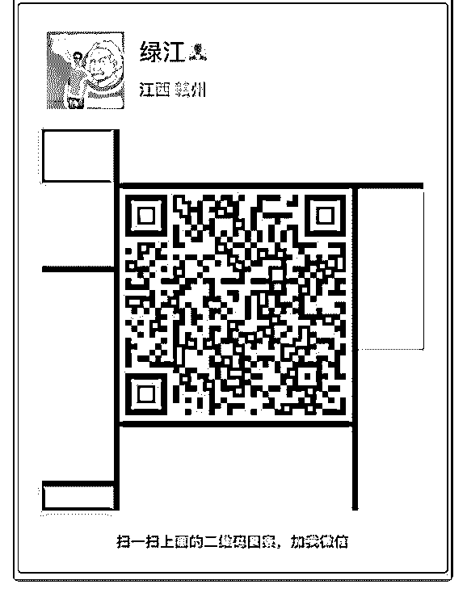

# 昨天好朋友 Gabr

昨天好朋友 Gabrielle 主动来和我说，试听了泽宇的第一节社交

课觉得非常需要，立刻购买了。她是我成为悉尼城市合伙人

后第一个邀请进入社交课程和线下群的小伙伴，也是我非常

欣赏的一位朋友。她和社交课结缘的过程还挺有故事可说

呢：

前几个周末，我们都有聊到社交方面的一些话题。她有一点 我觉得特别欣赏的是，对于不同的人和观点，她有着非常包 容的态度。遇到这样的人或事，她不会立刻觉得这个人和自 己不是一路人、无话可说，而是会开启其他话题来更多了解 对方，慢慢去了解为什么对方会对同一件事有不一样的看 法，非常有耐心。聊天中她也和我学习到，如果认识了新的 好朋友，加了微信之后如何经营线上的关系，比如给对方设 置备注、加描述和照片。

我觉得她也和我一样是心态很开放、喜欢结交不同的朋友的 人，于是我就提到了我在做悉尼线下群的运营，过两周准备 组织第一次活动，她立刻表示很感兴趣。但是当时我忘了要 先成为学员才能入群，一下子话题转的有些尴尬，她还和我 说，下次如果你换个方式介绍会更好。当晚我并没有把课程 分享给她。

过了一周左右，朋友来家里作客，我们又一次聊到社交方面 的话题，另一位已经是泽宇学员的朋友和我就说了说自己从 社交课中的收获，她觉得正好就是她需要的，于是我才把社 交课分享给了她。

从提到泽宇的社交课到让她也成为我们中的一员，大概花了

一个多月的时间。期间我没有很刻意去推销课程，而是因为 泽宇的社交课真的对我帮助很大，所以只要聊到 networking， 聊到社交，聊到朋友关系的维护，聊到不同人的价值观、人 与人之间的和与不同，都不可避免要提到泽宇的名字。

因为喜欢和认可所以忍不住向身边的朋友安利，让更多有趣 的人加入我们也让我非常有满足感，这个“成果”非常值得庆 祝

2018-09-04(9 赞)

JC : VOL.001

关注公众号"懒人找资源"，星球资源一站式服务

# VOL.001>时

>时间：2018092014：00-17：00

>地点：广州·蓝藻咖啡

>人物：8 位小伙伴+2 位贵客

☞【晶晶】 泽宇广州城市合伙人、企业 HR,初次见面给我印

象热情亲切，全程都在活跃气氛，引导大家进行自我展示和

交流，辛苦你的组织拉 笔芯[爱心]

定位是互联网运营

☞【小猫饼】情感自由顾问，定位是情感咨询

☞【秦涛】保险理财业务，定位是保险理财咨询

☞【芳草】药企临床试验监察，定位暂时未定

☞【Ellen】仓库管理，定位是幼儿教育咨询

☞【千羽】大健康营销、塔罗牌占卜师，定位是占卜咨询

☞【绿江】程序员，定位是时间管理

>【大家聊到什么】

各自是怎么样链接到泽宇的、为什么要参加

参与泽宇计划后有什么变化、遇到了什么问题

大家的定位是什么

探讨以后线下聚会的活动形式怎么更好

>【我收获到什么】

了解到各小伙伴不同领域的趣事和经验，刷新对他们行业的

认知；

体会到线下活动组织的不易，前期的统筹安排，活动时调动

气氛，引导各位小伙伴自我展示和交流；

认识到自己目前定位还未够精准，希望以后能够跟晶晶在互

联网运营营销这块进一步交流和打磨自己的技能

>【小建议】

001 活动的准时和给初次见面的双方贴个小标签方便大家加深

认识和进一步交流

002 每一期活动最好有个主题，让大家可以带着问题来，带着 收获和思考回去

003 下次可以增设小主持一个，既可以展示自我又可以锻炼到 能力

最后谢谢小伙伴们的分享，期待我们下次再见[咖啡] 2018-09-04(6 赞)

关注公众号"懒人找资源"，星球资源一站式服务

# 9 月 3 号 第一次打

鹿鹿鹿~ : 9 月 3 号 第一次打卡 今天晚上自习室里认真听完了泽宇核心课的第一节课，并做 了笔记，记录重点，最后自己整理出框架。

经六六小姐姐介绍认识了波力老师、然果小姐姐，给予了我 很大的帮助，回的每一句都是干货，令我受益匪浅。明天继 续写自我介绍请大家帮忙修改，尽量把以后的重点放在几个 点上，在一个定位上不断输出，提高自己的执行力，不断提 高自己。期待会有更大的进步。

不管怎样，一定要先去尝试！我会按照课程计划三个周时间 学习，并结合手帐来进行自我管理，加之老师的指导，去努 力去学习怎样精进输出，付出总会有回报。大家都一直鼓励 我、教我方法技巧，让我相信我也可以的～加油～

PS：加入泽宇核心课后，发现群里的大家不仅优秀，都还很 热情啊，很喜欢这种氛围，希望和大家一起加油！

2018-09-03(4 赞)

又绿江南岸 : 16.

关注公众号"懒人找资源"，星球资源一站式服务

# 16\. 昨天来了第

昨天来了第一次的广州泽宇线下聚会。看到一群优秀的小伙

伴，融洽的氛围，还有收货到了这个陌生城市的温暖。

看到晶晶姐的侃侃而谈，控制场面，我心生佩服。羡慕其社

交能力。我知道，这是她日积月累，练出来的。她是湖南

人，却能讲清楚地用粤语表达，她说：“很难练。我是为了学

粤语，每天去菜市场找不会普通话的人练习粤语，进步很

快。”

秦涛哥、金福兄的思维开阔让我长了见识。小猫饼、千羽 芳

草等人无不是很有正能量的一群人儿。Ellen 拍了一手漂亮的

图片。

这时候我深深感觉到每天认识一个朋友的意义。其作用之一

就是增长格局。在这次初次聚会我就已经认识到各行各业的

不同魅力，人力资源的社交能力，医药、健康类工作的养生

知识，以及咨询类的贴心热情。

同时，要想成为群体中心，首先必须拥有足够多的价值。

【昵称】绿江

【坐标】广东广州

【标签】时间管理

【个人经历】

1.学习了小能熊创始人陈华伟的时间管理课程，结合自身“焦

虑地懒”的特点，成功摆脱拖延症，摆脱了瞎忙活的生活。

2.大四指定计划、安排好一天学习生活，自学 3 个月后进入了

程序员高薪行业。

3.指导朋友解决制定一堆计划从头几天心累到放弃计划的问

题，并得到了肯定。

【我能提供】

①帮你更好的管理自己的时间，让你一天从容不迫、满足地 完成计划。

②提供改善拖延症的方法，让你不再拖延，高效完成一天的 任务，做到今日事今日毕。

【我需要的】个人品牌打造 理财入门

【未来规划】从事时间管理咨询，帮助更多人做时间的主

人，并且做到额外收入过万。

2018-09-03(7 赞)

邦尼 Bonnie :

关注公众号"懒人找资源"，星球资源一站式服务