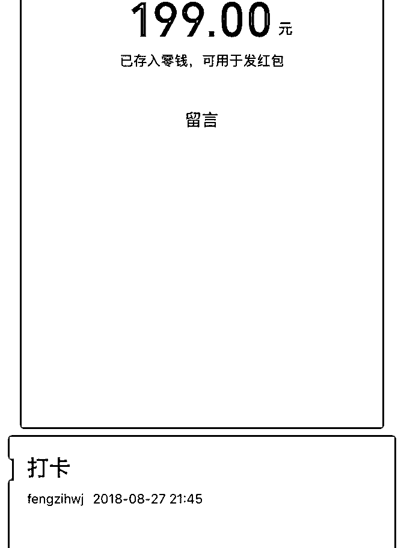

# 琉智打卡第 12 天#

俊智 : 琉智打卡第 12 天

# 八月复盘# 琉智最初逆袭的开始

我的经历

没有加入泽宇大家庭之前，我的生活布满阴霾。 中学被学校 以不收外地为由劝退，从小家庭给予了不少痛苦，现实中自 己没朋友。是一个三无青年，无论爱情、婚姻，事业，内心 深处一片迷茫。

上年大概 10 月份我加入泽宇课程，当时我确实真正开心过。 但好景不长，由于处于阴霾的环境，伤害再次来临，内心难

受没有一个人可以诉说，我害怕找高人，很在乎被看不起。

躲在被窝颓废着砸钱玩游戏才感到一丝的好受，放下游戏准 备入睡的时候，急剧的痛苦只有安眠药才可以入睡。

直到有一天，终于！我得到了熊凯、千老师都帮助，他们像 是一束阳光！波力老师，然果的指导却我看到阳光下还有彩 虹。

[太阳][太阳]我的改变[愉快] 于是八月份我有了不一样的转变。 1.定位变现 316.68RMB，就差一点就赚回学费，继续加油！

（图：1、2、3、4）

2.帮助了 30+小伙伴解决困扰了许久的皮肤问题，收获了许多 肯定、好评和红包。

3.整理出 20 种常见的护肤方案课程，希望能帮助到更多的人。

4.知乎从没有关注，没有粉丝，没有写作到 11 个创作、1400 赞 同、391 感谢、3300 收藏、470 人的关注。 （图 5）

5.开设了琉智 VIP 护肤群，及时帮朋友们解决相关的护肤问 题。

6.完成了油干、敏感皮肤测试大全，让大家可以快速了解自己 的皮肤类型。

#九月目标# 1.熟练掌握引流变现方法。

2.打造朋友圈。

3.完成 20 项护肤常见问题。

4.更好学习多多渠道价值输出。

九月，希望我所盼的都能实现，和大家一起成长。

2018-09-02(13 赞)

一木 : day3

关注公众号"懒人找资源"，星球资源一站式服务

# day31.八月份

1.八月份纯靠写作实现月入过万。

2.开办第一期写作班，对学员进行一对一指导，帮助很多完全

0 基础的学员（有的年龄还很大），实现上稿的梦想，其中有

几位，早已赚回学费。

3.通过第一期开课，发现大部分人的写作问题，就是不知道如 何下笔；以及写作逻辑不好，以至于文章写的水；包括不知 道如何寻找写作素材，如何升华立意…包括找不到好的投稿 平台，也没有老师指导修改，所以很迷茫，报了很多班，都 收获甚微，很打击写作自信。

在第一期的基础上，我们在对第二期课程进行全面升级，除 了完善课程，还请来了上稿大神做金牌助教，带着学员从选 题到切入，从标题到逻辑结构，从素材选择到立意升华，一 步步搞定完善。

同时，招聘了一名曾在千万粉丝平台做过编辑的朋友作为助 理，协助我修改学员初稿，给出最专业的编辑意见，再由我 带领学员，一步步修改。好的稿子直接推荐上稿，让更多学 员拿到高额稿费。

为了给新老学员谋取更多福利，我们设置了竞赛制，每期上 稿的前 3 名，还可以免费晋级到下一期，包括免费进入价值 399/年的素材分享群，作为写作老手，我们觉得，这对写作者 来说，是最超值的东西。

期待第二期写作特训营的开启[奋斗][奋斗][奋斗]

2018-09-01(17 赞)

Jack : Day4

关注公众号"懒人找资源"，星球资源一站式服务

# Day4 其实我是个

其实我是个不善言辞的人，不太喜欢说太多！既然大家相信 我，那我就尽自己努力带你们获得自己想要的！

一个人坚持会很累，但是我已经坚持过来了，下面的路，我 带着你们一步一个脚印，慢慢走！

感谢波力老师的无私帮助，感谢大家的信任！

2018-09-01(6 赞)

Jack : Day3

关注公众号"懒人找资源"，星球资源一站式服务

# Day3 小伙伴们陆

小伙伴们陆续进来，可把我忙坏了，从九点半到现在一直在

指导……

突然想起一位朋友，一次问我怎么减肥，我说了之后，她说 就这么简单么？我很惊讶于她的轻描淡写，因为我一直觉 得，很多简单的事情其实很难，因为简单就意味着枯燥无 味，而你要去精通它更难，你要坚持忍受这些痛苦！

于是人们开始抱团，选择抱团的原因我猜可能是：

1、有了目标就有动力

2、相互竞争

3、相互鼓励

4、有小伙伴的陪伴更加容易消除那种孤寂的枯燥感吧！

感谢大家的陪伴，一起成长！

2018-08-30(14 赞)

浅浅 : 浅浅打卡

关注公众号"懒人找资源"，星球资源一站式服务