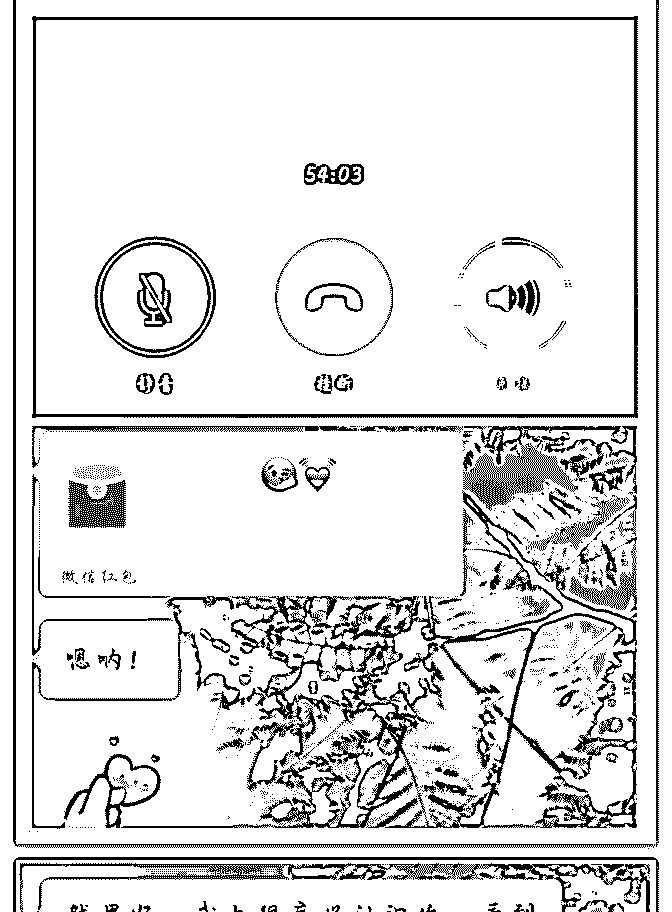
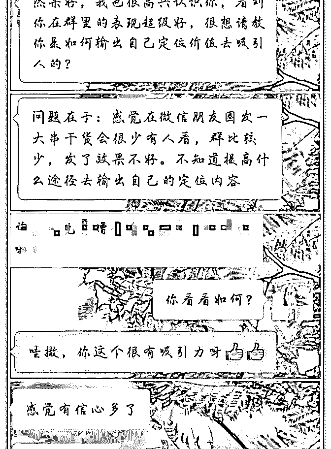
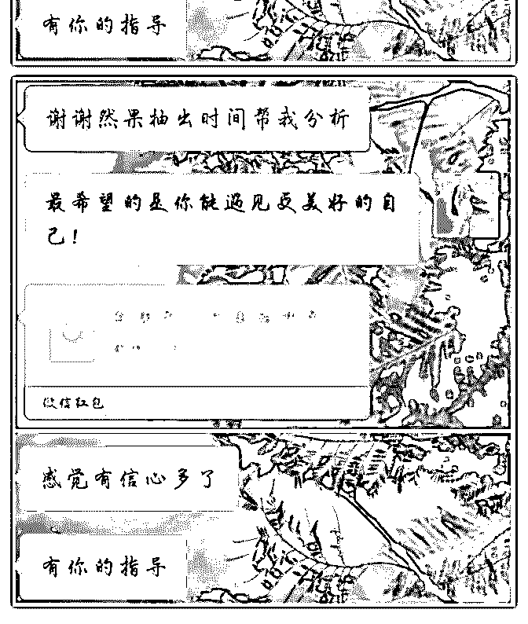
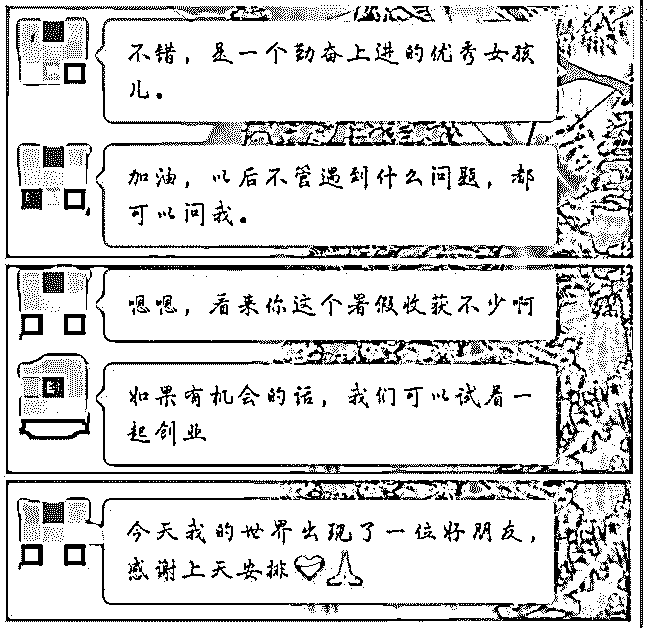
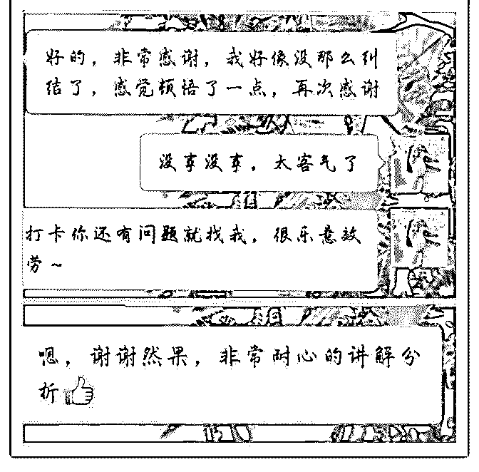
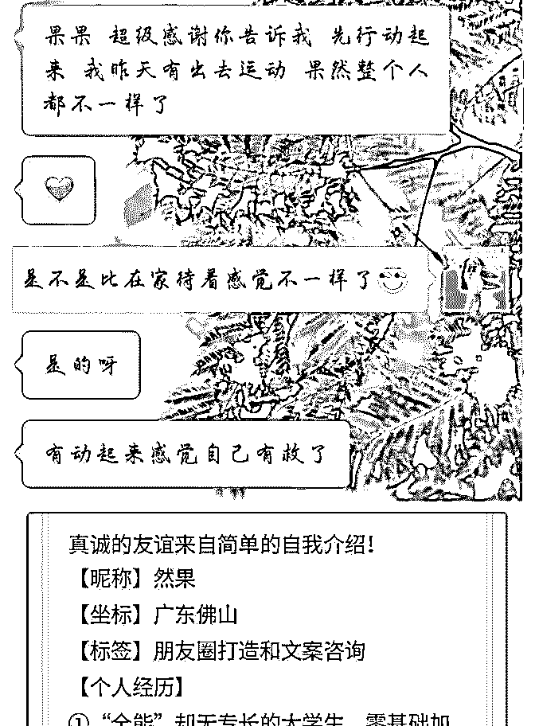
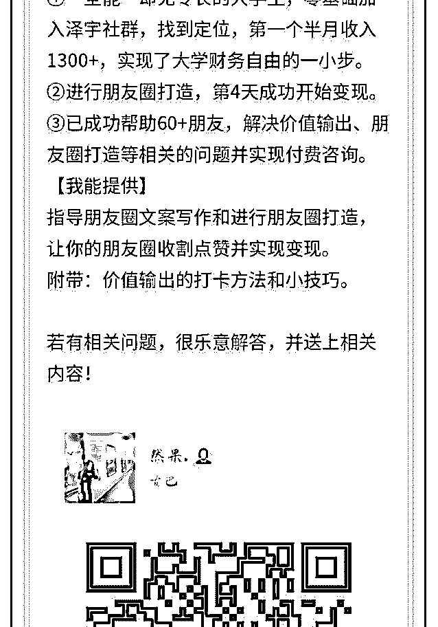
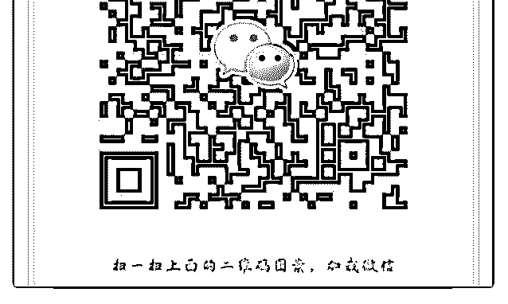

# 然果打卡第三十一天

然果. : 然果打卡第三十一天 1.第一次语音咨询，收到红包，小姐姐还说要寄产品让我体 验。 2.朋友发红包找我解决输出问题，却发现其实是个人品牌形象 没打造好！ 3.意外链接一位北大小哥哥，交流之后他说以后愿意一起创 业。 4.近日继续学习朋友圈文案写作，继续帮助朋友们解决个人品 牌打造的相关问题。

1.第一次语音咨询，收到红包，小姐姐还说要寄产品让我体 验。 （图一） 前晚第一次语音咨询，一位年龄相仿的小姐姐咨询我朋友圈 打造的问题。先看过她的产品介绍之后，我再根据她的产品 给了她建议。

注意：

①朋友圈类型有多种，需要根据具体情况分析适合发哪几种

类型的朋友圈。

②朋友圈分享的小知识要与定位相关或与经营的产品相关。

③销售类朋友圈不要单纯叫卖产品特点，应注重的是产品使

用的感受。

语音咨询过程很愉快，效率也比较高，而且很大程度拉进了 两者之间的距离。小伙伴们可以尝试语音咨询！

2.朋友发红包找我解决输出问题，却发现其实是个人品牌形象 没打造好！ （图 2-3） 朋友向我请教价值输出的问题，帮助她分析之后却发现是她 的个人品牌形象没有打造好。输出了之后一直在做“无用

功”。

注意：

感觉自己做了却没人关注怎么办？

①反思自己行动力是否够强。

②反思自己的自我介绍是否打造好。

③反思自己微信、朋友圈有没有打造好。

④反思自己是否坚持做输出，并且输出有价值，对大家有帮

助的东西。（拒绝单纯输出理论，要结合实际分析）

发现成长停滞不前，一定不要再做“不用功”，应该先检查自 己问题所在并解决好问题。

3.意外链接一位北大小哥哥，交流之后他说以后愿意一起创 业。（图 4） 在新加社群里与大家进行交流，意外链接到一位北大小哥 哥。一开始我们聊得很常规，后来我想起在泽宇学习到的价 值输出。

便主动输出自己，让对方更深层次地了解我，分享了自己暑 假的进步并分享了心得。最后小哥哥还说以后很愿意与我一 起创业。

在社交过程中，主动在合适的时机下输出自己的价值，容易 建立深层次链接，并且赢得更多机会。

4.近日继续学习朋友圈文案写作，继续帮助朋友们解决个人品 牌打造的相关问题。（图 5-6）

近日学习效率最高的是把近十小时的课程前前后后消化了三 遍。

帮助许多朋友解决个人品牌相关问题的时候发现，在这个过 程中不仅解决了迷茫的问题，还让朋友们找到了自信和信 心，真的是很欣慰的事情！

咨询 60+小伙伴以来的心得是：你的一切，从行动开始。 2018-08-24(11 赞)

林子预 :

关注公众号"懒人找资源"，星球资源一站式服务