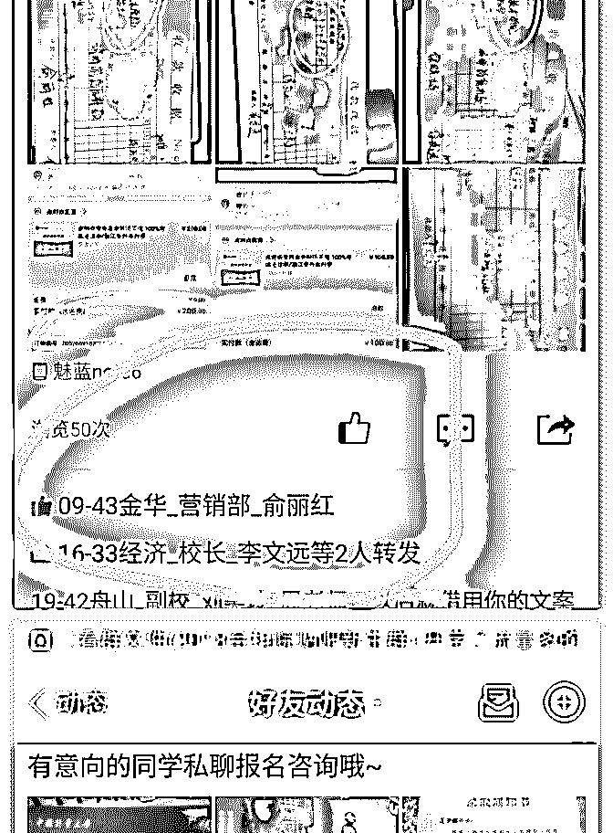
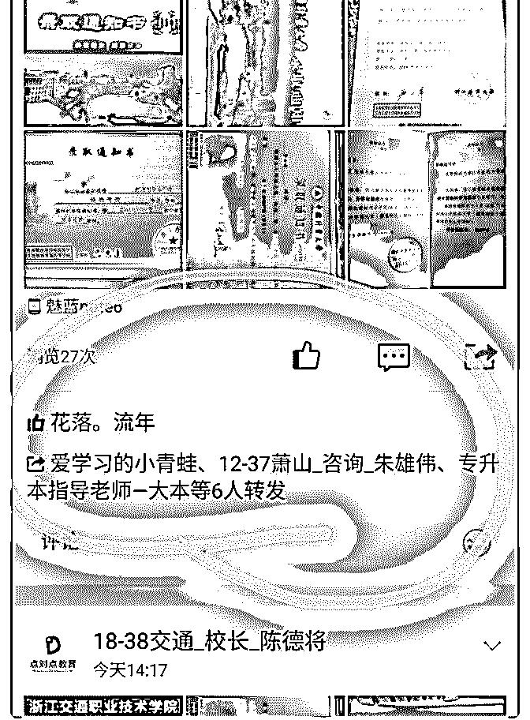
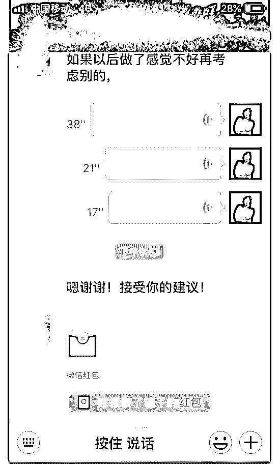
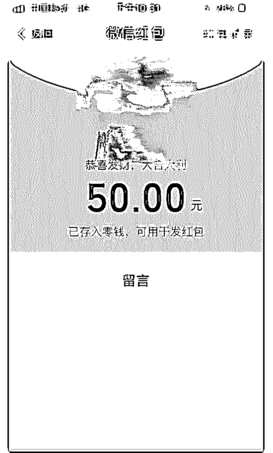
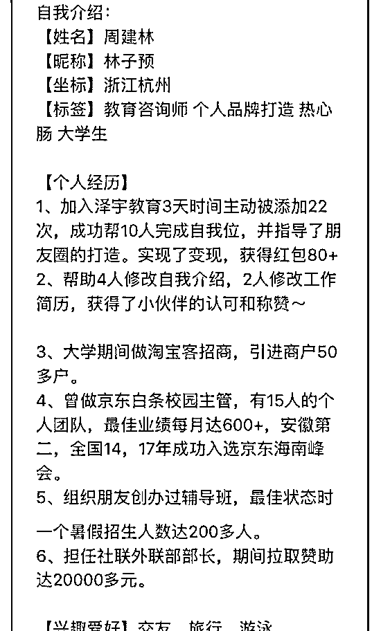
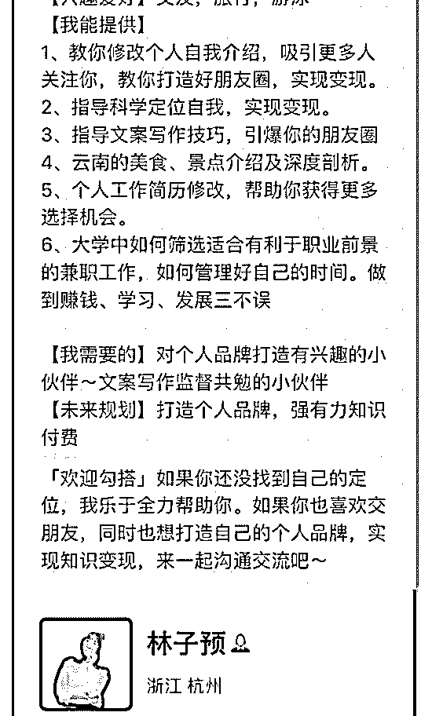

# 经过学习了一段时间

经过学习了一段时间的朋友圈打造，以及文案写作，我运用

到了公司的营销宣传中，这几天自己写的朋友圈文案多次受

到公司领导和同事的认可，基本都直接转发或者复制我的去

发

同时今晚也帮一位小伙伴做了定位，指导了朋友圈打造等，

意外获得了红包

欢迎对朋友圈打造自己文案写作有兴趣的小伙伴一起交流[害

羞]

2018-08-23(8 赞)

评论区：

HD－个人品牌咨询师 : 非常棒，做的好的事情多复盘，复利效应会更明显的

林子预 : 谢谢华丹老师，确实要多做复盘，坚持学习，才能不断进步

关注公众号"懒人找资源"，星球资源一站式服务