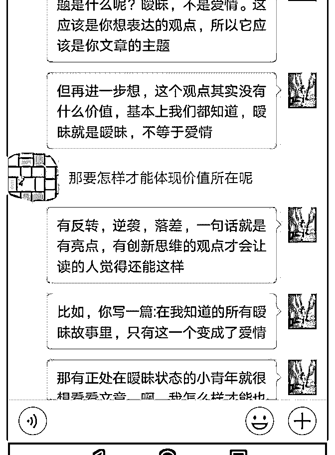

# 【米朵的核心课程打

米朵 : 【米朵的核心课程打卡】Day1

『今天我只想谈谈我和泽宇的缘分』

【缘起】 兜兜转转，又回到了泽宇。今年三月份，我刚生完孩子三个

多月，产后身体的变化让我陷入无限的焦虑中。

我开始尝试干点其他的事来转移自己的注意力，我加入了杭 州趁早的写作打卡，一周一篇，圆满完成。我开始在朋友圈 晒服装，做起了代理。但是当我自杀式的朋友圈刷屏，而没 有一单生意的时候，我意识到自己的方法不对。

我的微信朋友人数不到 100 人，我晒的产品怎么会有人买呢， 再高的转化率在如此小的基数上也起不了作用。我开始不断 的加人，我在微信群里加，在微博上找资源……经历过被群 主踢出群，经历过发好朋友信息没人回。而且加的人基本上 都是微商。

【遇见】 直到有一次，我找到泽宇情感自由的资源，我果断加了，并

且入了群。这时，我接触到了泽宇的知识星球。仿佛见到了

另一片天空，因为泽宇我知道了知识星球的存在，因为泽宇

我闯入了知识圈。

我开始在星球上打卡，开始写自我介绍，记得第一版自我介 绍我都不知道怎么填写，找遍自己所有的优点都写不出我能

提供什么资源。我开始在星球看其他伙伴的自我介绍。看到 好的我就会存下来，借鉴。看到优秀的小伙伴我就链接他 们。

有一天，我看到凤凤的自我介绍，小清新的排版，满满的正 能量，对这个女孩产生了好感。也是因为加了这个女孩，才 有了后面的故事。

【展翅】 加了这个女孩之后，我开始翻看她的朋友圈，我惊呆了，她

的朋友圈怎么可以打造的如此赏心悦目。美美的照片和文

案，满满的正能量，好想离她近一点。

通过她我遇见了柚子妹，朋友圈诊断师，一个能量场很强的 女孩。跟着她我学会了很多朋友圈打造的技能。从此我有了 一个新的身份，朋友圈打造师。她的朋友圈花了三年时间用 心打造。我很想预约她的朋友圈私人定制，但是我咨询的时 候她这个项目已经停止了。当我知道她有一个能量社群新项 目时，我果断找到她，加入了能量社。能量社群经过几次升 级，现在的能量场非常的强大，而我也在慢慢蜕变，朋友圈 从一开始的自杀式刷屏，到现在已经慢慢形成自己的风格。

通过柚子妹，我链接到了《爆款文案》作者关健明老师。获 得朋友圈文案征集红包，还成为他星球的管理员。

此后，我开始链接很多牛人，我向六子老师学习了很厉害的 读书方法，向秦淮老师学习了手帐，通过秦淮老师，我找回 了儿时的爱好，写字和画画。重新开始我的兴趣之路。同时 也希望兴趣能变现。这些经历也验证了泽宇在核心课程里讲 的六度人脉理论。我已经从点到面扩展了我的人脉圈子。

这些经历让我现在的个人简历有内容可写。我也能输出价 值，提供给有需要的小伙伴。

【泽宇是我的起点，也是我的归宿】 但是我发现我还是没有找到正确的方法，没有学习过底层逻

辑，变现之路一直没能开启。虽然好友已经从原来的 100+到

现在的 1400+，但我还是没能好好利用起来。走的太快，是时

候停下来思考，没有一步一步的脚踏实地的去实践，没有找

到正确的方法。

昨天听了泽宇的核心课程第一课，他说人脉的本质是连接。 他说每天去认识一个人，那一年后你将会收获不一样的人 生。我开始重新去连接我那些微信好友。

昨天我在朋友圈发了模块读书法的打卡内容，小伙伴很感兴 趣。我就把模块读书法的内容和方法分享给他，收获了一个 爱心红包。

昨天写周复盘，也写到模块读书法。吸引小伙伴来咨询。并 收获一个红包。原来用心的去分享，去利他，这种感觉如此 棒。一定要和朋友产生互动，不然微信好友就只是一个数 字，不能产生任何价值。一步一步，脚踏实地，慢即是快。 2018-08-21(15 赞)

评论区：

HD－个人品牌咨询师 : 非常用心的打卡，你的发展空间非常大，我一定好好带你[强]

上玄月-生涯规划 : 想加你微信，加不了呢[调皮]

关注公众号"懒人找资源"，星球资源一站式服务

# Day12 开始有被

九月星辰 : Day12 开始有被点燃的感觉 我的心得收获有:

1.优秀的小伙伴，牛人，大神所呈现的超强执行力、专注和友 善社交的态度都刷新了我对社交的理解。第一次主动勾搭大 神答疑解惑，第一次突破自我设限没有徒增心理压力，且出 乎意料收获了有关写作变现的可贵意见，非常惊喜。

2.在泽宇社群的这十几天里，逐渐找到了状态，并且在链接到 优秀小伙伴后，被他们的优秀点燃。昨晚哄娃睡觉后，第一 次失眠了，久久不能入睡的原因是，啊，为什么我还躺在这 里浪费时间，快从床上跳起来学习精进呀。高考完后，再没 有如此高的学习激情了。就凭这一点，我就知道自己进入泽 宇社群是进对了。然后今天趁娃睡觉后还有两个小时左右的 时间拆解文章，觉得很充实。

3.自我介绍这样一个以前我并不重视的环节竟然藏着如此深的 社交密码，自我介绍做的好，是可以迅速链接到很多小伙伴 的。在自我介绍中，要有明确的标签，重点是你能为别人提 供什么。个人经历不够出彩就深度挖掘，换角度呈现你的个 人经历，最重要的，你的个人经历会在做出成绩后不断迭代 升级。

4.通过自我介绍链接到好几个向我咨询写作的小伙伴，第一次 认真细致地为他们解答写作方面的困惑，竟然发现自己乐在 其中，像找到了一个新的闪光点，等到小伙伴的认可更是让 自己能量满满一整天。

2018-08-17(10 赞)

评论区：

HD－个人品牌咨询师 : 非常棒，给你加精了，可以发到群里和大家分享哦

九月星辰 : 好的，谢谢华丹老师~

雅星 :

关注公众号"懒人找资源"，星球资源一站式服务