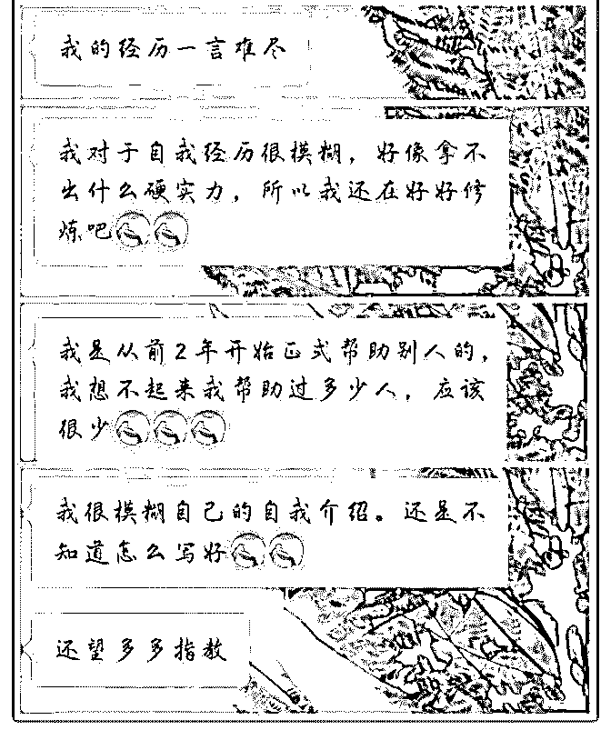
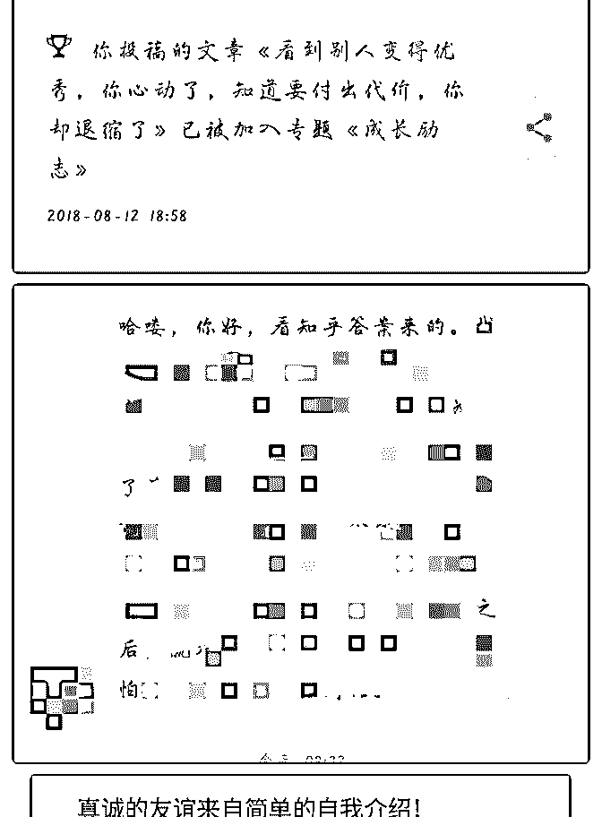
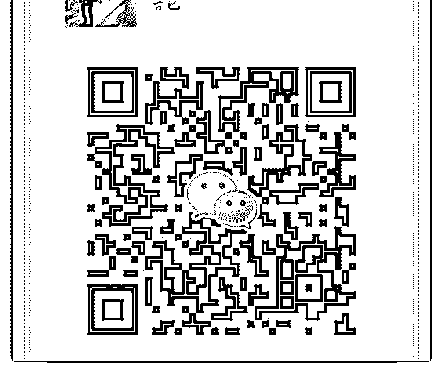

# 然果打卡二十七天 1

然果. : 然果打卡二十七天 1.帮助朋友从昵称、自我介绍、头像、朋友圈全方位打造，看 到了一个不一样的他。并且收到红包 2.在新社群发自我介绍引来微商请求打造朋友圈，收到红包

3.第二次简书写作，投稿成功。第一次写知乎得到关注和咨 询。

1.帮助朋友从昵称、自我介绍、头像、朋友圈全方位打造，看 到了一个不一样的他。并且收到红包

（图 1-5） 刚开始认识的时候，他不自信、焦虑、处处设限，迫切想要 得到改变。了解了定位之后，一步步从昵称、自我介绍、头 像、朋友圈帮他打造个人品牌形象。在此期间他也特别配 合！

最后让他发送自我介绍，便成功吸引了好友加他！

看到他从不自信到相信自己，我感到特别开心，也给了他很

多建议。上进的人谁都愿意拉一把！

分享技巧：

1.昵称：要简单好记，避免英文。

2.自我介绍：围绕定位来展开，个人经历不要过于设限，尽量

去深挖。

3.头像和朋友圈：符合定位形象，展现高规格。

2.在新社群发自我介绍引来微商请求打造朋友圈，收到红包

（图 6） 加入新的社群，发送自我介绍之后成功吸引到“目标客户”请 求打造朋友圈。给了一些初步建议之后，小姐姐就给我发了

红包。

精准定位并把自我介绍修改好，就会有精准的“目标客户”找

上门。

3.第二次简书写作，投稿成功。第一次写知乎得到关注和咨 询。

（图 7-8） 最近开始进行写作了。第二次简书写作进行投稿时投稿成 功，第一次写的知乎也得到不少关注，还有人私聊我进行咨 询！

想远远不够，做才是真实的有收获。 2018-08-14(10 赞)

关注公众号"懒人找资源"，星球资源一站式服务