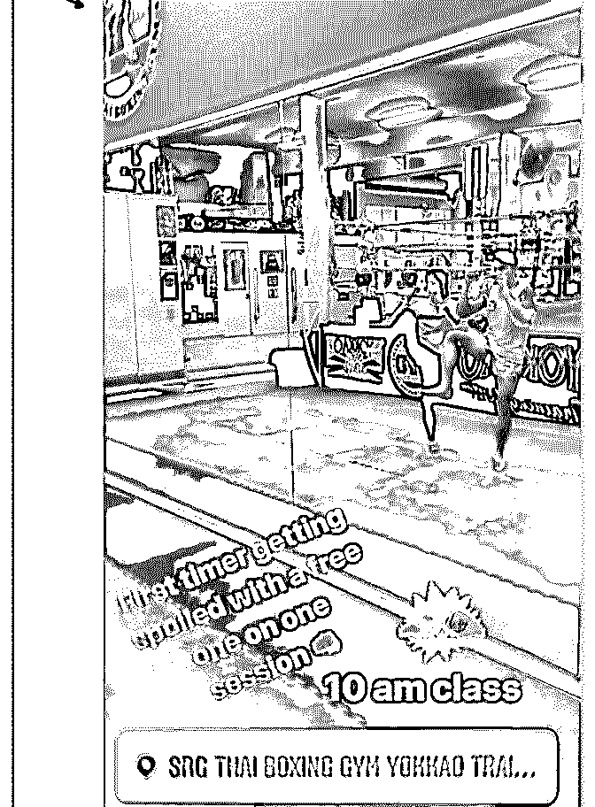
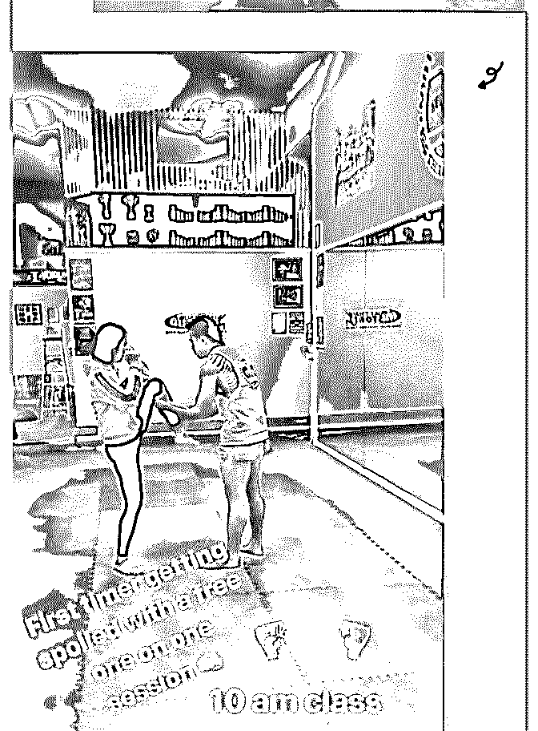
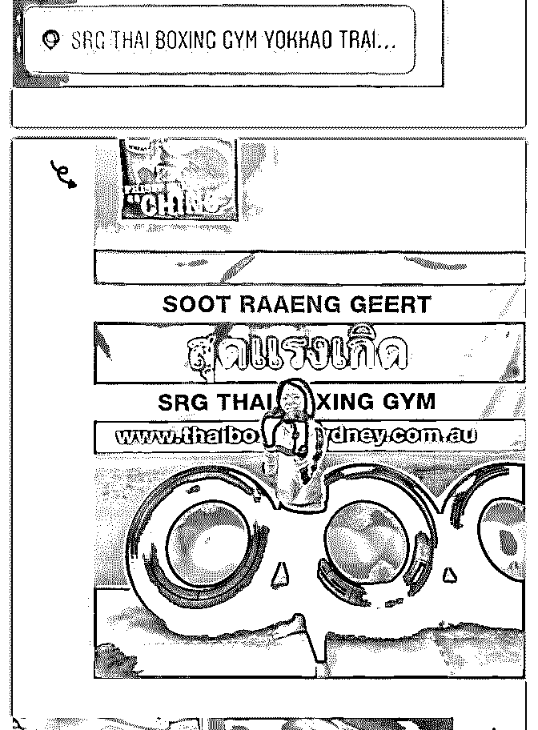
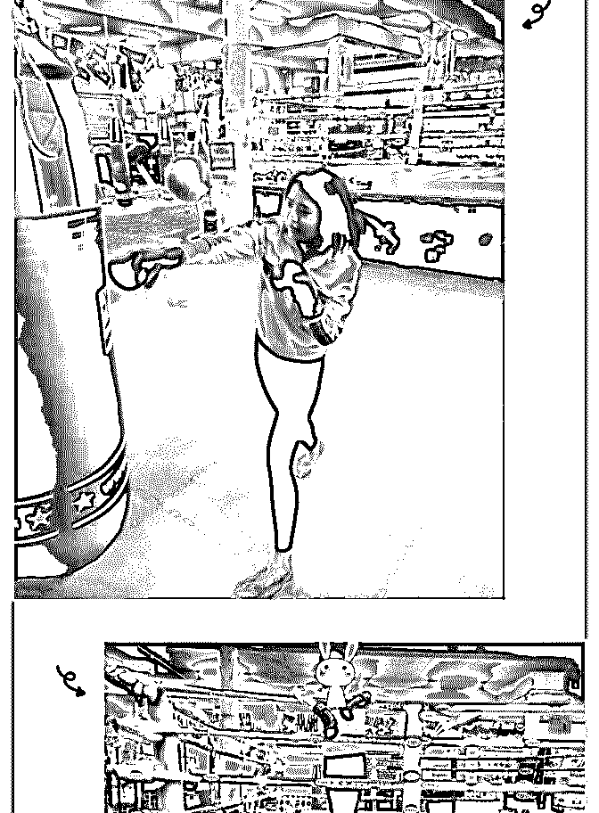
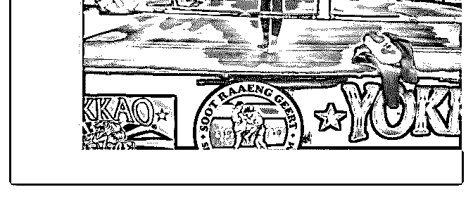

# 每天认识一个新朋友

花 蕾蕾在悉尼 : 每天认识一个新朋友 花蕾蕾 悉尼

2018.8.13

经历：今天在朋友的邀请下去了南半球最好的一个泰拳馆， 听说冠军都在这里学习~ 然后有 2 个泰国教练给我一对一训练了一个小时~Dwin 和 Du. 原来我也学习过一段时间的 Boxing,但是泰拳感觉不一样，更 加需要力量，训练中和教练聊起为什么想学泰拳，我其实并 不想，只是想来体验一下。所以我说，我原来学过 Boxing, 想 看看和泰拳有什么区别。然后问了他们一些关于泰拳的问 题，比如学习泰拳他们感觉对自己有什么变化之类的开放式 问题~后来留了 Facebook.训练的时候拍照发了 Facebook 做宣传

~ 泰拳真的好累，哈哈，训练一个小时以后感觉自己累趴下 了。

心得：和别人聊天，我觉得特别重要的一点是，自己首先对 聊的话题要有一定的认知。如果之前我没有学过 Boxing,不知 道 Boxing 的一些基础常识，就不会去问一些有关的问题。即 使不知道不懂，也要在聊天之前做一定的准备，如果提前知 道对方是什么领域的人的话，这样聊起来才会更有话题~

2018-08-13(12 赞)

评论区：

范范 : 会打泰拳的女生好厉害

HD－个人品牌咨询师 : 非常棒的打卡，看你的打卡忍不住要称赞 。泽宇今天开会还特意提到你的打卡，说是目前在几

个群里看到的最好的打卡。【过程 心得 照片】[愉快]第二部分的心得很棒，在聊天过程，自己对于哪个话题一定要有认

知，对某个话题有准备，这个很重要。

花 蕾蕾在悉尼 : 哇塞，开心！！谢谢鼓励！比心心

花 蕾蕾在悉尼 : 哈哈，谢谢

关注公众号"懒人找资源"，星球资源一站式服务