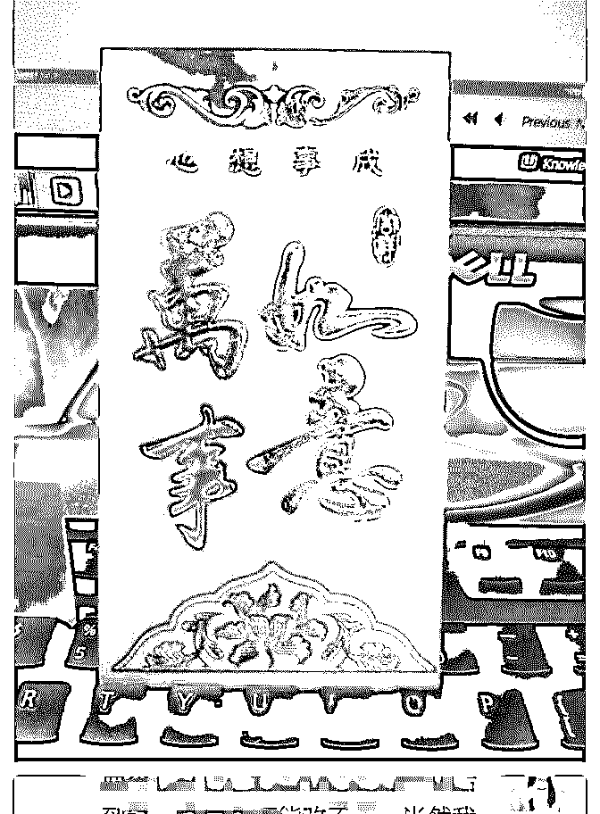
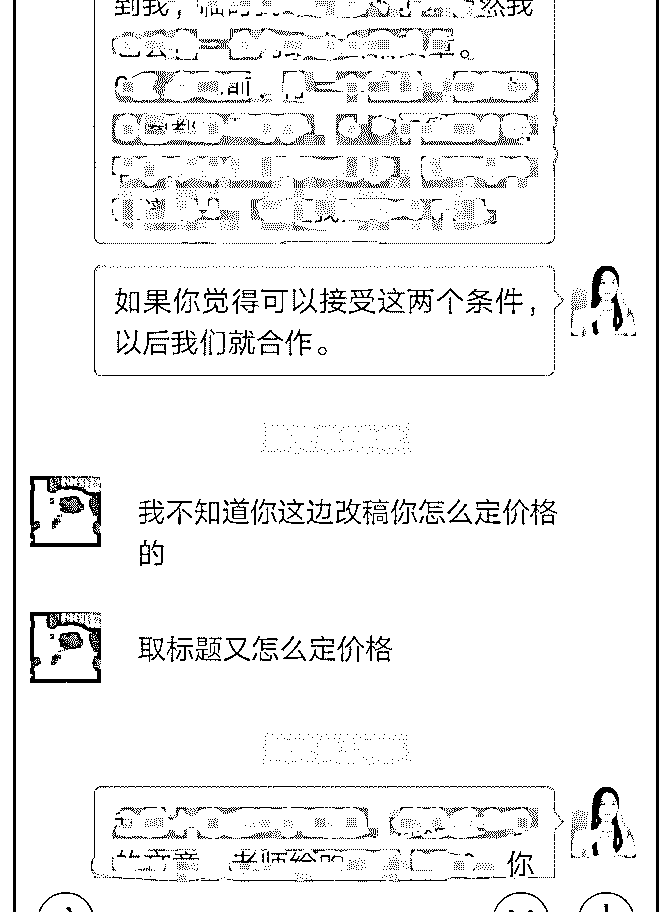
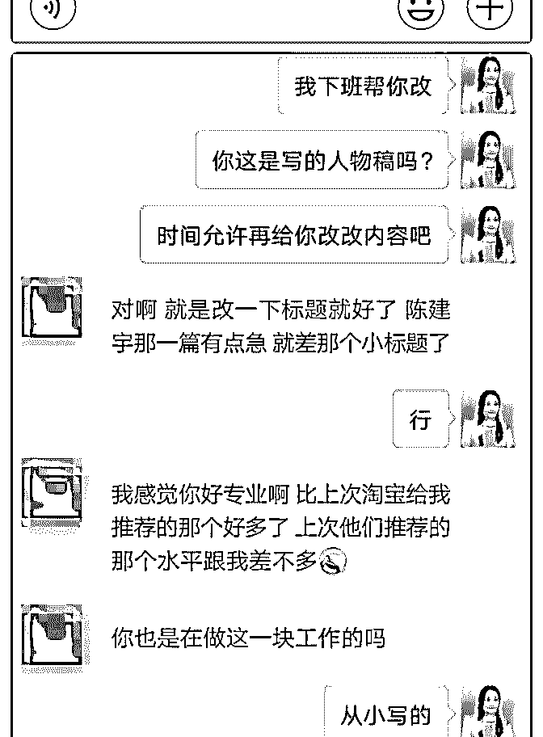
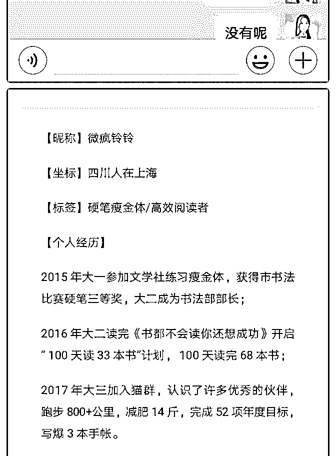
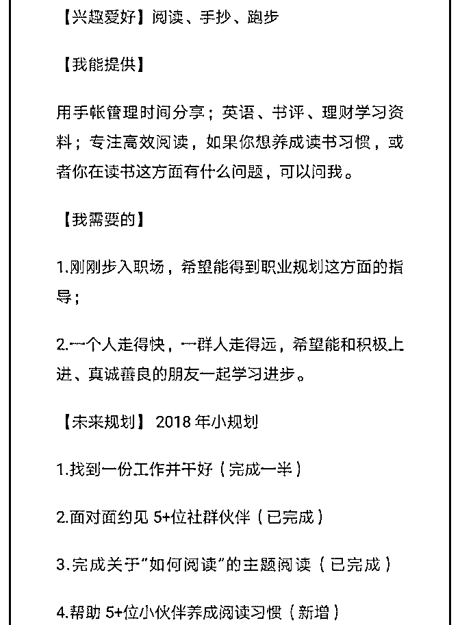
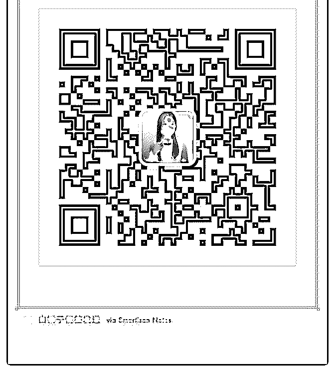
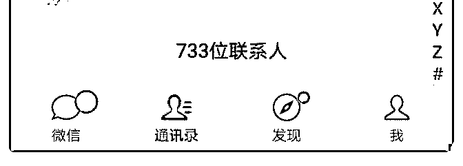

# 微疯铃铃打卡 Day

微疯铃铃 : 微疯铃铃打卡 Day48 写作获得红包收入 111 元，工作得到认可，开心！

今天是加入泽宇教育的第 118 天，时间过得真的挺快的，虽然 没有坚持天天打卡记录，但是每天都有去一点点突破自己。 微信从一开始的 300+人，到现在的 700+人。

世界上有两种动物可以等上金字塔，一种是雄鹰，还有一种 是蜗牛。前路虽远，行者将至，一步一脚印终会到达目的 地。

从来就没有一步到位的辉煌，我也更喜欢踏实傻傻坚持到底 的自己，做好了该做的，积累的够了，是火山就该爆发的。

001.工作和师傅搭档成为整个大区 TOP，收到公司发的一个超 级喜庆原始的大红包

即便现在做的是一份自己不喜欢的工作，但是更不喜欢被放 弃被选择，我希望有一天我放弃这份工作也是我自己主动选 择的结果。

002.在平台接稿，客户很满意，要求合作

在写稿子的过程中，跟客户沟通了很多次。改好稿子后，客 户很满意，说我很专业。 第二天问我能不能帮她再改改另一篇的几个小标题，用中午 吃饭的时间帮她改了，顺便还帮她把内容修改润色，错别字 改了。

然后晚上客户说希望跟我长期合作，因为在平台还需要交中 介费。跟她谈了具体价格和条件，完美成交。

☀ 世间所有的牛逼背后，都是不为人知的苦逼坚持。努力和 成功之间，永远隔着一段距离。平庸和成功之间，唯一的区 别是，你能否利用一切时间，坚持挺过这个无法估量的距 离。

始终记得，要永远相信自己可以，有梦想，不怀疑，特努 力！

2018-08-10(14 赞)

关注公众号"懒人找资源"，星球资源一站式服务