# 然果打卡二十六天

然果. : 然果打卡二十六天 1.一个 200 元的自我介绍咨询，使我加入一个半月收入 1300， 成功达 4 位数

2\. 朋友咨询价值输出以及一个月赚回两倍学费的经验，收到 红包。 3.发了一条分屏学习的朋友圈，朋友们纷纷表示 get 到新技 能。

4.分享自己的经历，激励了新朋友行动起来。

1.一个 200 元的自我介绍咨询，使我加入一个半月收入 1300， 成功达 4 位数 新朋友加到我，被我自我介绍吸引，请求我帮忙修改自我介 绍。

修改自我介绍 →标签确定 →能提供什么 →给公司、商城的 宣传、营销提供建议。

（从一开始修改自我介绍谈到了宣传模式，朋友还以为我学 广告的，说营销懂不少。）

永远不要低估自己给别人解决问题的能力，用心发现对方的 需求，找出根本性问题，帮助别人解决好问题。

2\. 朋友咨询价值输出以及一个月赚回两倍学费的经验，收到 红包。 看到我的打卡分享，朋友主动跑来询问我自己短时间赚回学 费经验，于是我分享了很多之前整理的干货给她。

自己学习并琢磨出来的东西，善于整理起来，可以帮助一个 人、两个人、三个人、一批人……

3.发了一条分屏学习的朋友圈，朋友们纷纷表示 get 到新技 能。

昨天采用分屏模式学习 2.0 课程，上面视频下面便签可做笔 记。

结果朋友们纷纷评论说这是好方法。

分享一个新技能给大家，大家可以尝试一下。

4.分享自己的经历，激励了新朋友行动起来。 新朋友说自己定位多个，有些迷茫，自己没有动力去执行。

我分享自己的个人经历：经过三次定位更改才找到自己真正 想做的事情。

最后她说“你的开导让我有了动力”

没有去行动、没有去尝试永远不知道自己喜欢什么或者想要

做什么。

2018-08-10(20 赞)

评论区：

心作 : 然果小姐姐，棒哦！

Leslie 林 : 小姐姐带飞

Bing : 哈哈哈

然果. : 谢谢小贾

然果. : 你已经在飞的路上了~

然果. : ❤比心

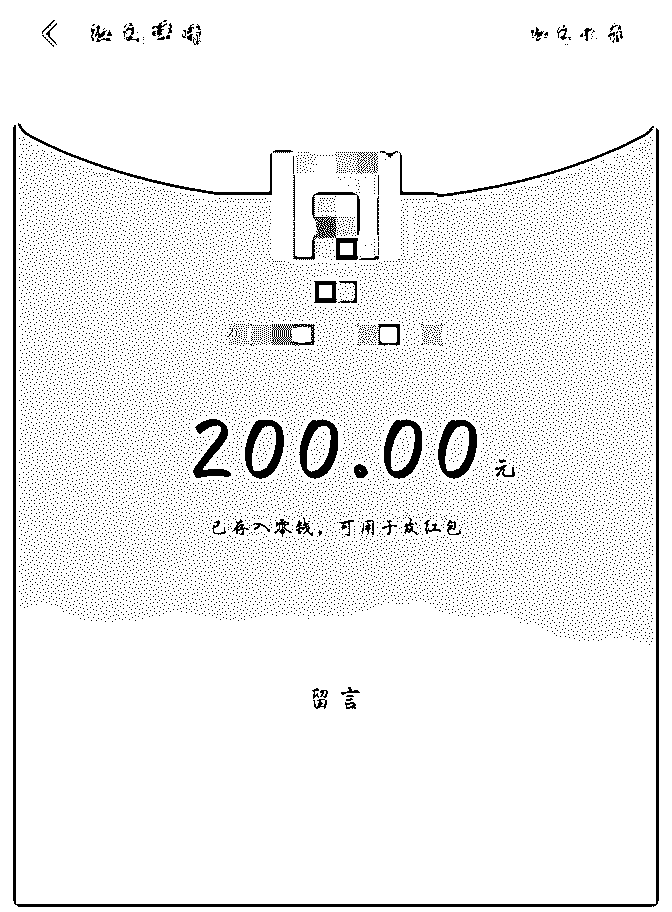

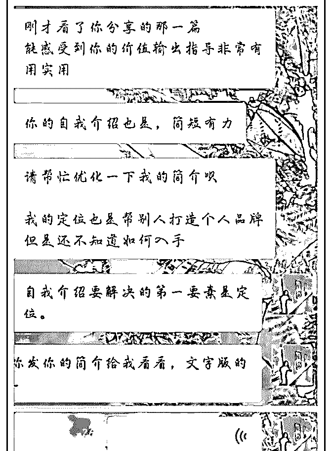

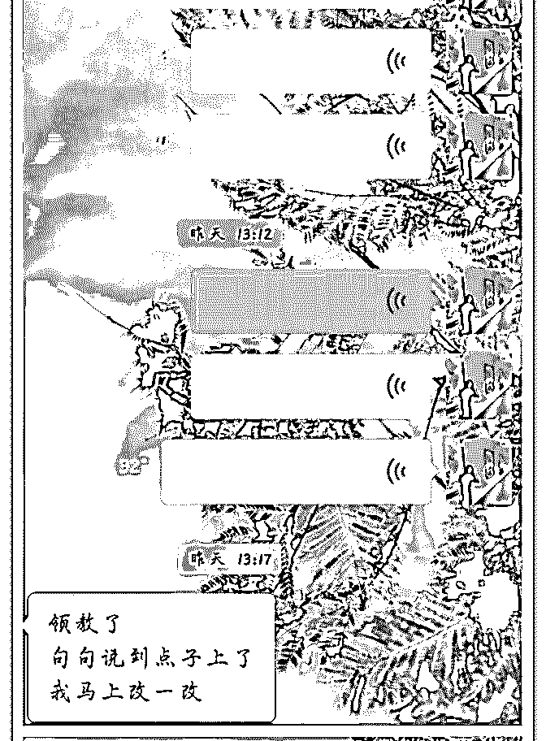

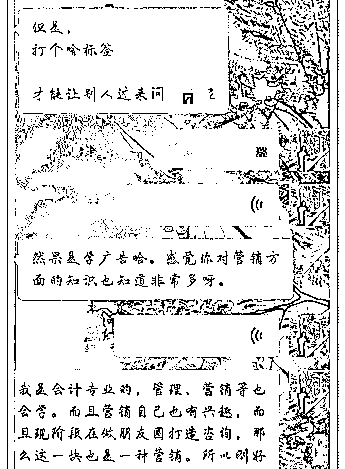

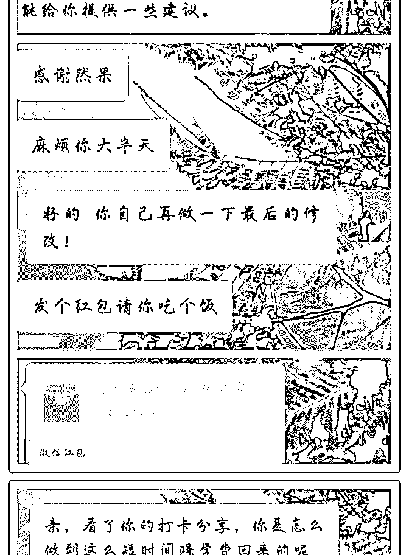

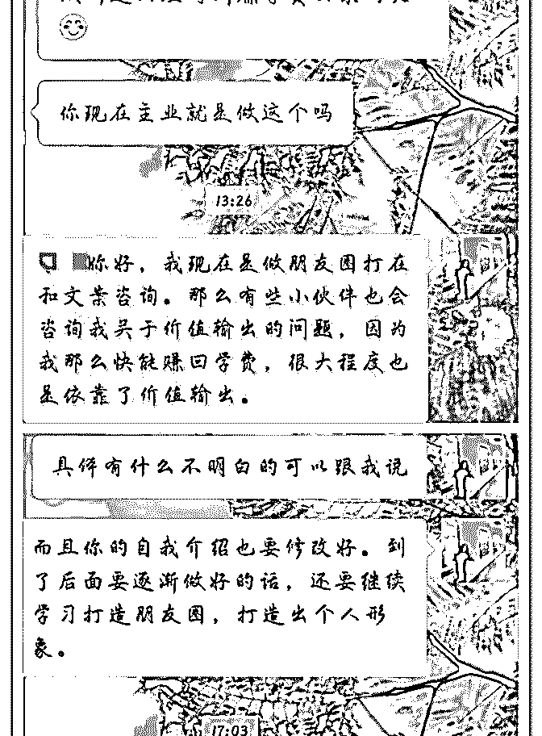

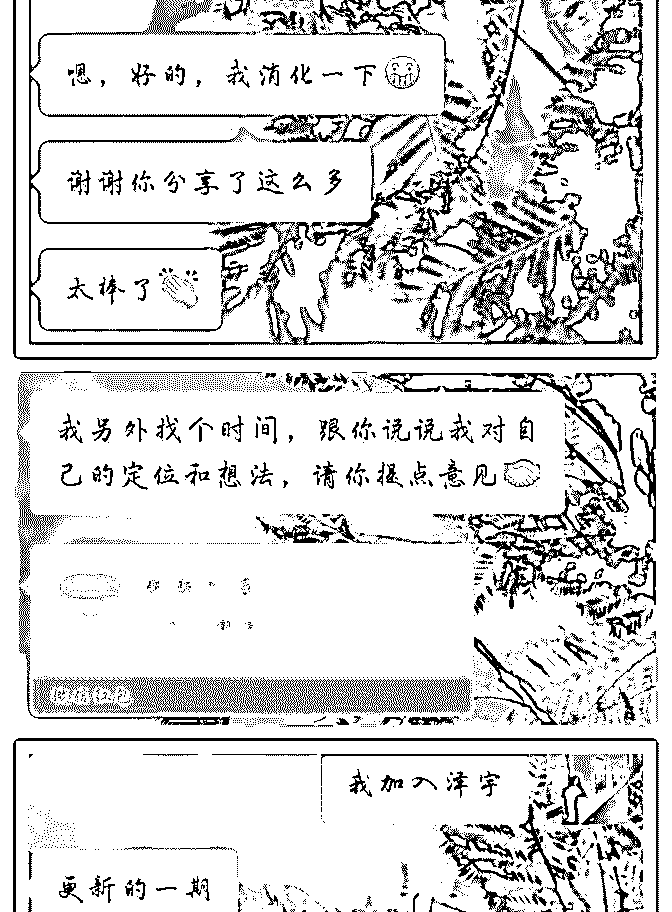

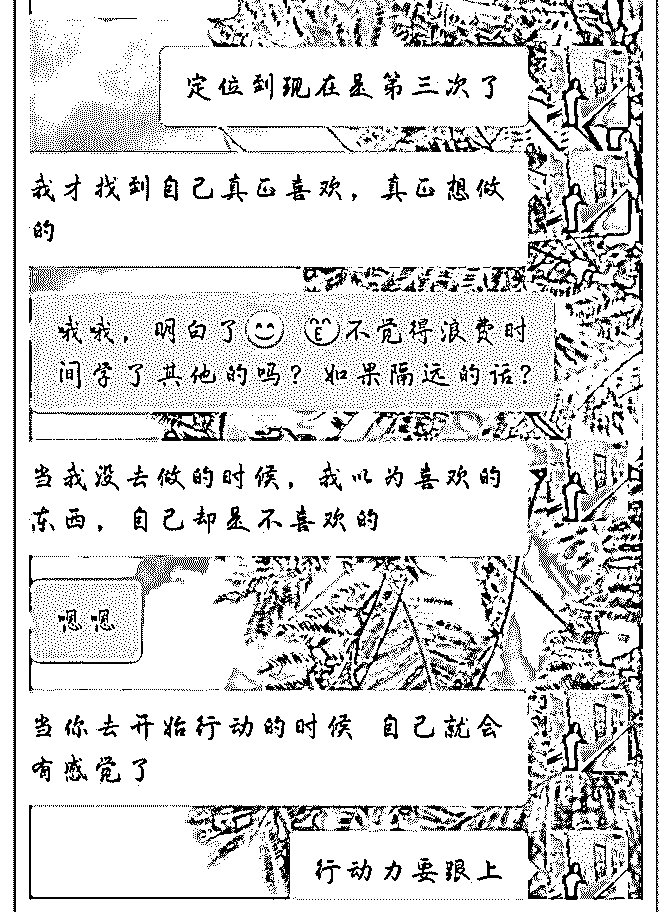

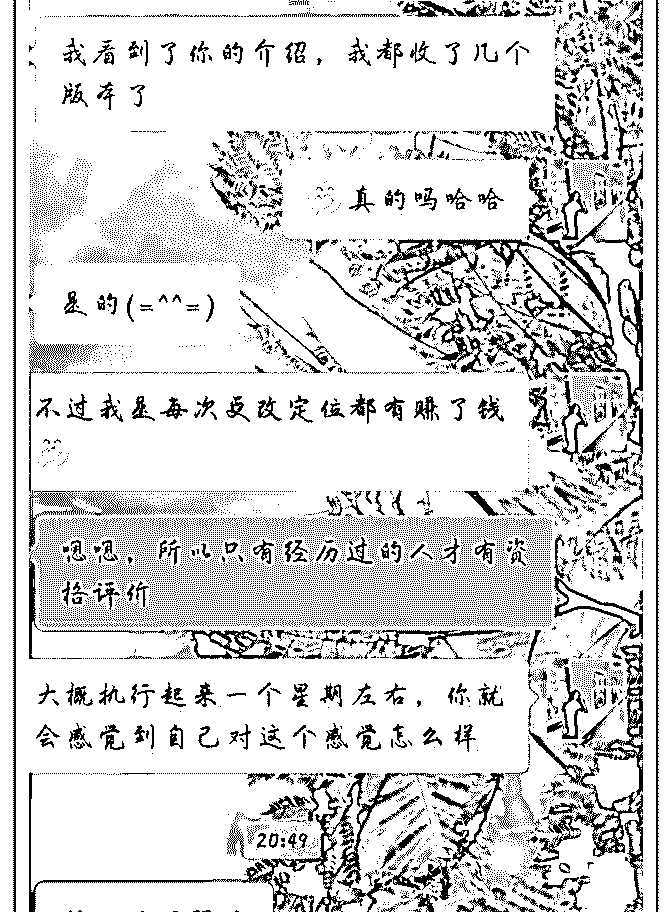

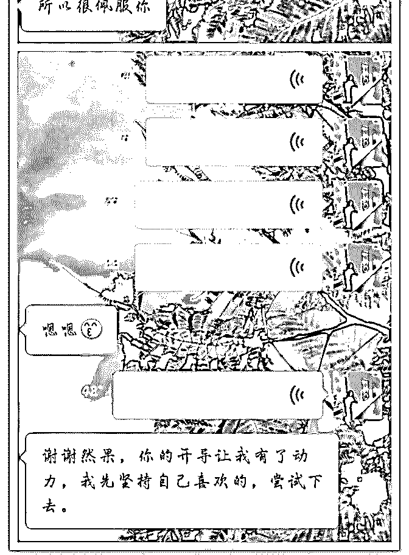

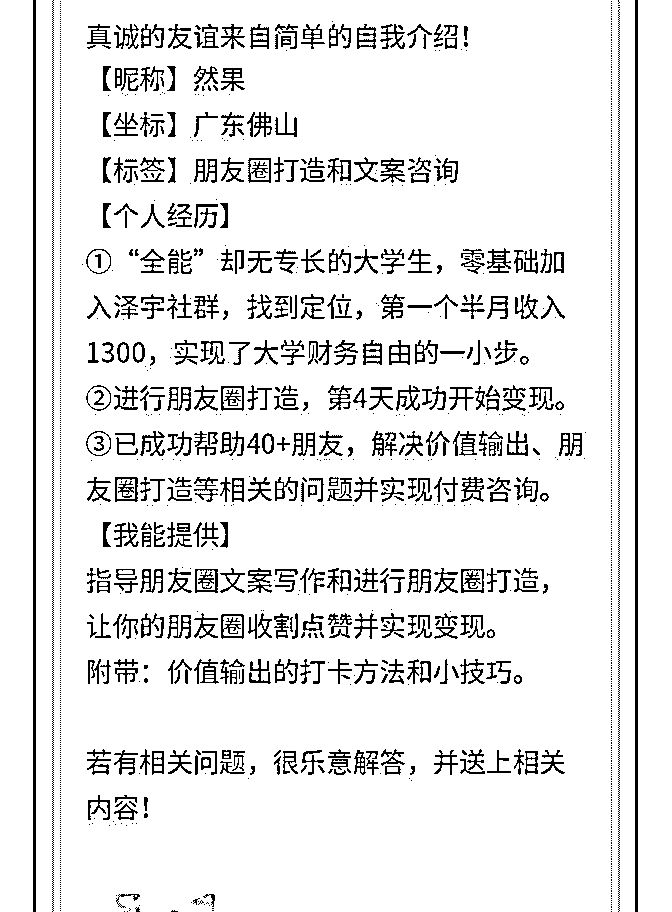

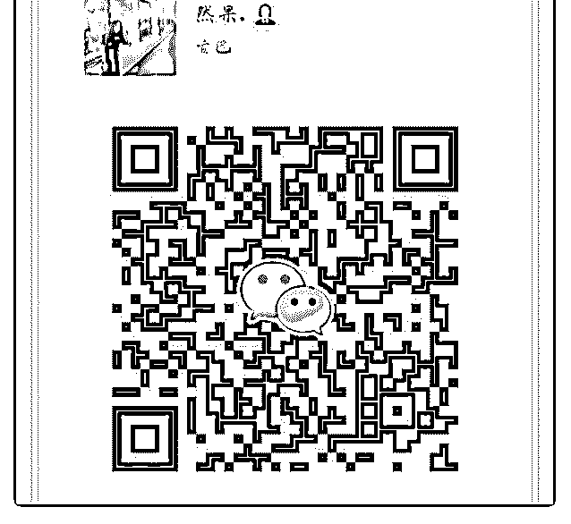

关注公众号"懒人找资源"，星球资源一站式服务