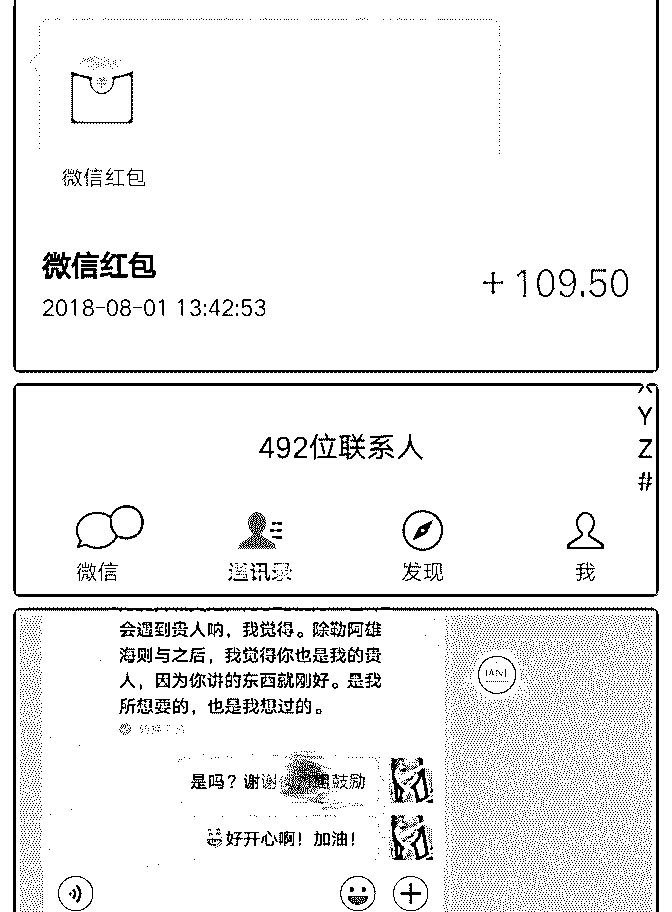
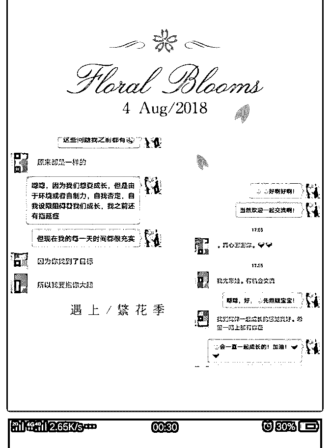
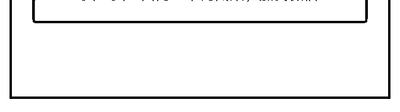

# 范范打卡第 42 天！

范范 : 范范打卡第 42 天！ 1）听完熊凯老师群里干货分享 5 天后，价值输出，实现变现 到三位数！ 2）加入泽宇教育 60 天，践行课程，每天认识一个新朋 友，300＋

3）一对一指导，改变性格思维，成长看得见

1，学习熊凯老师在群里提前分享的干货内容 5 天后，通过线 下帮助朋友解决一些演讲表达方面的问题，线上解决了一些 朋友复盘打卡的迷茫，获得了线下线上伙伴的肯定，并收到 了红包，实现变现，过百到三位数！（图一）

2，通过学习社交课第一课践行“每天认识一个新朋友”到今天 新认识了 300＋的朋友，各行各业的精英，有 47 万粉丝的自媒 体大咖，有 18 年演讲经历的演讲大师，有区块链大神，有心 理咨询师，有个人定位咨询师，有写作大咖的学生，有 90 后 创业者等等优秀的伙伴，开心和感谢与他们的遇见，了解学 习到很多之前所不知道，所没有过的认知，也逐渐建立起我 自己的核心自信，不再受到外界的一些否定言语，怀疑眼 神，不屑口气的影响，收获到“每天认识一个新朋友”所释放 的能量 也有新朋友们通过我的分享和复盘打卡过来主动遇见我，沟 通解决了当时她们的问题，帮助她们找到动力和方向感，其 中一个伙伴说除了泽宇老师，熊凯老师之后，我也是她的贵 人，哇！特别开心！（图二＋图三） 从之前的封闭小圈不足 200 人到今天的 492 人；从之前微信圈 里都是同事，同学，家人到今天的各行各业的精英和一起前 行，一起成长的伙伴，

看到，感受到，收获到很多之前没有看过，想过，甚至于不 敢想的东西！

你的天花板也许是别人的地板砖！

3，通过和熊凯老师的一对一指导，在每周和家人、朋友打电 话，他们都说我的变化好大，和之前不一样了，根本的改变 是在听完熊凯老师的指导后，把我的敏感多疑转化成强大的 感知力，同理心，让她们感受到了我的性格逆转，不再自虐 的多疑而是去理解他们，带着他们去看到生活的另一面！ 对于他们另一个认知的碰撞是遇到问题，不再跟着他们吐 槽，抱怨，那一种无能，无奈的表现被我转化为更有力量的 解决问题的态度和方法，这也是我从熊凯老师身上学的很重 要的一点，谢谢！

范范一路的点滴成长，离不开伙伴们的鼓励和陪伴！更要感 谢来遇见我的贵人～熊凯老师，真的从心底里很感谢他，他 对我的包容，鼓励，支持和指导！

遇见并加入泽宇教育的我是幸运和幸福的，我也会通过我的 输出，通过我的分享让迷茫的伙伴遇见泽宇教育，改变自 己，收获成长！ 遇见期待的自己是一件太美好的事情，我一直在路上，期待 与你相遇！

2018-08-10(15 赞)

评论区： 心作 : 棒

关注公众号"懒人找资源"，星球资源一站式服务