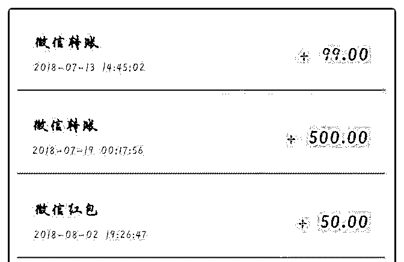
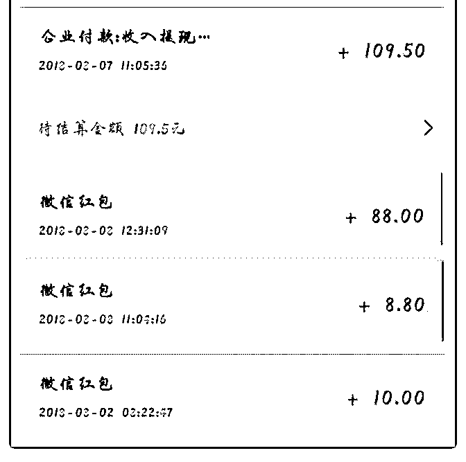
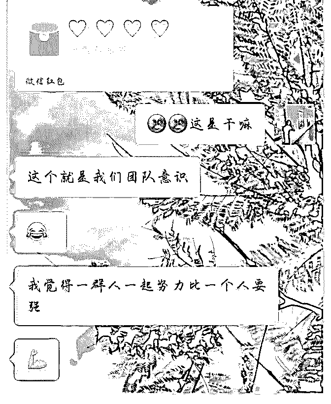
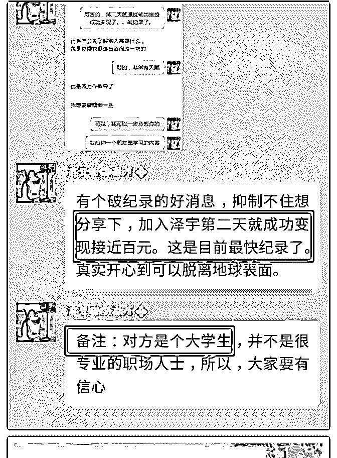
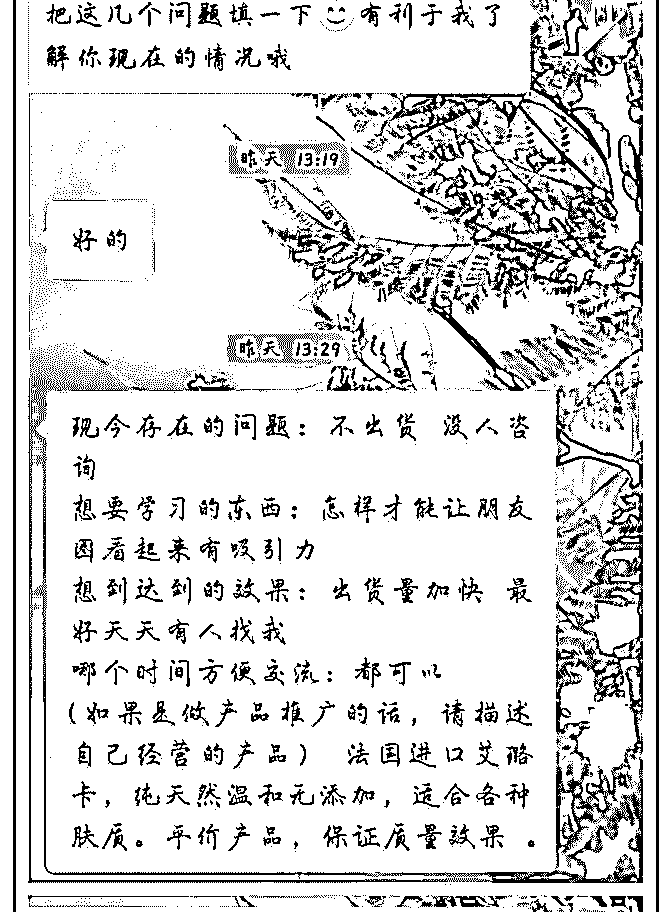
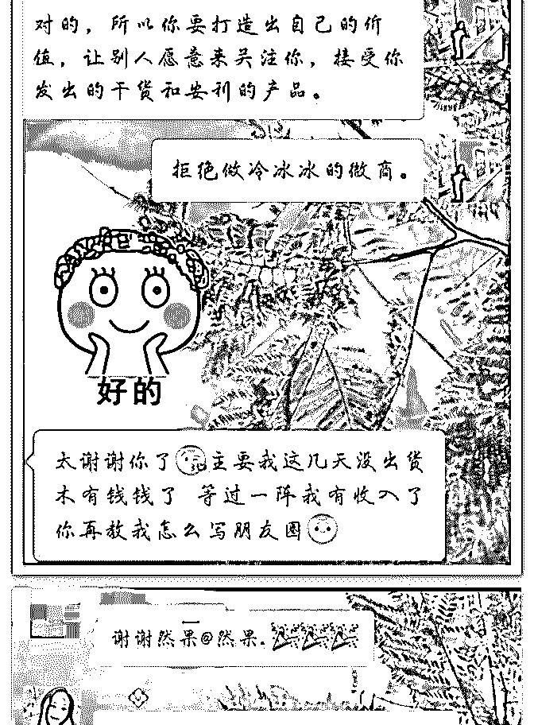
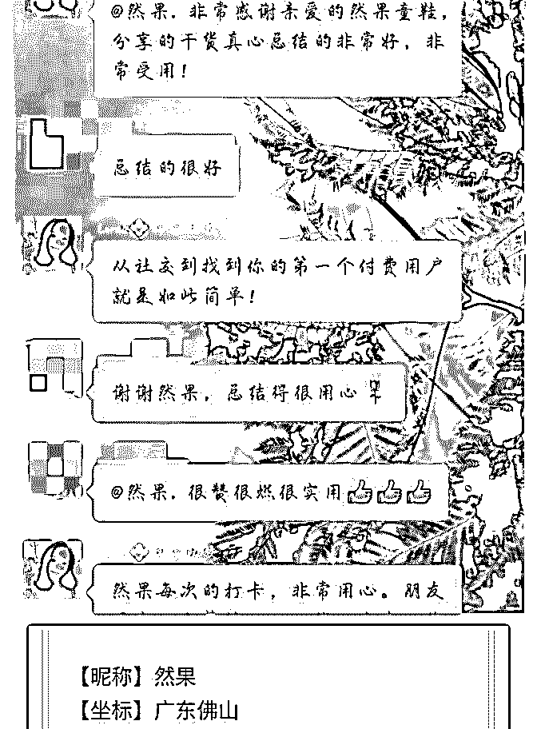
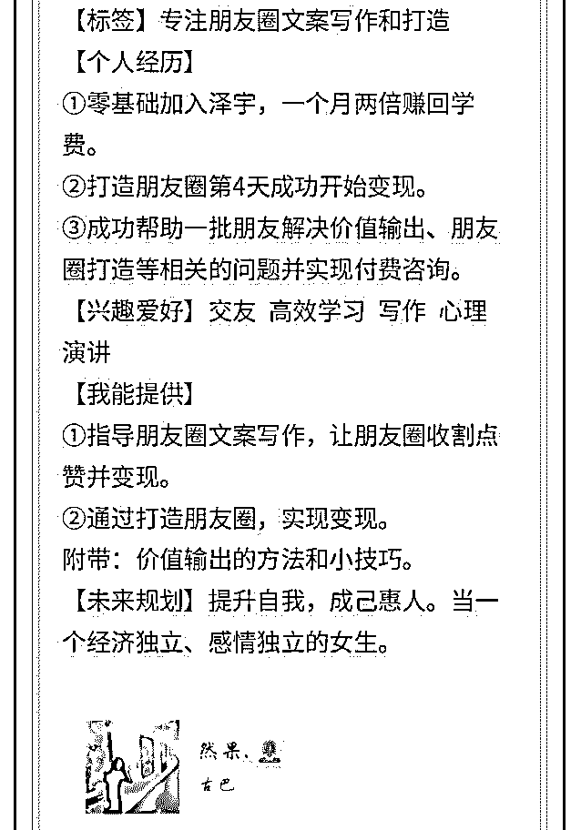
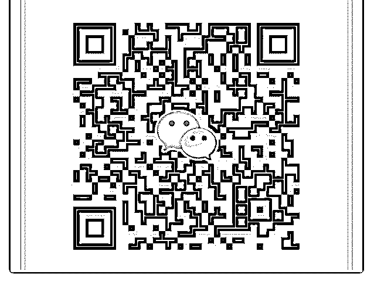

# 然果打卡第二十四天

然果. : 然果打卡第二十四天

1.加入泽宇一个半月收入即将破千。

2.与朋友抱团学习，加入二天的他收入实现破百。

3.经介绍，微商小姐姐决定付费向我咨询朋友圈文案和打造。

4.Lorna 姐邀请做分享：如何一个月赚回两倍学费。

1.加入泽宇一个半月收入即将破千。 一个半月，收入马上就破千了。（图一） 最近有很多朋友来加我向我咨询如何做好价值输出、打造好 朋友圈等问题。

在解答的同时，我也在抓紧把自己的经验整理成课程，让更 多的人能学习。

学习是输入，思考和创新是内化，实现收入是输出。

2.与朋友抱团学习，加入二天的他收入实现破百。 （图二 三） 现实中的朋友经我介绍加入了泽宇社群，于是我们开始抱团 学习、交流，加入第二天他的收入破百了！

或许一个人能走得很快，但一群人能走得更远。

3.经介绍，微商小姐姐决定付费向我咨询朋友圈文案和打造。

（图四）

一个微商小姐姐很困惑自己为什么东西卖不出去，花了三百

元做推广都没有用。可当她加我的时候，我的第一感觉是：

商业气息十分浓厚。让人不自觉地有距离感。

经我一些建议之后，小姐姐决定要付费咨询我。

学好朋友圈打造，拒绝做冷冰冰的微商，拒绝被屏蔽或拉

黑。

4.Lorna 姐邀请做分享：如何一个月赚回两倍学费。（图五） 周日晚上，受 Lorna 姐邀请，去 E 群做了一场分享。 自己整理了很多自己学习和思考而成的干货，献给了大家。 之后就有朋友陆续来加我了。

分享小秘诀：

①精准引流

②把握好手上的人脉。

③做好价值输出。

④敢于迈出第一步。

⑤第一个人很重要。

⑥边学边用，持续输出。

（看似很简单的步奏却需要很多心思和好方法去经营）

坚持持续输出对大家有用的东西。

然果与你一起成长☀

2018-08-08(12 赞)

关注公众号"懒人找资源"，星球资源一站式服务