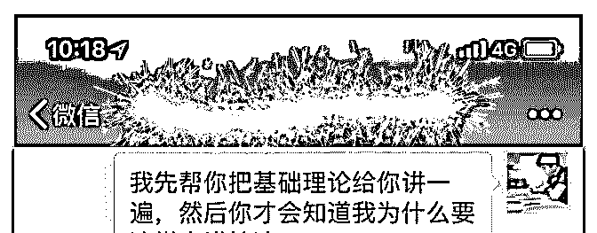
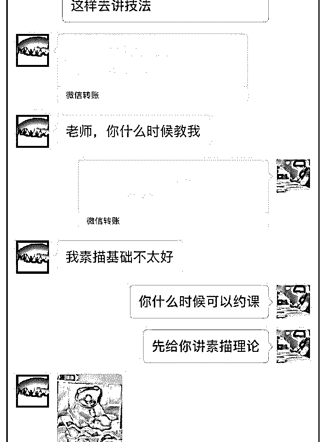
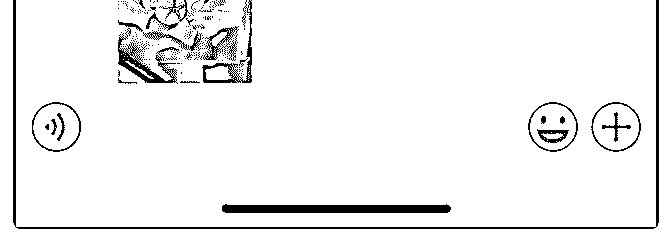
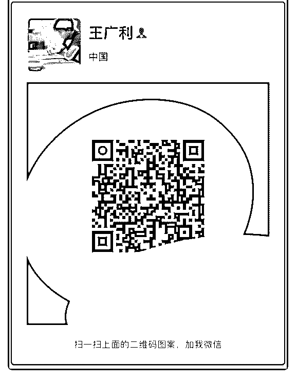

# 打卡第六十四天通过

王广利 : 打卡第六十四天 通过三个月泽宇核心课的学习，这段时间是自己改变最大、 收获最多的一段时间，很庆幸自己能加入到这个集体，改变 自己。 加入泽宇核心课短短的三个月内，通过自律的黄老爷的一对 一指导，让自己快速成长，最重要的是在自律的黄老爷的指 导下，让自己增加了收入，轻松赚回了自己当时交的学费 365 元。 通过核心课第五课打造自己的朋友圈，其中最重要的一句 话“朋友圈是每个人在互联网上的形象”这句话，我深信不 疑，通过泽宇的一对一指导，调整自己的朋友圈，让更多人 了解自己。 感谢泽宇、自律的黄老爷在这个过程中给我耐心的指导，这 个群体的指导以及帮助是我从来没见过的，他们的行动也深 深的感染着生活中的我，谢谢群里的每个小伙伴，和你们相 处才真的体会到行动的重要性。 特写一句：自律的黄老爷对每个问题细心的解答，让我感到 的不是问题本身，而是解决问题的用心程度，感谢黄老爷。 下面是截图

2018-08-07(9 赞)

Leti 茜雅—西语零* :

打卡 Day40

关注公众号"懒人找资源"，星球资源一站式服务