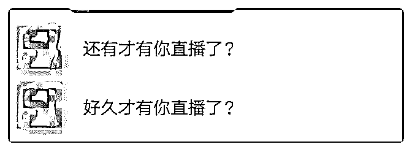

# 打卡 Day40 加入

加入核心课刚好一个半月了

001 初试直播，获得打赏 171.43 元，直播后有伙伴加我并一直 关注

002 教学课程处于初试阶段，收获两位学员，低价收费共 65 元，让他们学到一门外语之外，自己也积累教学经验，改进 教学方式

003 15 天里链接 23 个好友

2018-08-04(7 赞)

评论区：

自律的杜仔（笨笨鸟） : 恭喜，我觉得可以尝试把课程录音，然后结束后，回听内容。不足的地方，下次可以改正。

Leti 茜雅—西语零* : 嗯嗯有在思考做成这样的

心作 : 太棒了

Leti 茜雅—西语零* : 谢谢夸奖，这还远远不够，还得努力跟上大家的脚步

心作 : 向你学习哦！

Leti 茜雅—西语零* : 互相学习，共同进步

关注公众号"懒人找资源"，星球资源一站式服务