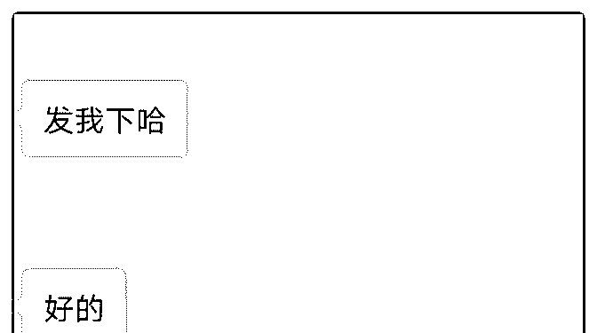
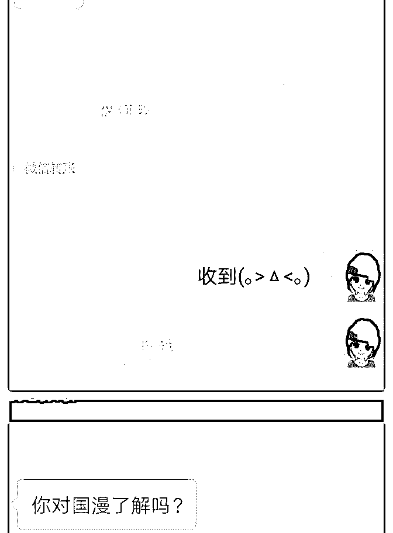
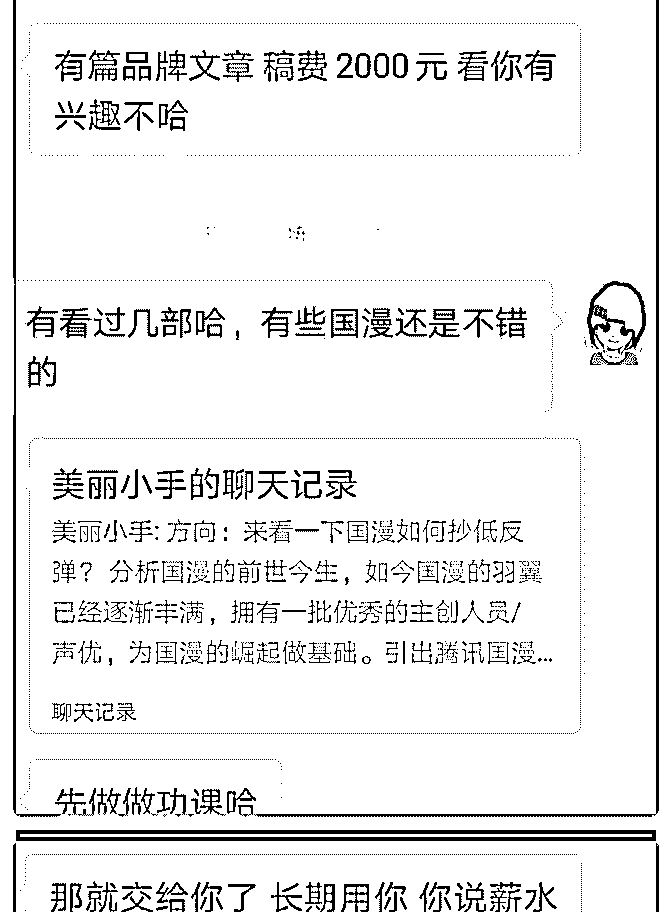
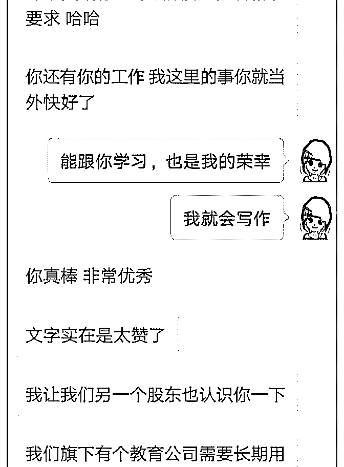
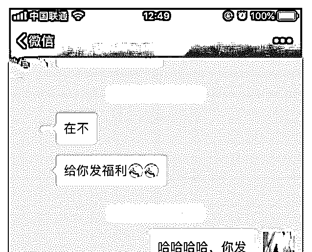
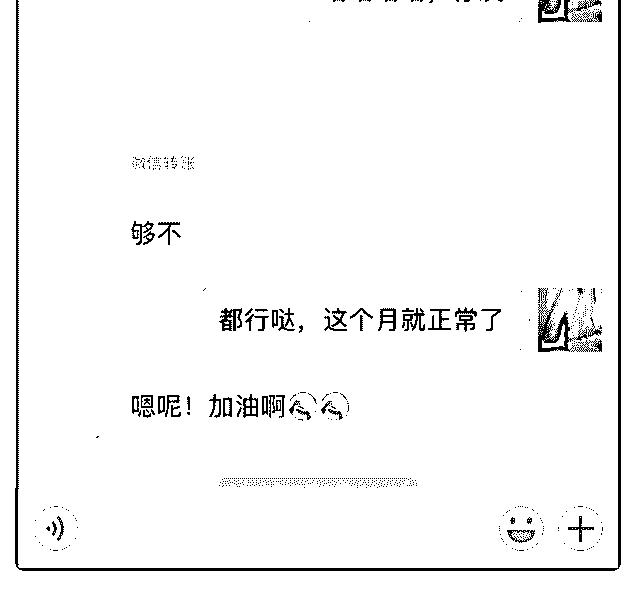

# 七月#成长复盘#

胃窦 ｜个人品牌专栏* : 七月#成长复盘# 打卡第五十二天

#加入泽宇社交第 52 天#

你想要的人生，只有你自己给得起。

1.本月通过输出，链接到甲方爸爸，一篇文案稿 2000 元，另外

还被邀请写了公众文。

2.主动链接到德国 Danke 国际文化艺术有限公司董事长苏阳

阳，她对我的文案能力很认可，邀请我可以加入他们，兼职

做文案。

3.通过在知识星球里发自我介绍，这个月新结交一百多人，深

度链接的有二十几人。

转变一种思想，变被动为主动，永远不要跟自己说不行。八

月继续努力！！

2018-08-04(17 赞)

评论区：

范范 : 好棒啊！

心作 : 超级厉害

胃窦 ｜个人品牌专栏* : [害羞][害羞]目前要学习个人品牌建立

九月星辰 : 太厉害了，向你学习

关注公众号"懒人找资源"，星球资源一站式服务

# #成长记录#7 月终

木槿 : #成长记录#7 月终于迎来喜讯，有自己第一笔额外收入 700 元，很开心。 刚开始与这位朋友聊天并没有想着会有付费这块的，只是帮 助他解决了一些推广方面的问题，后来也是问的问题越来越 多，慢慢的加深了他对我的信任，才有了后面的付费效果。 通过学习泽宇课程后，一直处于沉寂状态，感觉信心不是很 足，一直找不到清晰的定位，也是多少有些气馁，不过朋友 有问题依然会给出诚心的建议，坚持做一些自己的价值输 出，认为坚持输出还是有效果的。这件事对自己来说影响挺 大的，后面坚持输出有价值的东西。

2018-08-02(7 赞)

关注公众号"懒人找资源"，星球资源一站式服务