# 然果打卡第二十一天

然果. : 然果打卡第二十一天。

#七月复盘 记加入泽宇一个月零五天#

never under estimate your power to change yourself.

永远不要低估你改变自己的能力。

——然果

1.本月通过输出，收入总计 771 元。

（含付费咨询、红包咨询、课程收入等。）

2.被华丹助教邀请到两百多人的群里做分享。

3.依靠价值输出，本月被 60 人主动增加为好友，其中包括助教 老师。超额三倍达到月初目标。其中与 35 个好友深度链接。

4.持续输出高价值分享 18 篇，6 篇被列入精华主题。

5.成功指导 25 小伙伴价值输出、社交技巧、朋友圈打造等方面 的问题。

6.打造朋友圈，成功引起关注和各种询问，并且打造的第四天 赚取 109.5 元。

7.找到新定位——个人品牌指导。 包括价值输出、朋友圈打造、社交指导，写作文案指导。

8.成为佛山高校大学生演讲联合会副会长。 担任演讲与口才学会主办的特训营的小助教。 参加演讲/朗诵比赛获朗诵组二等奖。

9.加入知乎写作群，开启写作生活。

10.半个月用加速学习方法学习了 4 份课程。

#八月目标# 1.吸引 100 位朋友主动增加。

2.坚持写作，至少日更一千字。

3.学习更深入的知识，坚持输出，帮助到更多的人。

4.争取有更大的收入。 我能提供：

①对输出价值（星球打卡）和社交过程中有疑惑的朋友欢迎

咨询！

②微商、个人品牌等需要朋友圈打造和变现知识的朋友欢迎

咨询~

③写作、文案策划有疑惑欢迎咨询。

后期将分别推出课程分享。敬请期待！

2018-08-01(16 赞)

评论区：

波力 : 很棒呀，哈哈哈，接下来让你月入 3000-5000

然果. : 我已经准备好抱奶爸的大腿了[奸笑]

Allen : 能加个微信吗

然果. : 打开最后一张自我介绍扫码可加哦！

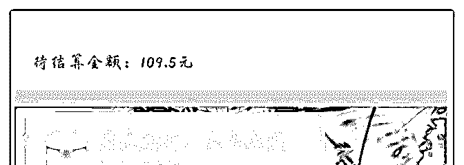

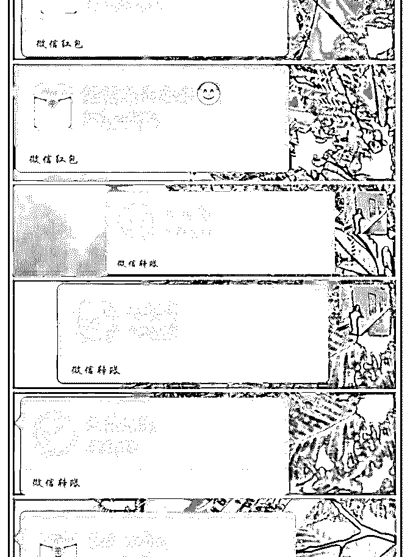

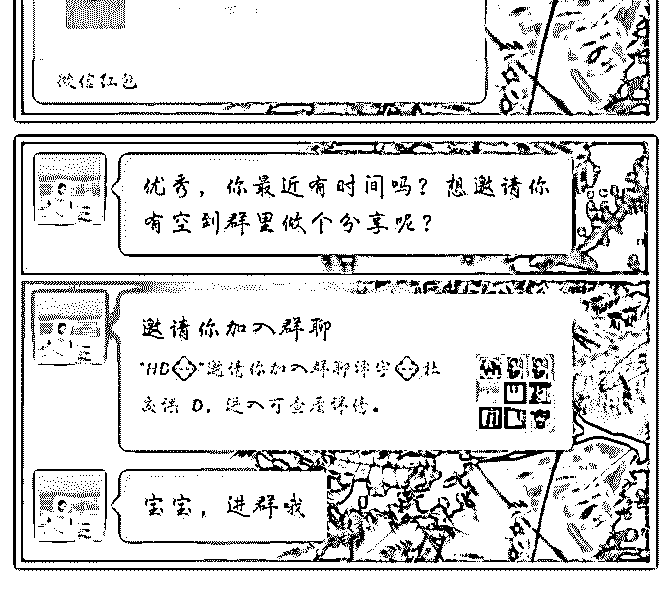

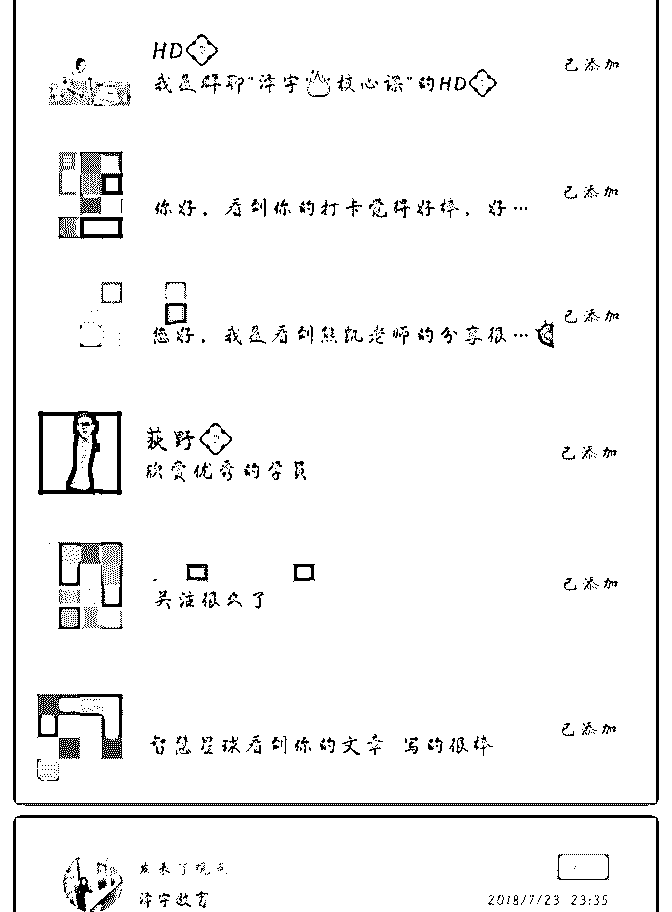

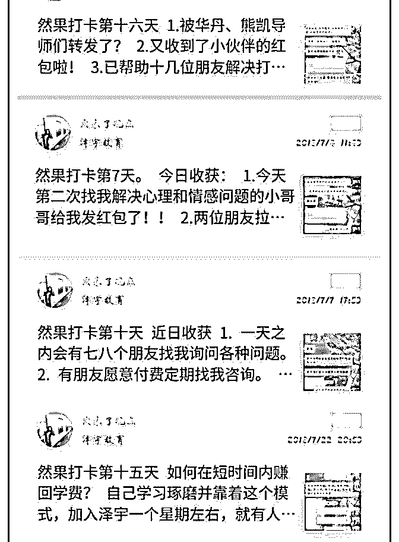

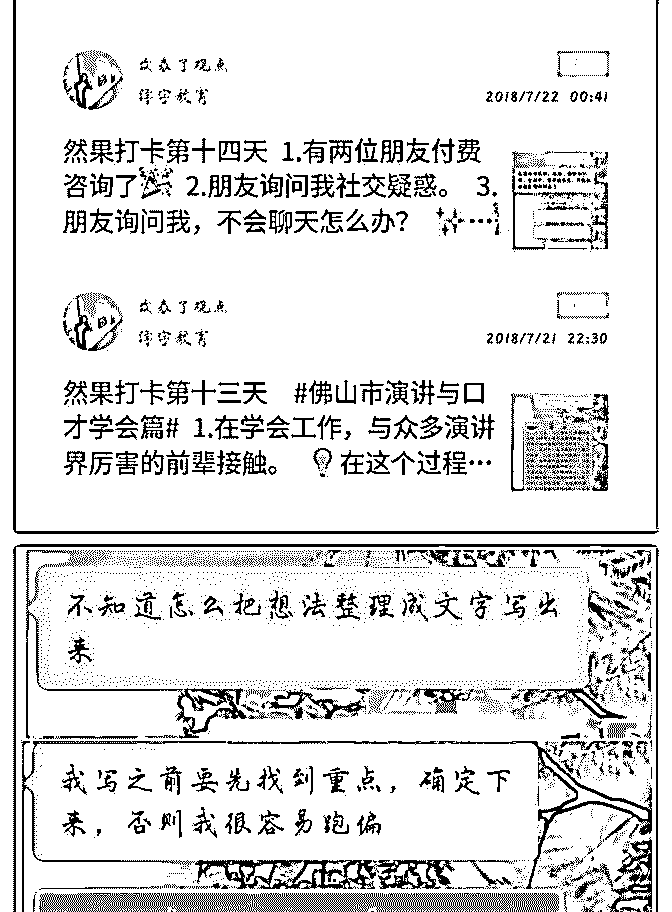

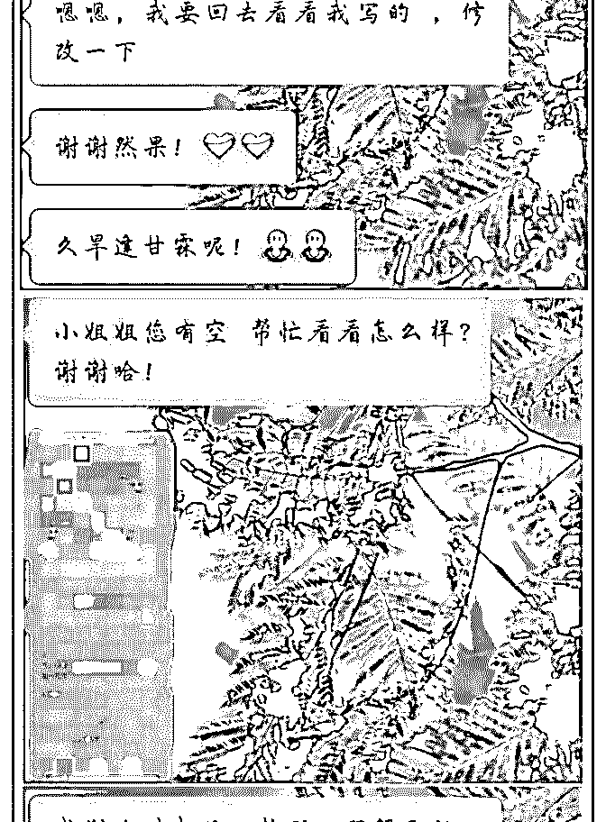

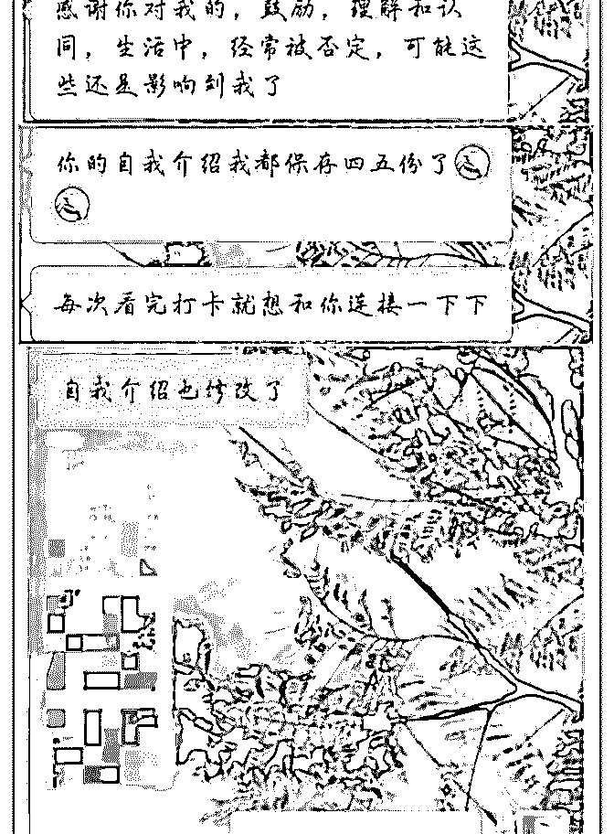

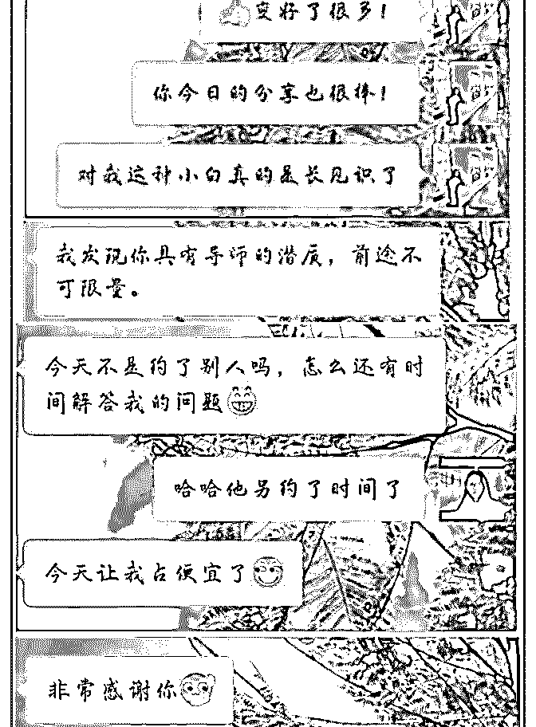

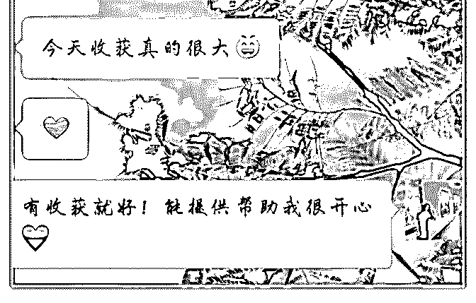

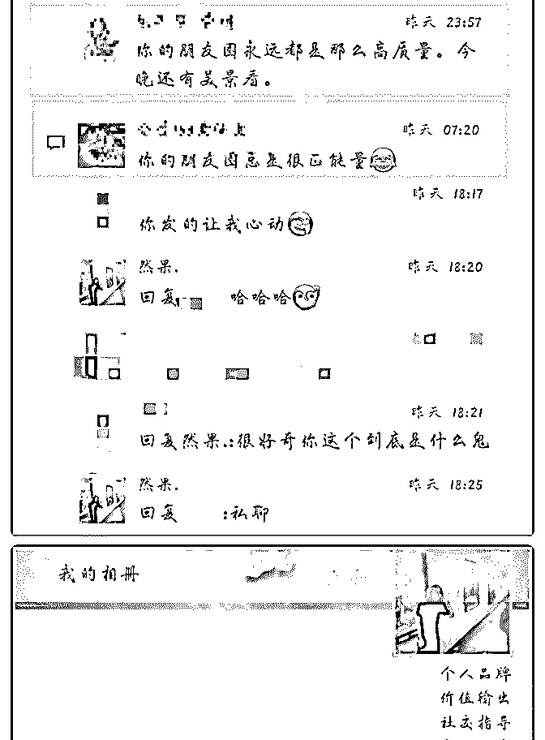

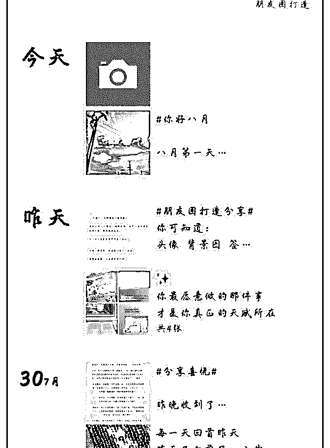

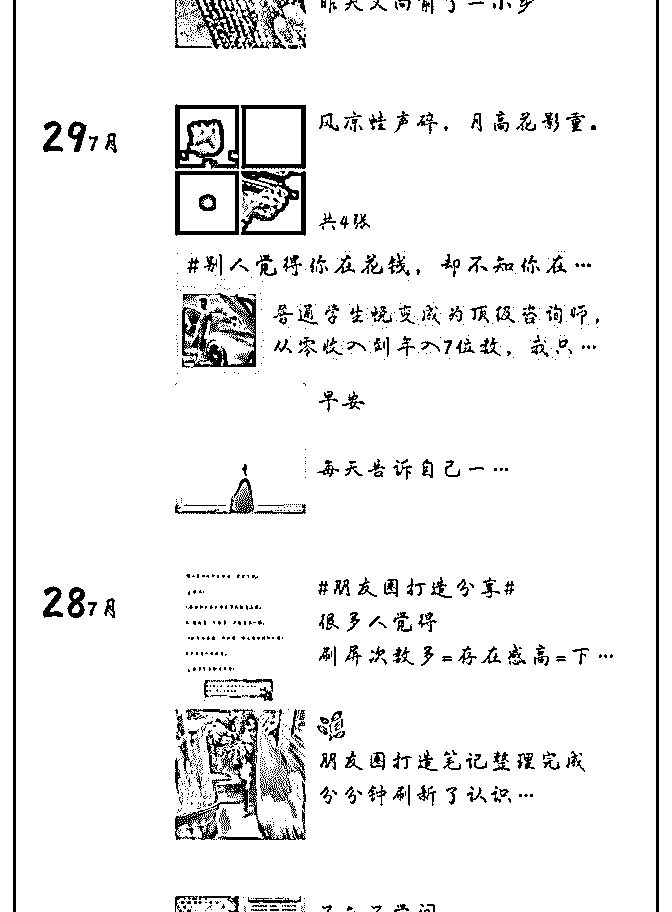

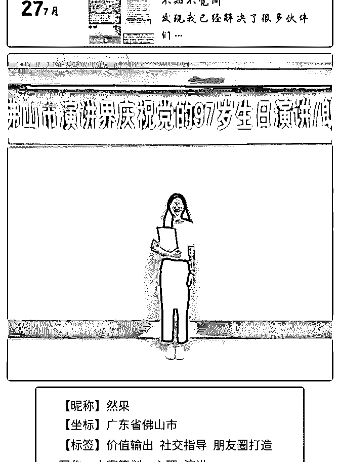

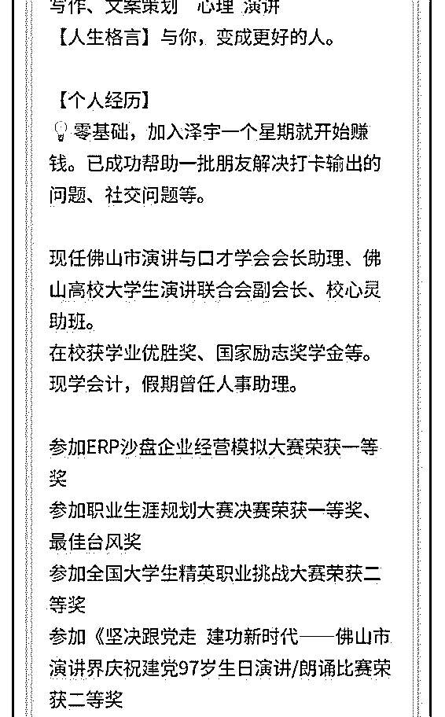

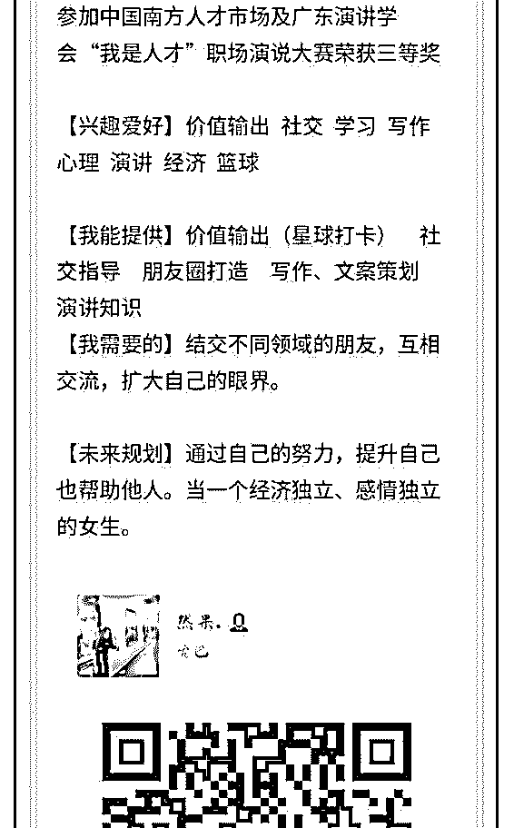

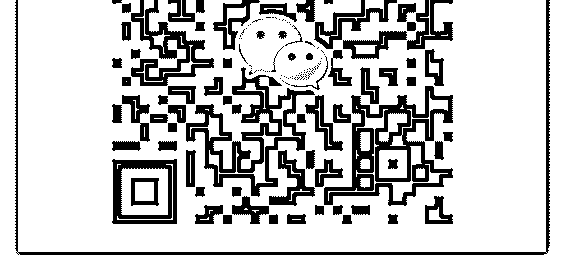

关注公众号"懒人找资源"，星球资源一站式服务