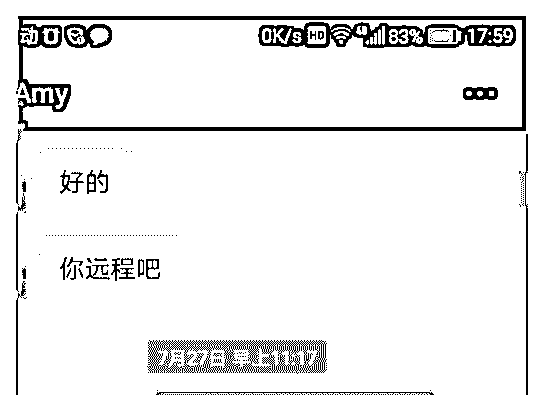
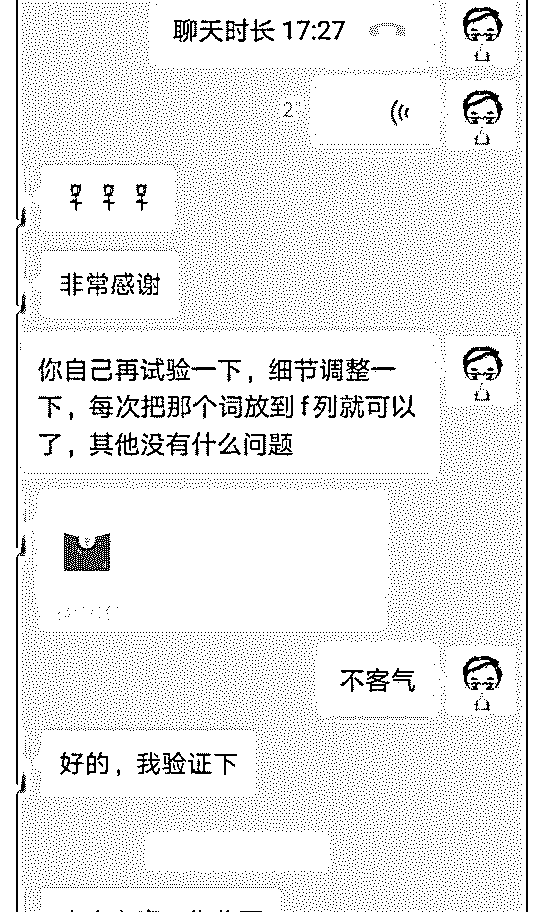
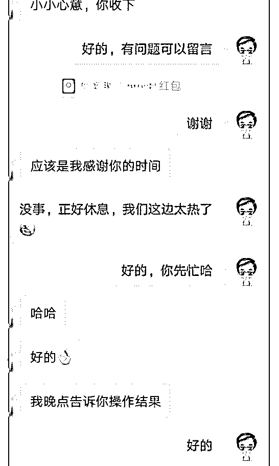
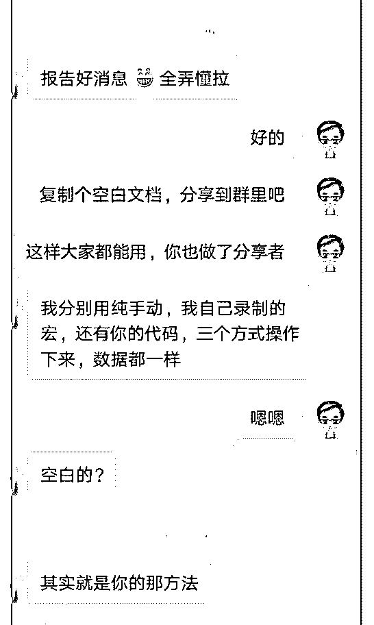
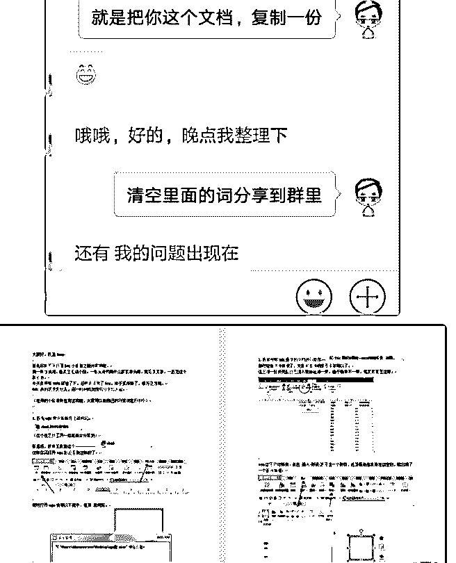
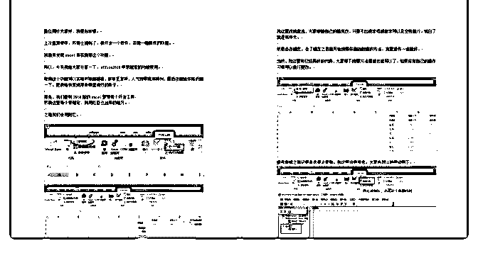

# 打卡第十天分享的力

Eric : 打卡第十天 分享的力量

“不求回报的付出，得到的可能比想的多” 我们群里有很多的同行是零基础做网店的。办公软件还不会 用。

我稍微会一点，整理了一个素材给群友们使用。 关于这个其实就是“宏”的运用，宏用好了可以减少很多重复 性的操作。

以我的举例：我们做标题需要选词。 涉及到：去除超链接、删除重复项、降序 简单说：就是”一键美图”功能（类似于省去了一步步操作， 一键得到结果）

所以这几天，一直有群友在添加我，并向我询问如何使用。 我这里也做出了解答。 因为个人时间有限，所以我又做了一个模板给他们直接套 用。 由于我用的是 Excel,而部分群友用的是 wps。文字沟通有时不 能表达清楚。

所以我用远程帮助了这位同行。 具体部分过程可见图 1。

从图中可以看出我给她的解答，还是解决了她的燃眉之急。

最后，我提醒她把 wps 的表格。整理成文档分享到群里。 目的在于：让她也可以给大家输出，而不只是求助。我们除

了有大群还有一个核心群，那里都是有分享过的成员，跟大

群的比例是 1:8。只有愿意分享的人，才有机会得到大家的信

任。

当然最后她的分享也很精彩，收获了大家的赞扬，这个没截 图（图 2 有别人整理的文档，可以看出也是用心的） 所以，我自己的感受就是，不要自我设限，你觉得这个东西 很简单，但是还有别人不懂，我们要能够在力所能及的情况 下，多输出给其他朋友。 我们每个人都有自己的特长，对你来说就很简单，但是，对 于不懂的人则仍然是一个槛，我们的举手之劳，对他来说， 可能就少走一些弯路。得到帮助的人也可以回馈给别人。

这样，我们就是一个正能量的循环，不论是商业交流还是学 习交流都可以参考。

多一些真诚，少一些套路。 只有真心才能换得真心[害羞] 2018-07-31(7 赞)

评论区：

沁心｜情感咨询 : “只有愿意分享的人，才有机会得到大家的信任。”[强]

关注公众号"懒人找资源"，星球资源一站式服务