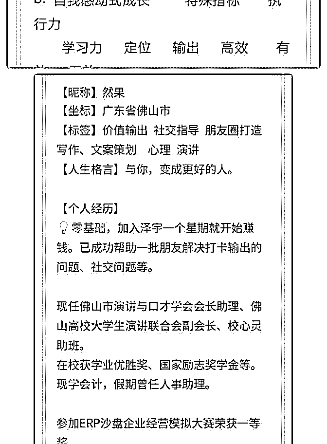

# 然果打卡第十六天 1

然果. : 然果打卡第十六天

1.被华丹、熊凯导师们转发了？

2.又收到了小伙伴的红包啦！

3.已帮助十几位朋友解决打卡问题了。

1.被华丹、熊凯导师们转发了？ 今天有 7 个朋友主动加了我，这一切源于我昨天分享的《如何 在短时间内赚回学费》，而且华丹、熊凯导师们还转发到他 们的群里了！感觉特别惊喜！

努力输出自己的价值，真的会有人看得见的！这也是我一直 坚持输出有价值的内容的动力！你也可以！

2.又收到了小伙伴的红包啦！ 今天帮助一位“初来乍到”的朋友打破了自我设限、帮助其定 位并引导她如何打卡。

①自我设限是很多新人普遍存在的问题， 对此，我在《如何 在短时间内赚回学费》的详细版里也重点举例说明了这个问 题，发给小姐姐看后她马上就明白过来了。

②定位是新人需要解决的一个问题，只有找到自己的定位才 能有学习和输出的方向，为他人提供价值。

③关于打卡的心得，我不止一次做过分享。 而且也一直帮助 更多的人去做好这一块。

3.已帮助十几位朋友解决打卡问题了。 不知不觉间发现自己在打卡这一块已经帮助到了十几人，甚 至拿了好几次红包了！

图 6.7 是指导后打卡对比

我的初衷是帮助大家高效输出价值，打造更有价值的社群，

而不是看社群跟在看朋友圈一样没什么大的区别。

需要帮助的朋友可以加我向我咨询！

我能提供：

①对输出价值（星球打卡）和社交过程中有疑惑的朋友欢迎

咨询！

②微商、个人品牌等需要朋友圈打造和变现知识的朋友欢迎

咨询~

③写作、文案策划有疑惑欢迎咨询。

后期将分别推出课程分享。敬请期待！

2018-07-23(9 赞)

关注公众号"懒人找资源"，星球资源一站式服务