# 然果打卡第十五天如

然果. : 然果打卡第十五天 如何在短时间内赚回学费？

自己学习琢磨并靠着这个模式，加入泽宇一个星期左右，就 有人给我发红包而且还有人愿意付费找我定期咨询。

一、找到定位 二、高效学习 三、输出价值

一、找到定位

①清晰的定位可以让你确定你发展的方向和努力输出的东

西，像波力常说的：“专注做好一件事。”不断提升你的定位

目标的能力，有利于自身能力提升，更加高质量的输出自

己，增加个人魅力，吸引更多的人。

②除此之外就是个人的自我介绍，就相当于个人的名片。所

以个人自我介绍很重要。

③个人微信头像、朋友圈等

个性签名要写出自己的定位，朋友圈的内容都要符合定位，

展现出自己不断努力，取得进步。

二、高效学习

①“碎片化高效学习”，让你的学习时间大大缩短。

②边学习边实践。有些人觉得自己要全部学成之后才能开始

使用，其实边学边用是最好的学习方法。加之你学习之后每

天都能分享，自己加深印象，也能吸引更多的人加你，与你

成为朋友。

三、输出价值 高质量打卡也是吸引别人很重要的一个点，不断输出自己的

价值，就会有需要的人来找你。加入泽宇到至今，只要我坚 持高质量打卡，每天都有人加我。

①“不要为打卡而打卡，真正打造出对别人有帮助的分享。” 避免记流水账，避免单纯理论。多分享心得，多提供有帮助 的东西。

②“吾日三省吾身” 善于观察学习，善于思考改变。

发现问题之后，善于向别人学习，善于自我思考，融入自己 的特色，进行调整改正。

③“用心去发现大家的需求” 例如：我就发现社群里有一些人的打卡分享很简单，没有能 提供给别人价值。而且也有朋友来询问我怎么高质量打卡。 我才发现打卡这一块有些朋友其实还能做得更好，所以我会 发表跟如何打好卡相关的分享，于是又有朋友来加我了。

我能提供：

①对输出价值（星球打卡）和社交过程中有疑惑的朋友欢迎

咨询！

②微商、个人品牌等需要朋友圈打造和变现知识的朋友欢迎

咨询~

③写作、文案策划有疑惑欢迎咨询。

后期将分别推出课程分享。敬请期待！

2018-07-22(9 赞)

评论区：

艾斯坦 : 看到你的打卡，让我明白了一个道理，不懂就问能让人进步更快。

然果. : 总有人走在我们前面，虚心请教[OK]

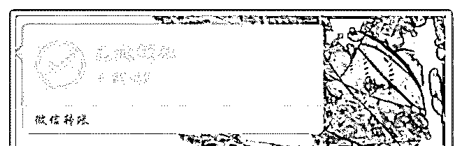

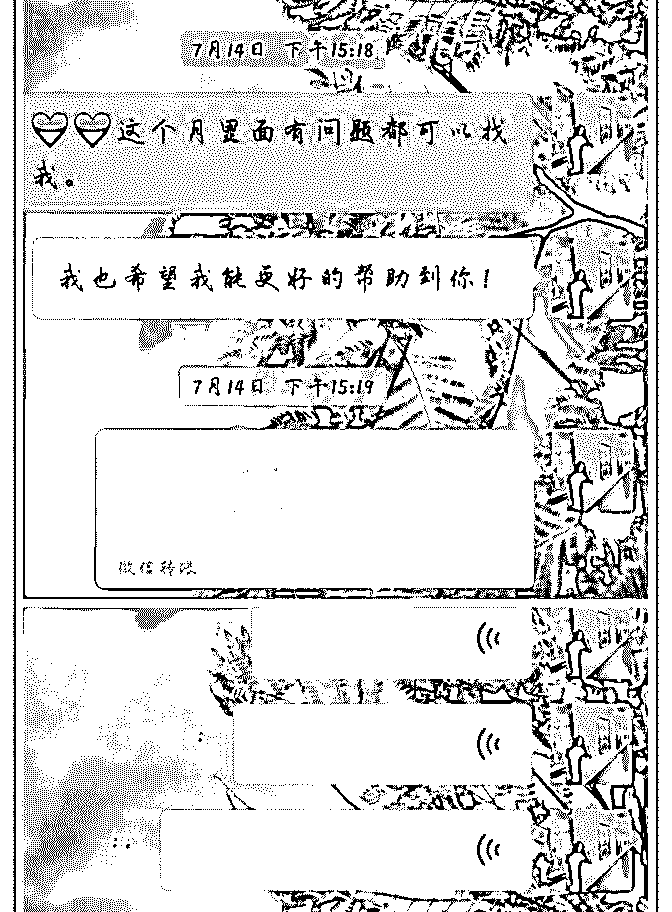

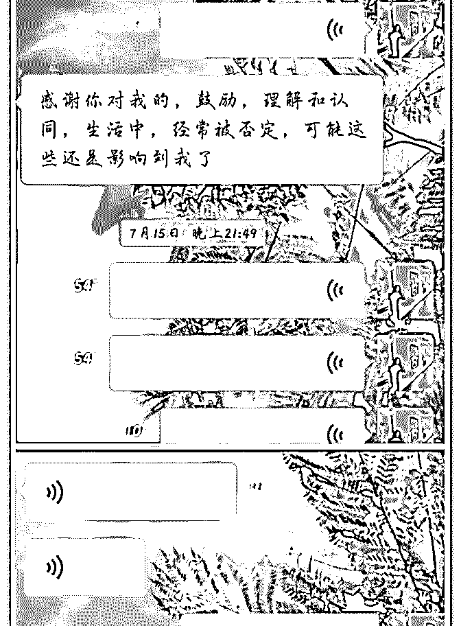

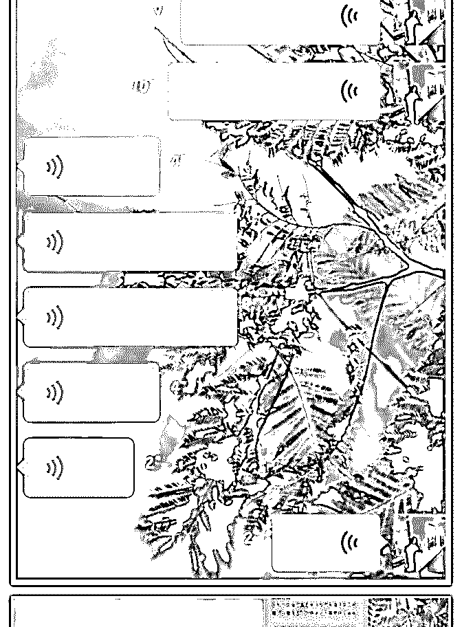

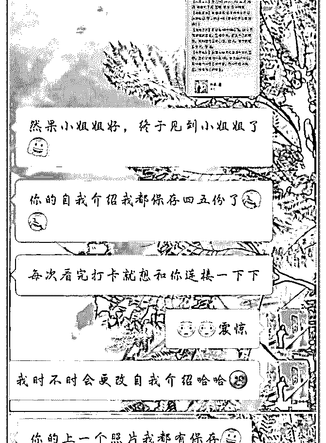

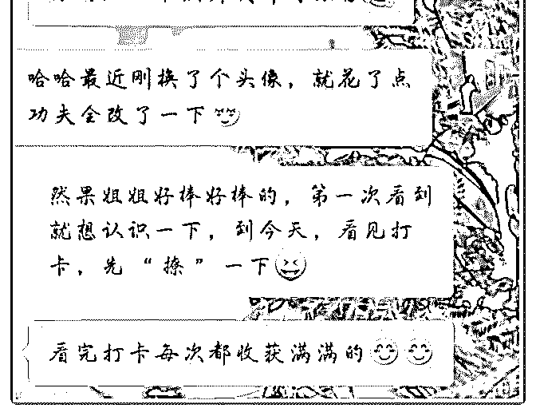

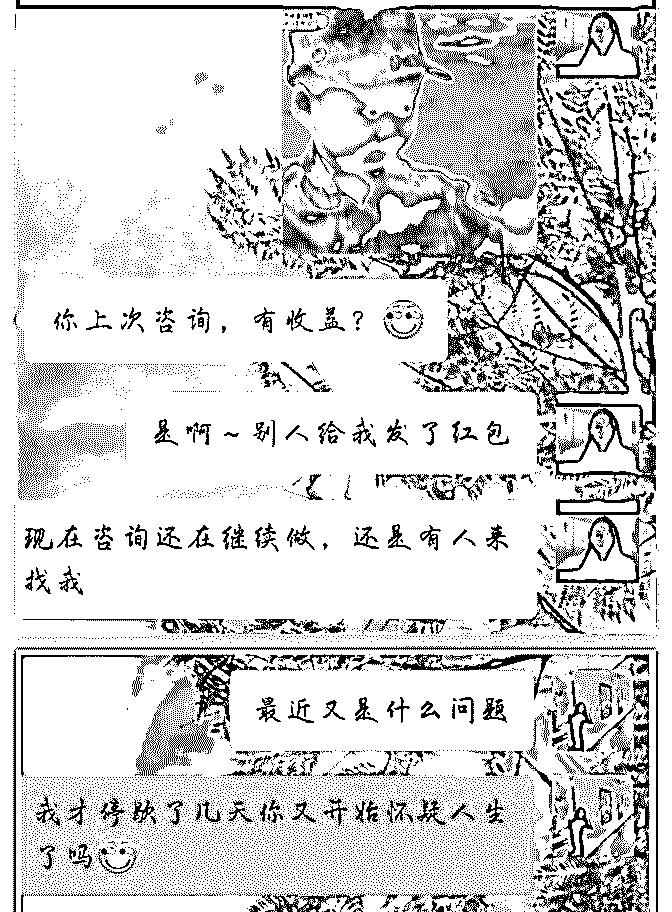

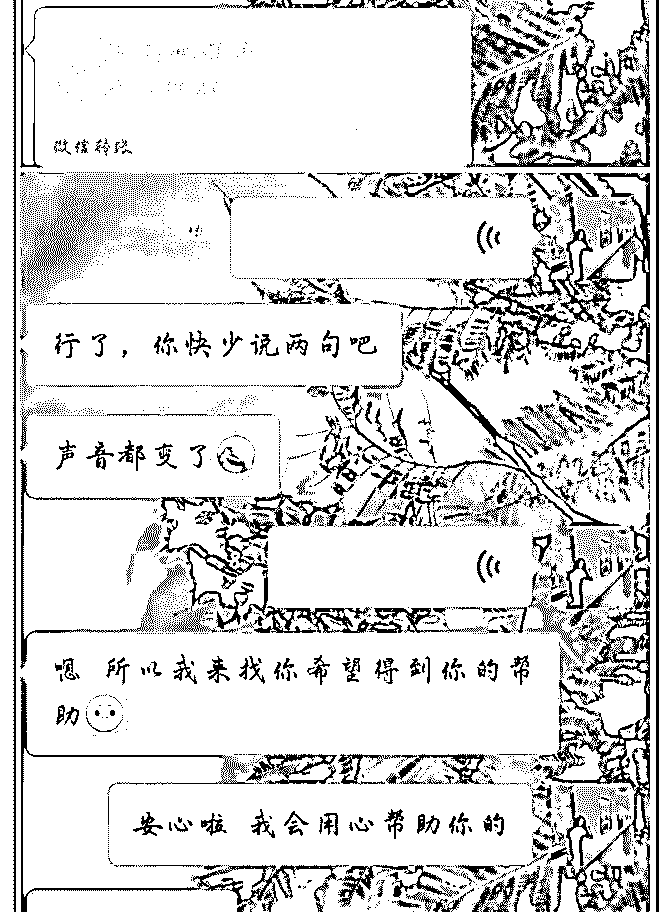

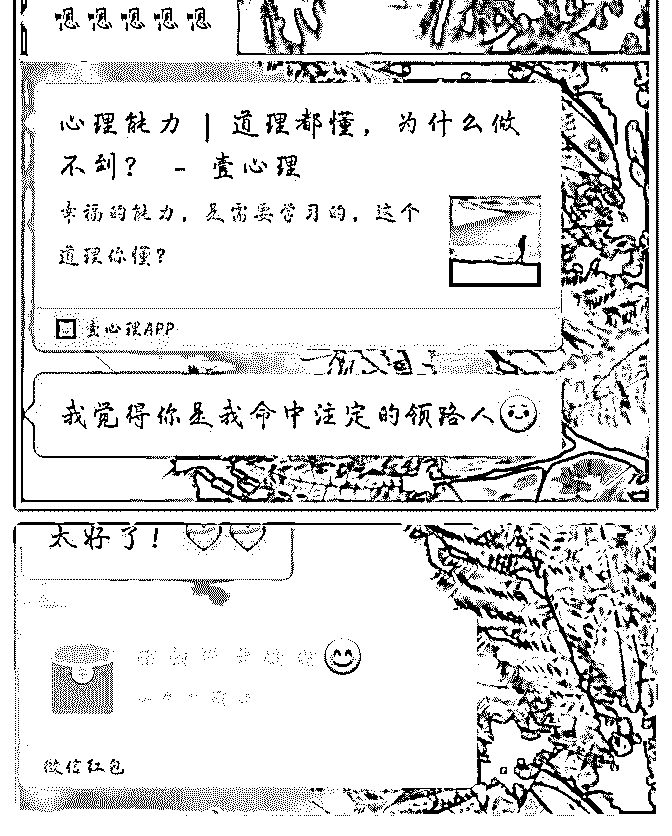

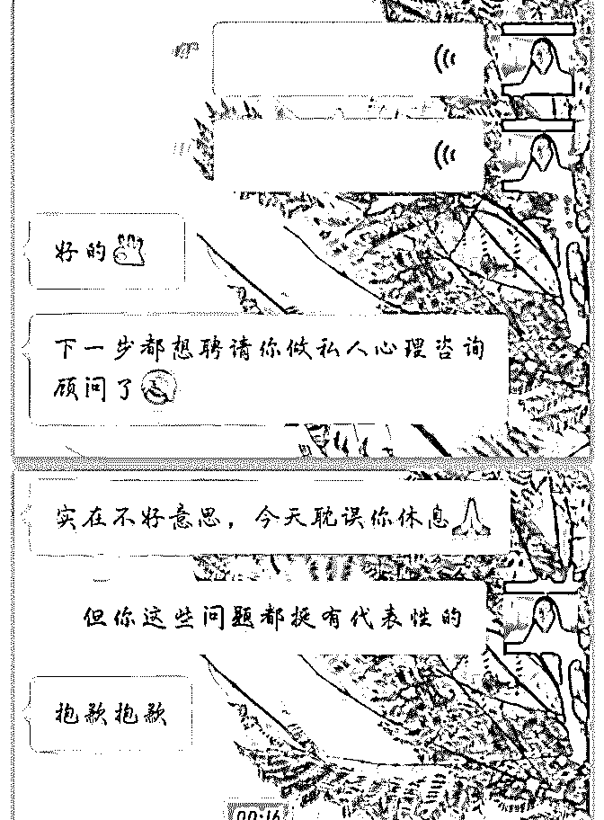

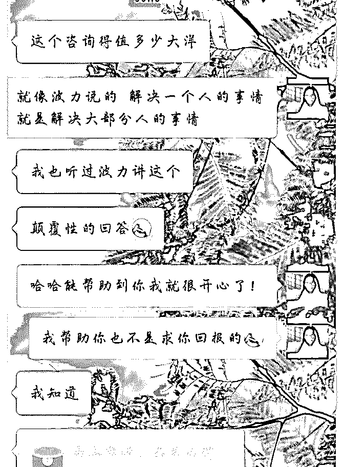

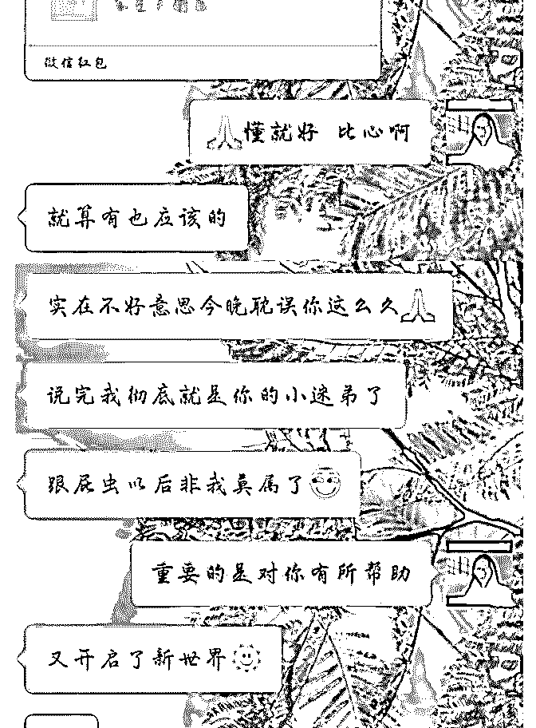

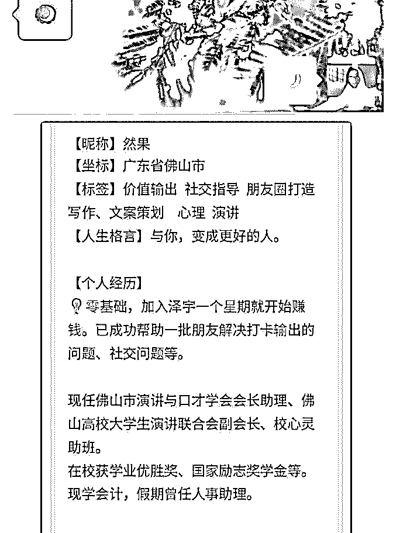

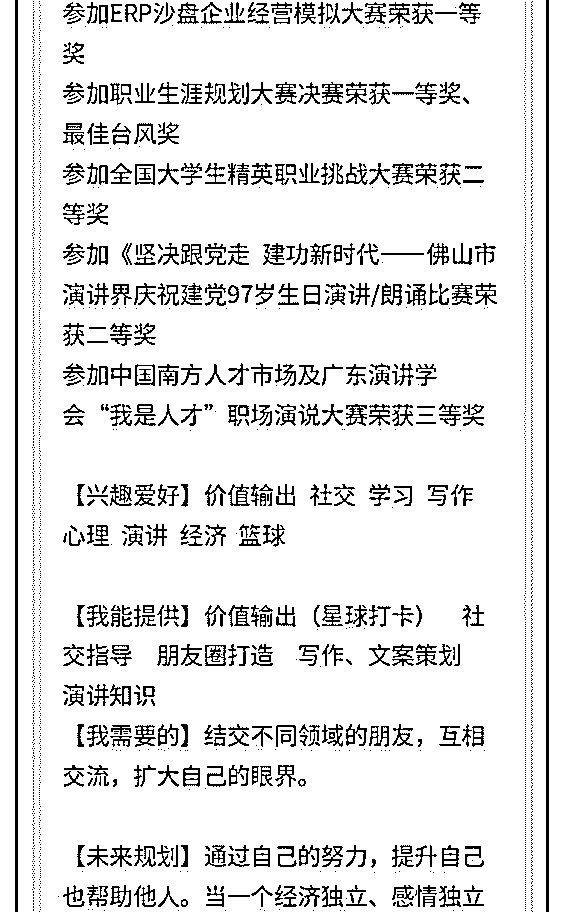

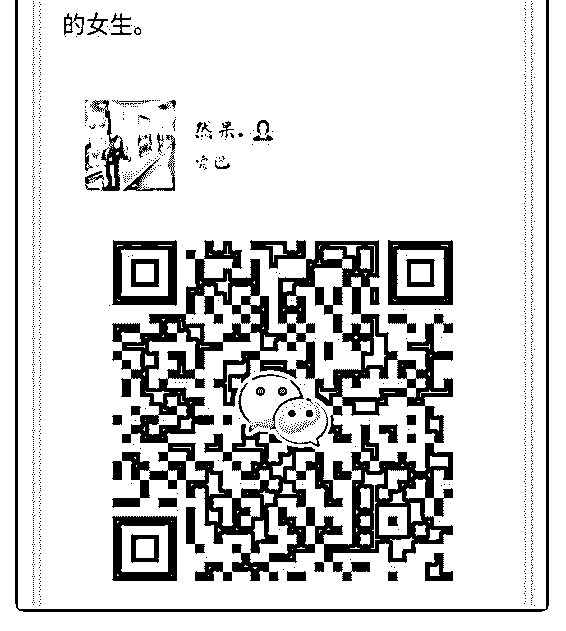

关注公众号"懒人找资源"，星球资源一站式服务