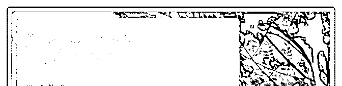
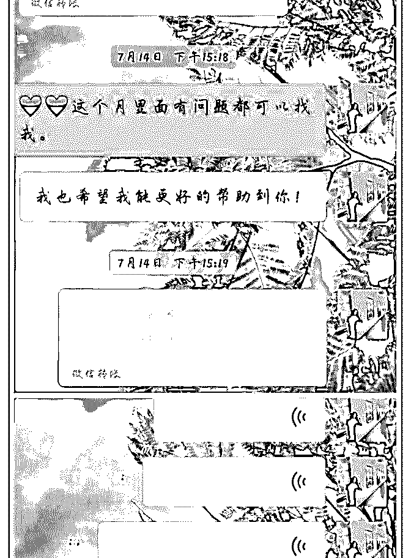
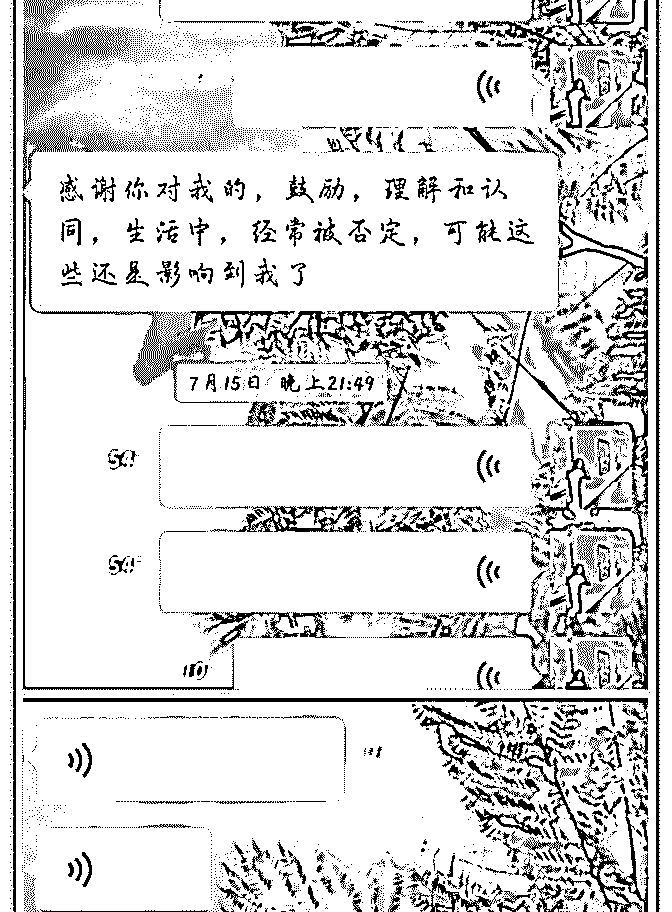
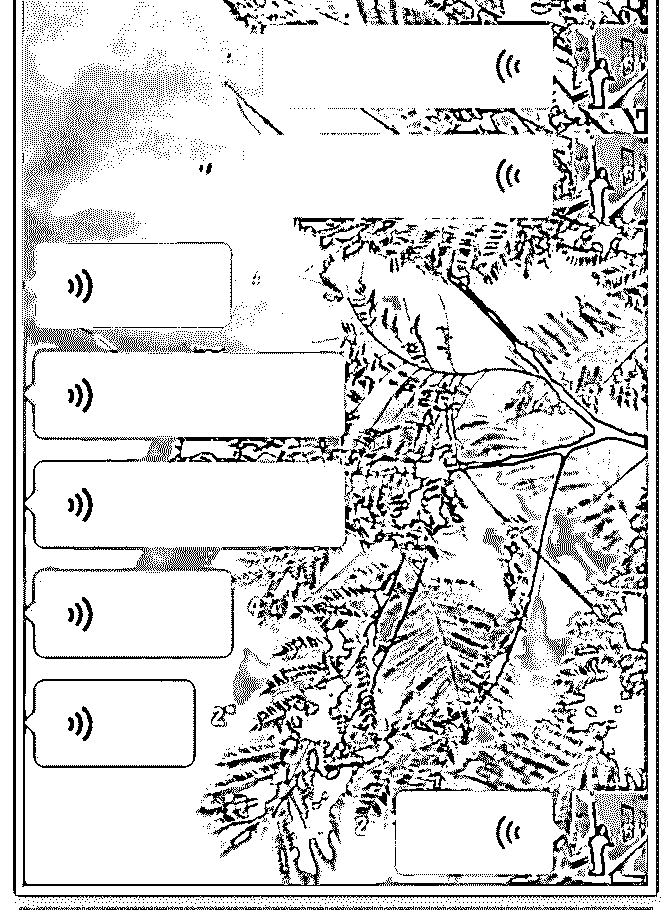
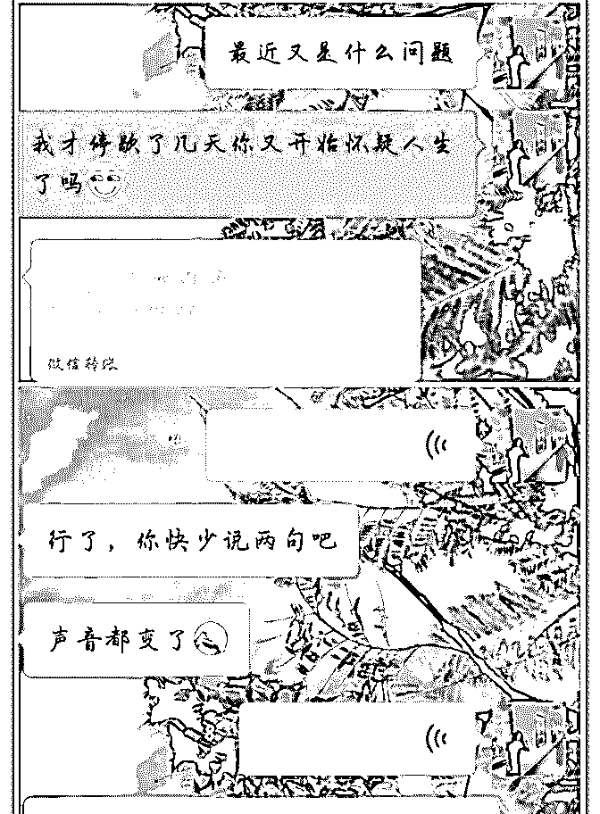
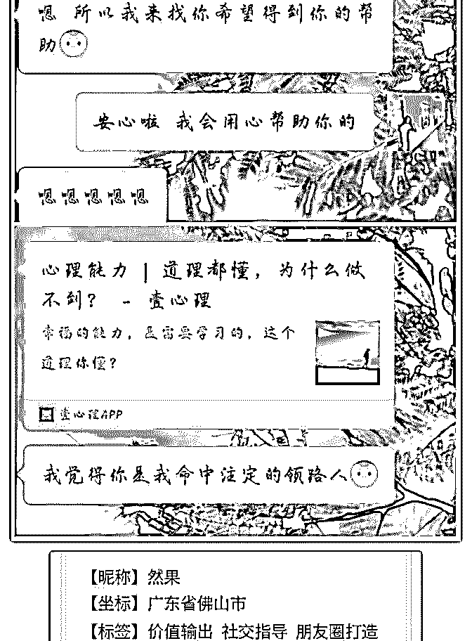
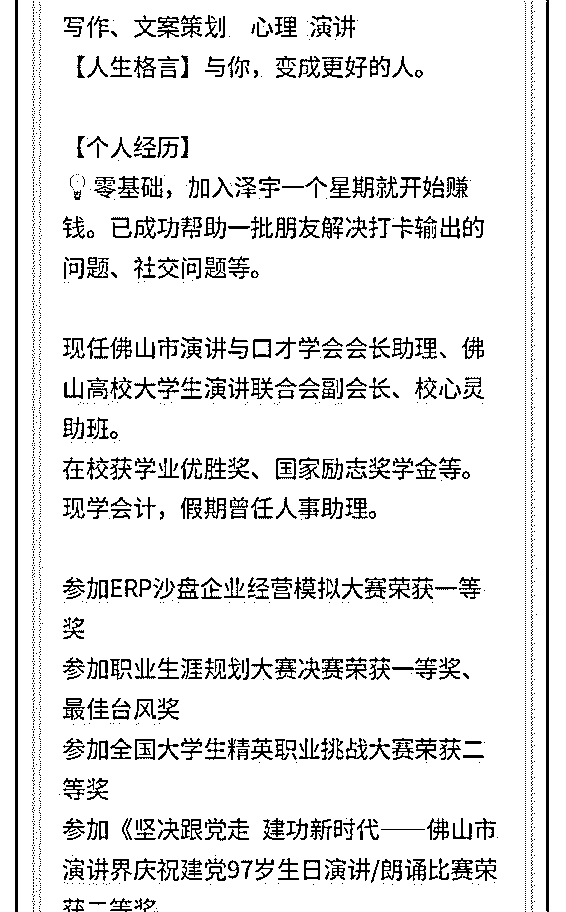
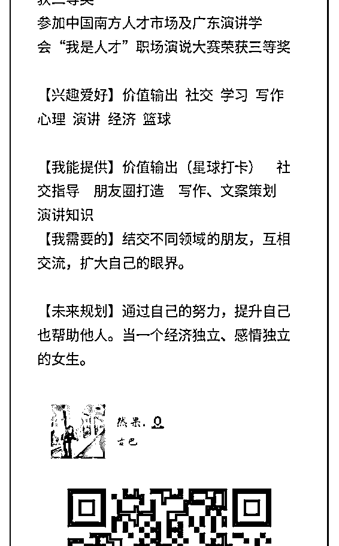
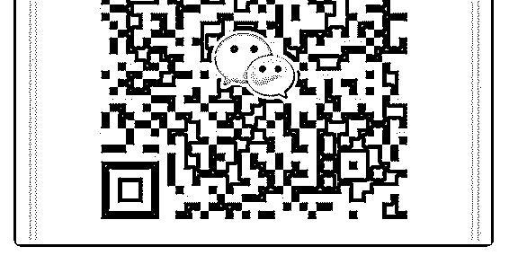

# 然果打卡第十四天 1

然果. : 然果打卡第十四天

1.有两位朋友付费咨询了

2.朋友询问我社交疑惑。

3.朋友询问我，不会聊天怎么办？

真正的咨询师是怎么样的？

1.有两位朋友付费咨询了

①一个向我咨询过几次的朋友，最终选择付费定期找我咨询

了！

为此我建立自己的星球“果树开花”把我学到的或者实践得来

的经验都输出到星球上，受益于更多的人。

②另一位朋友第一次咨询就愿意付费向我咨询一个月！

这个朋友是通过朋友介绍才到我这里咨询的，非常感谢他们

的信任！

当你真心帮助别人的时候，你将变得值钱。

2.朋友询问我社交疑惑。 一个朋友为了要跟不熟悉的朋友加深联系，准备让大家一起 聚会，结果组织起来并没有多少人响应。

对此，我帮助他分析为何没人响应，并且向他提出建议：让 自己受益的同时也要让他人受益。才能让别人积极响应。

3.朋友询问我，不会聊天怎么办？ 学习心理和演讲之后，我发现这两项结合在一起也能帮助到 别人，心理不强大者说话也不够有力量。 问题：朋友询问我，他自己很不会聊天，感觉自己一说话总 是卡顿，逻辑思维也混乱，感觉总跟别人尬聊。

其实这位朋友陷入了一种“害怕讲 不去讲 不敢讲 不会讲” 的 死循环中。心里越害怕越不去做，越不去做越不敢做，越不

敢做越做不好，越做不好越害怕去做……

并且不断引导、鼓励他去尝试，从一开始觉得自己不行到现

在愿意发微信语音聊天了！

真正的咨询师是怎么样的？ 咨询师只是一个引路人，心理成长的陪伴者或者助推力，可 以帮助你发现问题，梳理根源，引导搀扶着你，朝着正确的 方向一步步努力。 他不会替你去想，替你去说，替你去做，真正作用于你的生 活的，还是你自己。 所以，说到底，心理成长是一个自我提升的过程。咨询师是 一个引导者，一个外力。 成长的过程，就是不断地把外力转化成你自己的能力。

我能提供：

①对输出价值（星球打卡）和社交过程中有疑惑的朋友欢迎

咨询！

②微商、个人品牌等需要朋友圈打造和变现知识的朋友欢迎

咨询~

③写作、文案策划有疑惑欢迎咨询。

后期将分别推出课程分享。敬请期待！

2018-07-22(5 赞)

评论区：

范范 : 好棒好棒啊！

艾斯坦 : 我之前就一直认为一个人在某些方面取得的成功，肯定有人在背后默默付出，今天看了到你的打卡，使我更加坚

信这一点。

然果. : [愉快]谢谢范范

然果. : 谢谢！更优秀的自己，我们值得拥有！

关注公众号"懒人找资源"，星球资源一站式服务