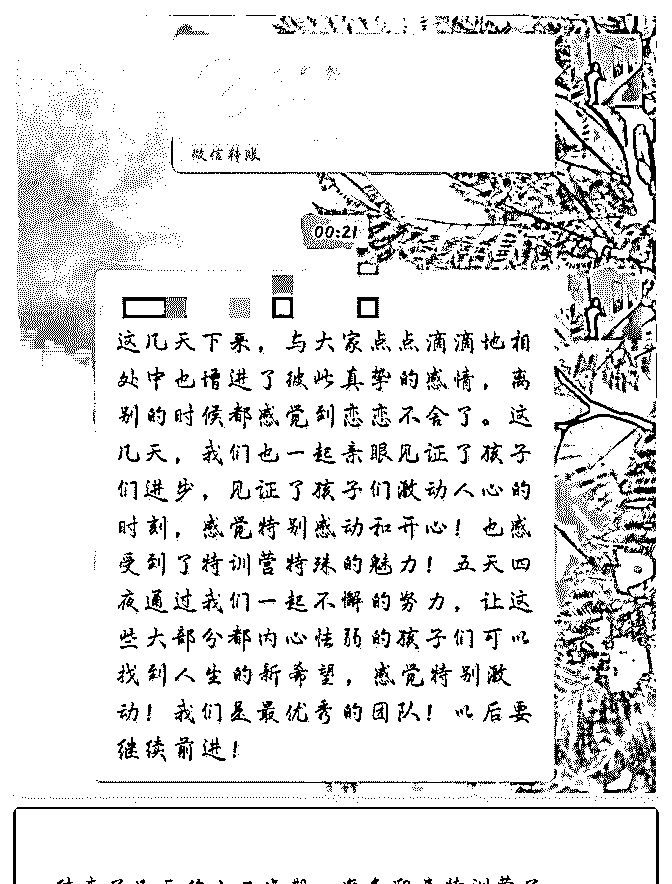
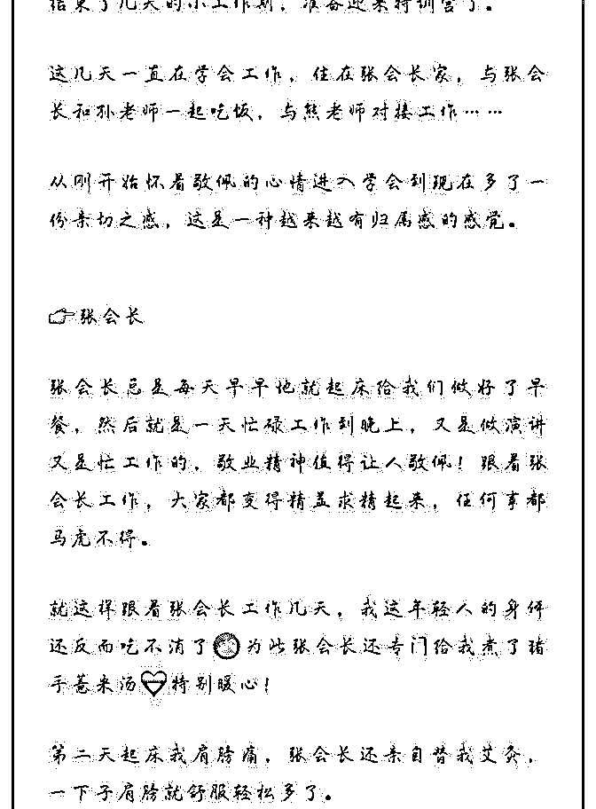
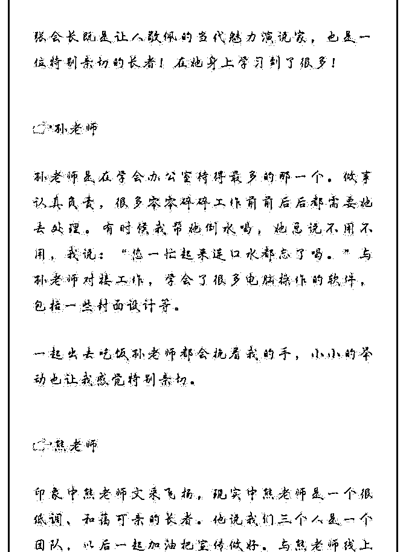
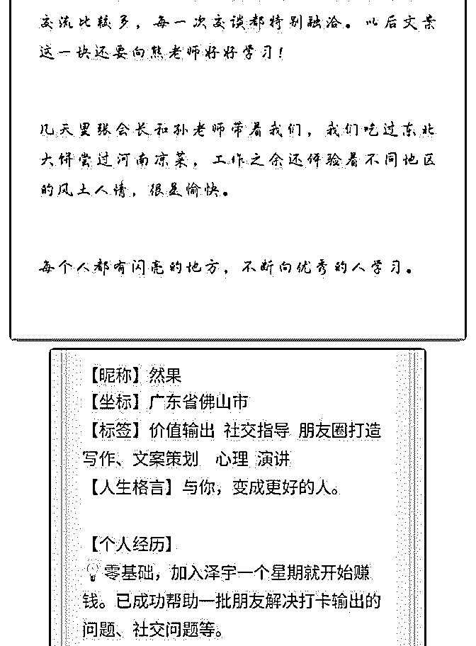
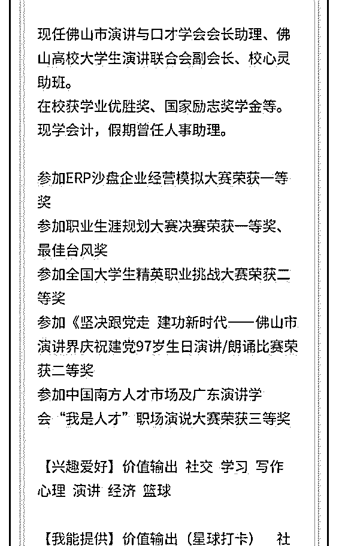
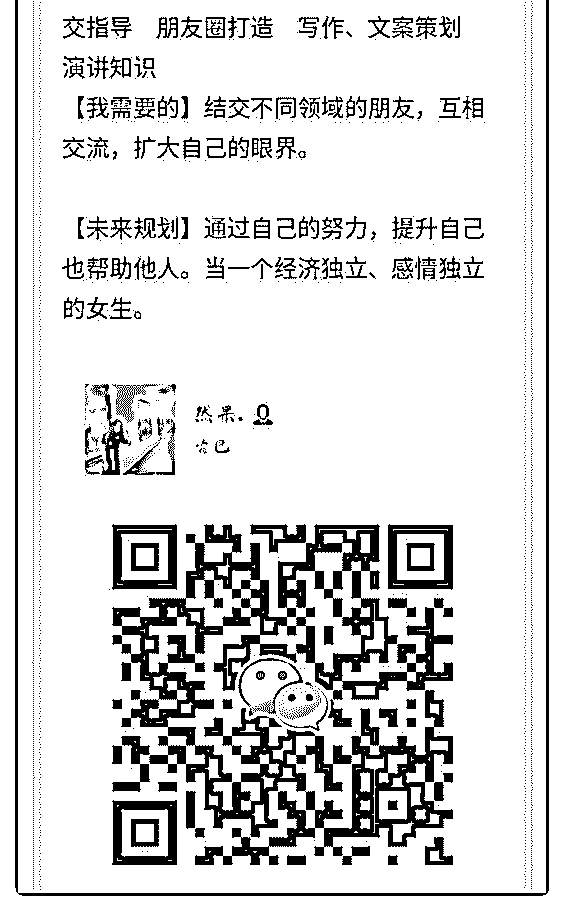

# 然果打卡第十三天

然果. : 然果打卡第十三天

#演讲与口才学会篇#

1.在学会工作，与众多演讲界厉害的前辈接触。

在这个过程中不断积攒人脉，认识更多的人，并把社交技巧

（例如找到链接点）实践于现实中，结交了不少优秀的朋

友。

2.在特训营做小助教，帮助孩子突破自我，快速成长。 五天四晚，让你看到一个不一样的自己。 以前会觉得是个噱头，但是自己亲身经历却发现这是真的。 从一个孩子怯懦到让他自信勇敢站上舞台，真的特别激动人 心，家长都特别感动！ 在这个过程中，我也发现许多孩子打不开自己的内心，或者 很自卑，甚至有觉得世界对她有敌意的。所以他们很怯懦， 不敢说话。

一个人说话的声音跟底气有关，如果内心软弱也发不出有能 量的声音。

内心的强大很重要，社交中说话的底气也跟内心力量有关。 我把社交和心理学进行融合，开启社交指导，希望帮助更多 的人！

我能提供：

①对输出价值（星球打卡）和社交过程中有疑惑的朋友欢迎

咨询！

②微商、个人品牌等需要朋友圈打造和变现知识的朋友欢迎

咨询~

③写作、文案策划有疑惑欢迎咨询。

后期将分别推出课程分享。敬请期待！

2018-07-21(4 赞)

关注公众号"懒人找资源"，星球资源一站式服务

# #情感自由# 打卡

胃窦 ｜个人品牌专栏* : #情感自由# 打卡第三十七天 最近接了一个两千块的文案， 改了三稿，今天总算定稿。 一直比较向往自由的职业生活状态， 泽宇社交一再强调的建立起个人的品牌， 是当前需要提高的关键能力。 当你有能力过上自己想要的生活， 你就会明白当初吃的苦都不算什么。

2018-07-19(14 赞)

关注公众号"懒人找资源"，星球资源一站式服务