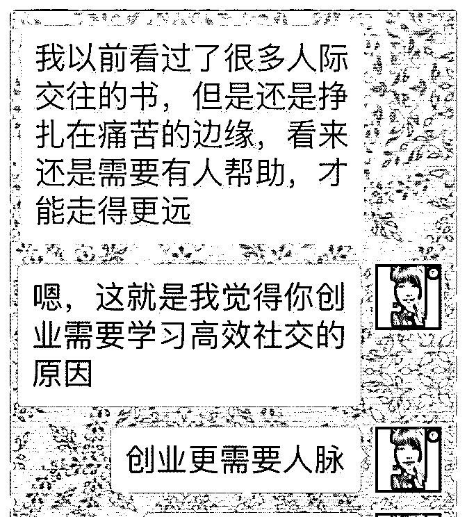
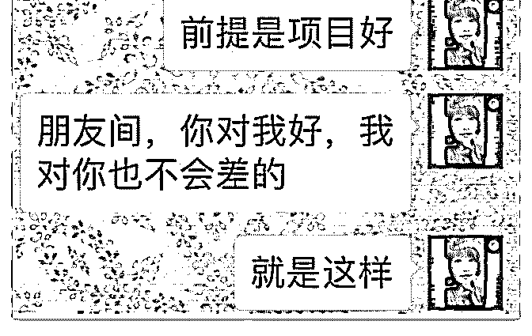
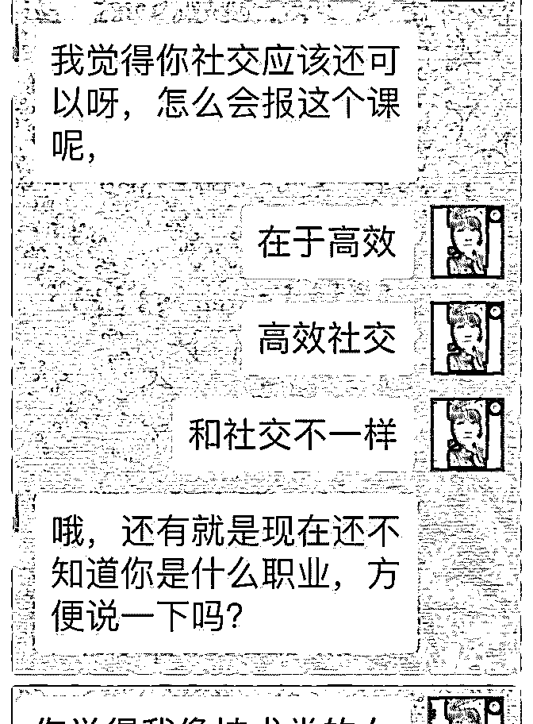
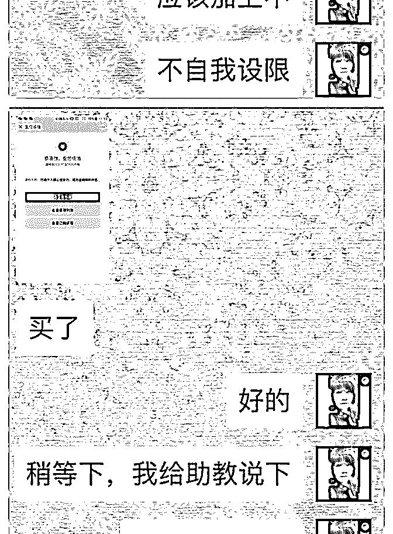
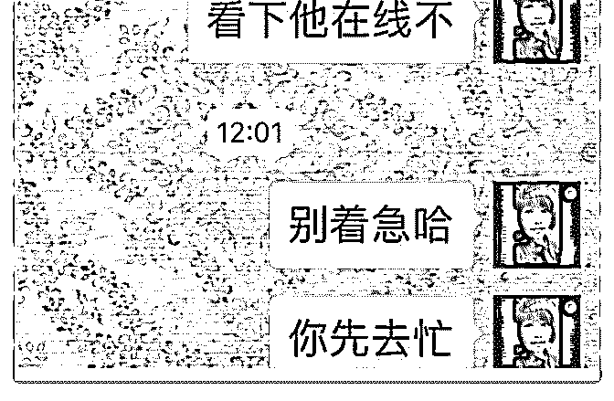
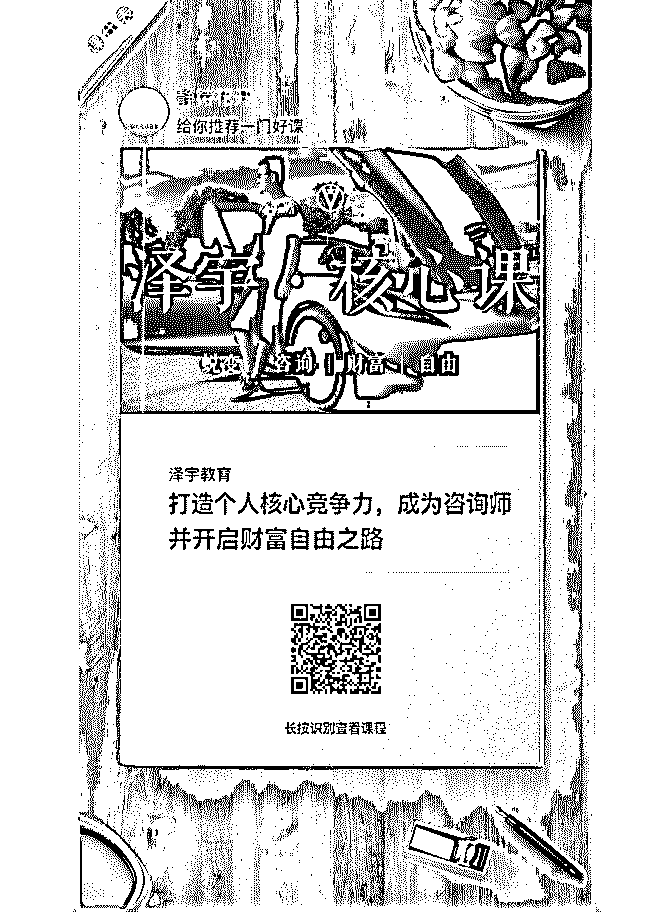
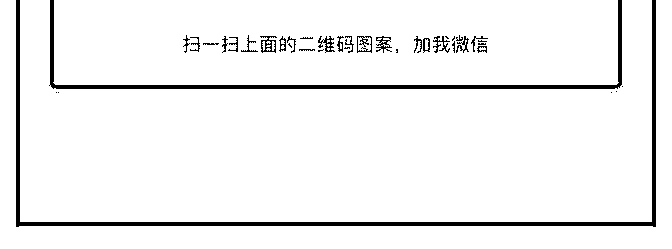

# 打卡第 24 天（连续

邦尼 Bonnie : 打卡第 24 天（连续打卡第八天） 今天之前链接的一个小伙伴来泽宇高效社交群学习啦，开心

。

他是 6 月 12 号通过二维码添加的，说是对恋爱技巧有兴趣，聊 过一次后，他说我是个开心，有趣的人。

之前给他提到过我学习的社交课，他还取笑我不会当导师， 我说找我助教，我助教人很好，泽宇团队最厉害的。可以找 他带你。

今天我教给他一套怎么和父母相处的可实操的方法。他说自 己看过很多人际交往的书，还是挣扎在痛苦的边缘，自己意 识到需要人帮助才能走的更远。

然后他问了我一个问题，他说我觉得你社交还可以呀？怎么 会报这个课？

我的回答是: 在于高效，高效社交和社交不一样。

我说我是技术类的，像吗？别给自己设限。他更逗，他说他 以后每天早上起来把别自我设限说三遍，不，说十遍。

我给他说他在跟我聊天的这几天的变化，说你没感觉到进步 吗？我逗他说表扬一句也好呀。

然后他问我课程的事，问自己买和从我这买的区别，我说从 这我请我助教带你，从我这里买也是给我的人情。 然后他就让我发链接了。

为了感谢他对我的信任，我拉他进了我的星球，并且说要写 给他一篇关于指数基金定投的方法的星球文。

有人信任的感觉真好。欢迎小伙伴一起来学习高效社交，让 你几倍几十倍赚回学费，从此人生踏入一个新起点。

2018-07-16(2 赞)

关注公众号"懒人找资源"，星球资源一站式服务