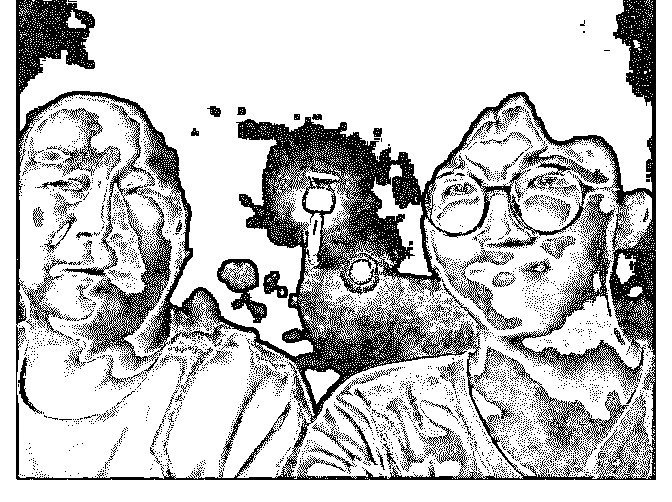

# 加入泽宇教育之后对

宏暖 w : 加入泽宇教育之后对大脑的思维转变巨大，还能接触 的很多优秀的人，自己也开始慢慢的自信起来。 下边是自己搭讪的经历和总结

第一次搭讪是在小区里和大街上。 周末上午 10 点钟我出去搭讪陌生人，因为刚开始搭讪一个完 全不认识的人会很尴尬和会很不知所措。

①我就在自家楼下看见 3 个人坐在椅子上，两个孩子一个家 长，我还在想要搭讪什么样的人的时候，突然想到搭讪谁不 行，既然是第一次要出来搭讪的，那么就要勇于尝试第一 次，不管是谁。 随后我就径直的走向她们，并坐在家长的旁边，开口就是你 好，这是你的孩子们啊，她便问我干嘛，我表明来意说性格 内向要出来交一个新朋友，她对我表示鼓励。后来了解到我 们都是同一栋楼的邻居，我也加上了微信。

②后来我想去大街上，去搭讪那些走路的人，但是人很少， 想想可能是我选择时间段不对。我就故意走在对立面的人行 道上，逆着走，这样碰见的人是迎面而来的，一个能清楚的 知道他们的长相，一个是能更清楚的表现自己的方位，总比 从背后追上人家吓人家一跳好的多。 这时候从我身后走来一个人步伐很快，我已经等不及要搭讪 一个人了，我扭头多看了她几眼，她看见我再看她她也笑着 看我。等她走近我，我也向她靠近，向她说你好，情况是这 样的，我性格有点内向。在我说的时候她已经超过我好几步 了，我只能说一句，你是有急事么，她说了一句嗯便走了。 我就开始反思我哪里错了，有几个点我做的不对。

总结

第一，分清时间段，尽量不要去大中午或者太阳正毒的时候

去大街上或者某个露天地方搭讪。

第二，选择好的地点，比如图书馆咖啡厅等，人们长时间逗

留的地方，如果是大街上行人大多都是匆匆忙忙有事的。

第三，简单的表明来意，直接了当的说自己要干什么，再去

看对方反应，看看对方有没有继续下去的意思。如果刚开始

就说自己因为什么什么，最后才说了一句我要跟你交朋友，

大多数人是不愿意耐心听下去的。

第四，交谈的时候保持恰当的距离，不要过分的去贴近对

方，会让人觉得你有什么不好的企图。也不要远远的交流，

这会感觉不礼貌。

第二次是晚上在广场上搭讪。

①搭讪的是蹲在台阶上的一个妈妈，她的孩子在一边玩耍，

我过去直接说阿姨，我可以跟你交朋友么，她说跟我交什么

朋友啊，你们是不是搞什么活动啊，我说不是什么活动，就

是交朋友，然后她就跑去她孩子那边了。

②搭讪的人是坐在长凳上的妈妈，我直接问她我可以跟你交

朋友嘛，她说可以啊，随后我说了一下大概状况我家里人说

我内向怎么怎么样，她也就明白过来了。但是我不知道该说

什么了，那位阿姨到是一直找话题，她跟丈夫用手机聊天的

时候，她丈夫不信有个小朋友说要跟她交朋友，然后她说那

就来张自拍吧，拍完了我说那再加个微信吧，又聊了一会回

家了。

总结

1.总是在犹豫要不要上前去打招呼，或者要说什么

2.自我设限太大，还是怕别人的目光搭讪的时候有一个看起

来特别合适搭讪的一个人，我却一直她旁边，在想我到底该

说什么，直到她弟弟来找她说要回家的时候，才晚了，气的

我看见前边一大推零食袋的垃圾不知道谁扔的，也不扔垃圾

桶，我全捡起来扔进垃圾桶

第三次搭讪是晚上在广场搭讪。

①搭讪了一位带孩子的叔叔。他当时自己坐在一边玩手机，

孩子没有在他身边。到他身边之后我直接说，叔叔我能跟你

交朋友么。他回复当然可以了，我也就跟他解释缘由，家里 人说我性格比较内向，我从网上找到社交的方法就是每天交 一个新朋友。他听完之后说这很好啊，然后我就坐他旁边 了。聊了一会后一看时间快该走了我说拍张自拍加个微信 吧，他也同意了。

总结

1.根据之前的经历我还是直接表明来意。结果证明确实很

好，因为这会使人放心，也不会产生不好意思。

2.次数多了很利于自信心。虽然泽宇说过，但是真正还是自

己实践之后才能知道什么感觉。这次我去搭讪完全不像前两

次一样，想很多东西我该说什么，而是直接去打招呼。

3.不知道该找谁搭讪。因为大晚上出现广场的人大多数都是

跳广场舞，老年人，领孩子的家长，和自己朋友一起出来玩

的人。所以我还是有些不知道该怎么下手，去找谁去搭讪。

即使有那么几个单独的人坐在那里，也是在低头玩手机。因

为这种情况我只能去请教了一下华丹助教，她说找玩手机的

人就行，我也是照做了一次，结果还是很好的。

第四次搭讪是晚上在广场上搭讪。

①第一次搭讪的是坐在石凳上戴耳机玩手机的男生。我从他

侧边走过去，问他你好，能交个朋友么。他摘下耳机不耐烦

的问我什么事，我说能交个朋友么，不。这次就这么失败

了。

②第二次搭讪是一位坐在台阶上的阿姨。我半蹲在他身边问

她阿姨，能交个朋友么，她回复我为什么。我就说想出来认

识更多的人，自己性格也比较内向，就是单纯的交朋友没有

其他意思。阿姨笑了笑，问了我很多问题，我也都回答了，

随后我们都算是互相有一定的了解了，不像刚开始一样很有

戒备的样子，聊的也就挺轻松了，最后也要到了自拍。

总结

1.要大概知道自己要去搭讪人的状态，他是不是在忙或者因

为某原因不愿意与人交流。

2.不知道该去搭讪谁。后来仔细想了下这个问题，我明白了

我是不是要去搭讪谁，而是我不搭讪谁。

第五次搭讪是在补习班里搭讪。

①搭讪的人是坐在我前边那一排的一个妹子。因为看她听课

特别认真，而且老师讲的东西她大概都知道，所以想加她了

解一下。结果因为放学了，因为赶时间，我学泽宇一样用备

忘录里写一下原因，看看能不能互加个微信。她当时正在收

拾东西，看见我手机上的东西她还有点懵，就问我什么意

思。我当时也蛮紧张的，只能说想认识你一下，加个微信可

以么，她说可以，就扫的我的码。

加上之后她问我有什么事么，我回复她因为看你上课挺认真

的，想交个朋友认识一下，没有意思。她也同意了。

总结

1.跟人聊天没有后续，不知道要去聊什么。只敢开头了，中

间的过程缺不知道该干嘛了，只能说一些简单的问答。这需

要把自己的专业知识提升，才能更好的开展后续。

2.与人交谈一定要表露出自己的真实想法，而不是拿别的理

由来掩盖。

第 6 次搭讪是在放学。

①搭讪了一位，放学跑回教室的妹子。她有事没来上补习

班，所以课上发的卷子没有收到，等放学人都走光了，她才

来，发现已经晚了。

我当时正好也是最后走的，手里也有几套卷子，因为没人要

打算扔了，走的时候碰见她了，主动跟她打招呼问她怎么

了，都放学了才过来，她说明了理由。我听完以后分了她两

套，然后走了一段路就要分开了。我问她有没有微信，加一

下，以后互相学习一下，她同意了，随后就分开了。

总结

经过前几次的搭讪这次明显的自信满满，说话时候并没有什

么紧张感。我们有共同的话题，同是接本的学生，我也帮助 了她，产生了连接所以就比较轻松。

第 7 次是晚上在广场上今天搭讪。

①第一个搭讪的人是坐在台阶上年龄较大的叔叔。我走过去

问他能交个朋友么，他说交什么朋友，我只能回复他就是交

一个新朋友没有其他的意思。他随后问了我不少问题，交朋

友干嘛，家住哪，你干啥的等等。我也只能一个个回复然后

降低他的警戒心，但是问完问题以后就没话说了，我也没想

着要跟他继续继续下去了，因为聊的过程中三观有些不一

样，说去那边转转然后就走了。

②第二位是坐在水岸边 50 多岁的叔叔。我直接问他能交个朋

友么他也是问我什么朋友，我就回答普通意义上的朋友，真

的就是交一个不认识人的朋友而已。他笑了笑说可以啊，我

解释了一下为什么要交新朋友，然后就聊了起来。先是他问

我的情况，知道我是个学生之后他就开始讲他的女儿了，他

家 3 个孩子，女儿最小。但是很聪明，高中在正定上的，研究

生在上海交大读的，随后又被北大录取读博士。之后的话题

我都是围绕着他女儿来说，北大全国只招 5 个人他女儿被选中

了，初中到研究生的成绩在学校排名没下过前五，周末一直

在学习等等。我也一直在夸他的女儿多么的了不起，事实上

确实很了不起。到最后自拍了一下，并加到微信。

总结

1.我要结交什么朋友，只有搭讪之后才知道。搭讪的第一个

人给我说，你要去交新朋友去找那些同龄人，找我们这些老

头子干嘛。我便说，在广场上歇着的大多都是年龄比较大

的，其他同龄人的都是跟自己的朋友们一起出来的，我也不

太敢上前去找人家。其实我要搭讪的人年龄是什么样都无所

谓，只是我要交的朋友起码要跟我的三观差不多，就算他跟

我的同龄人，可是我们的三观天差地别，那也不适合做朋

友。年龄再大，我们有同样的三观，年龄根本不是问题。

最后 总结一下之前搭讪的经验

与人交谈保持合适的距离

直接表明来意

选择合适的时间地点去搭讪事半功倍

去搭讪的时候不要想太多，直接去，想的多了就不敢去了

刚开始可以求量不求质，因为次数多了会有利于自信心的成

长，慢慢的质量也就上来了

不能为了单纯的搭讪而去搭讪，如果本身没有可以交谈的资

本的话，很容易就没有话题没有后续

只有去搭讪过才会明白自己哪里不足，才知道需要补充哪里

不是要去交什么样的朋友才去搭讪什么样的人，而是搭讪完

了才知道这个人是不是自己要交的朋友

交朋友没有年龄限制，不能因为他比我们小或者大很多就算

了

一定要去实践才可以，一定要实践！

最后加上我的微信跟他们的合影，期待和大家一起成长

2018-07-07(17 赞)

评论区：

小螃蟹 : 练习了这么多，真棒。有个小建议，和陌生人搭讪时，比起直接的过去问“我能和你交个朋友吗？”可以根据不同的

场景合和根据对方的特质，找开头语，能很快建立联系，而且不显得突兀。

范范 : 好棒好棒

关注公众号"懒人找资源"，星球资源一站式服务