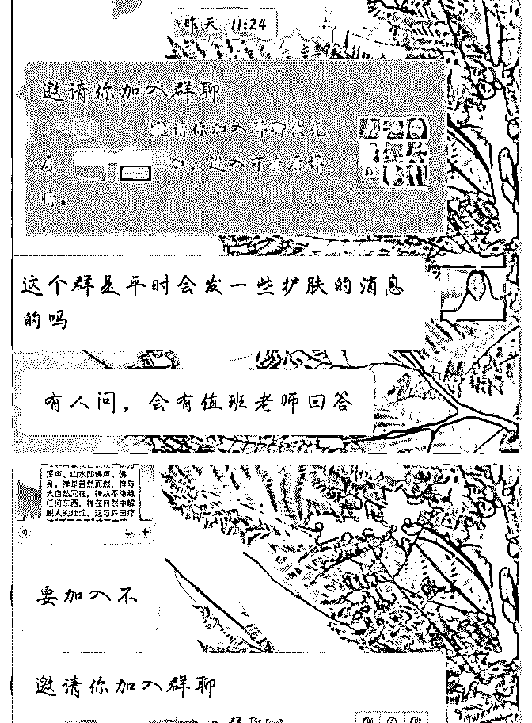

# 然果打卡第 7 天。今

然果. : 然果打卡第 7 天。 今日收获：

1.今天第二次找我解决心理和情感问题的小哥哥给我发红包 了！！

2.两位朋友拉我进入两个新的群！

1.下面来看看小哥哥的问题

（主要靠两个心理学家的理论支撑，大部分人普遍存在的问

题，可以看看，希望对你们有所帮助！）

张德芬说：“如果你的人际关系一再出现相同的模式，比方说

你的同事、老板和你相处的模式，不管你走到哪里都碰到同

样的人、同样的事、同样的互动方式，这时你就知道是潜意

识的一个模式在主宰你的命运和行为了！”

我们一生可能为了各种各样的事情而在努力奋斗，却很少停 下来深入地思考和了解自己。当开始研究心理之后，我发现 很多人都生活在自己既有的模式里，而且自己未曾发现。当 这个模式是一个不好的模式的时候，你身边很多不好的事情 就一直在重复又重复，像恶性循环一样。 这种时候我们需要的是及时找到自己的问题，打破模式，重 新开始。

这也是向我倾诉的小哥哥存在的问题之一，他听完我分析他 的问题之后说，他之前谈了几个女朋友他都没弄明白自己的 问题在哪，一直以为就是自己不够了解对方所以才会僵持。

心理学家徐浩渊博士在《我们都有心理伤痕》中举了个例 子。（栗子 看图！图二为错误思维，图三是正确做法！） 当对方诉苦的时候，很多时候是想交流感受，而不是要你急 着出主意。这种思维上的错位会容易惹出很多不愉快。（多

对比一下例子，能感受到） 而现实中，我们很容易出现第一种错误的思维，导致两个人 相处得很糟糕，甚至引起争吵。所以学会看清对方行为的实 质很重要！到底是要倒苦水还是要出主意呢？要搞清楚才能 更好地交流！当你搞不清楚的时候，可以试探性地问他：你 是否想让我帮你出出主意？

（徐浩渊博士的这个截然不同的两种思维，最好两方都能一 起学习，有利于以后两个人琢磨彼此的需求。）

2.今天有一个新好友，我们的连接是：护肤。于是聊到最后她 介绍了一个群给我，平时群里都会发一些干货。 之前加了一个朋友，我们的连接是：心理。 于是她推了一个心理学习的群给我。

这可能就是我们每天认识更多的朋友的原因之一！可以一起 学习进步，有好的资源共享~感恩这两位朋友

我能提供：

①对输出价值（星球打卡）和社交过程中有疑惑的朋友欢迎

咨询！

②微商、个人品牌等需要朋友圈打造和变现知识的朋友欢迎

咨询~

③写作、文案策划有疑惑欢迎咨询。

后期将分别推出课程分享。敬请期待！

2018-07-04(13 赞)

关注公众号"懒人找资源"，星球资源一站式服务