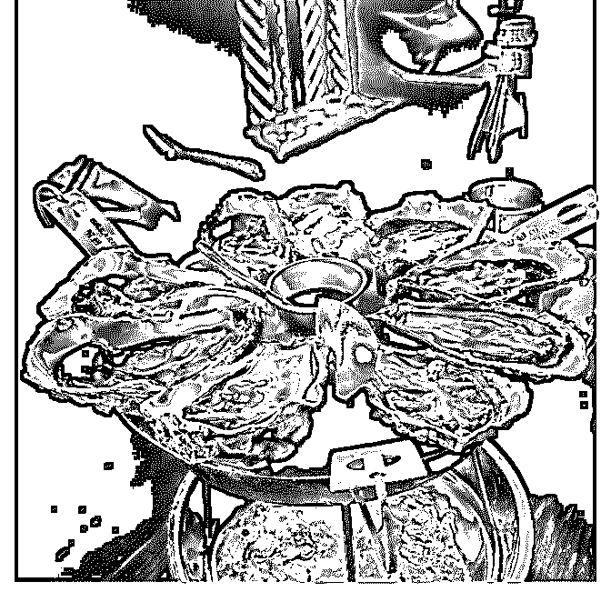
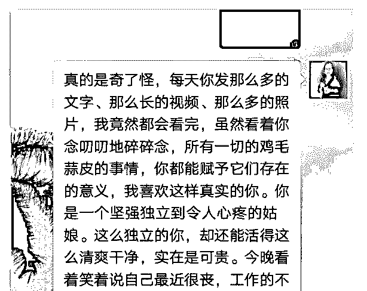
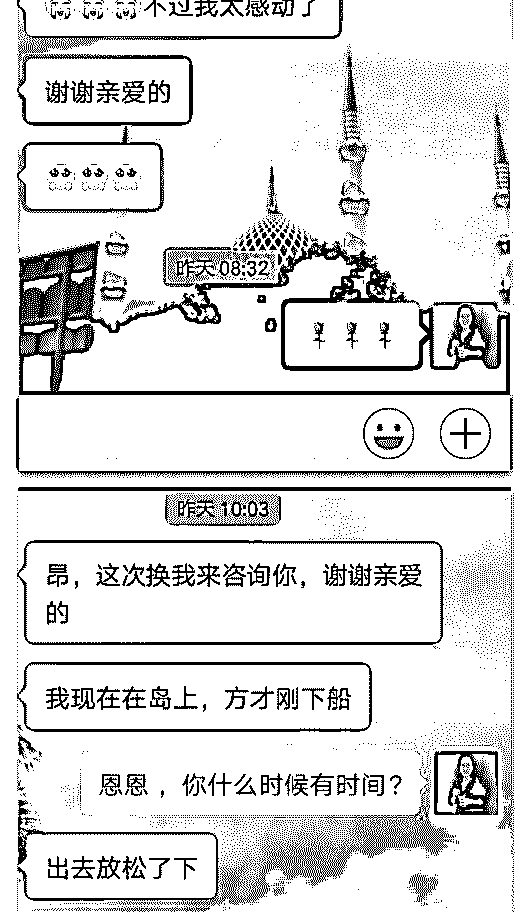
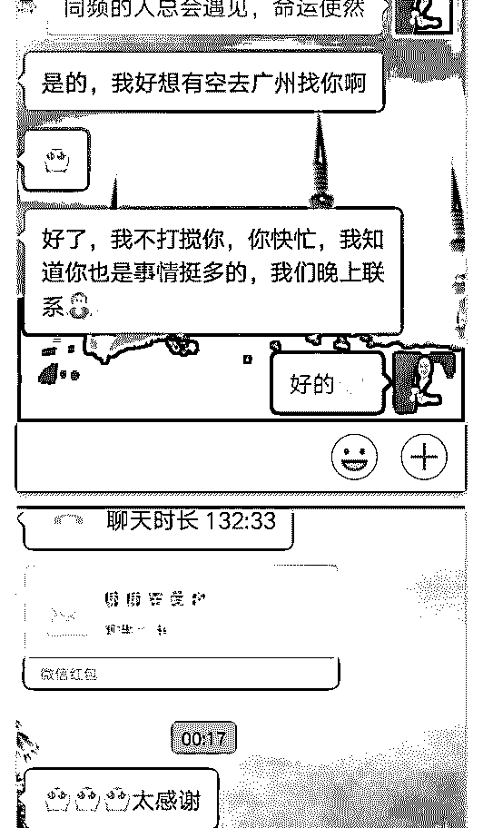
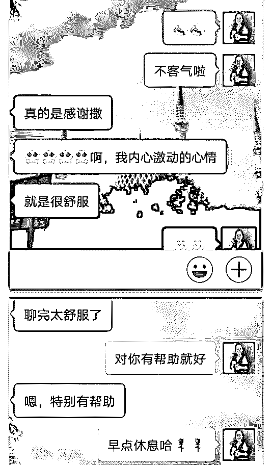
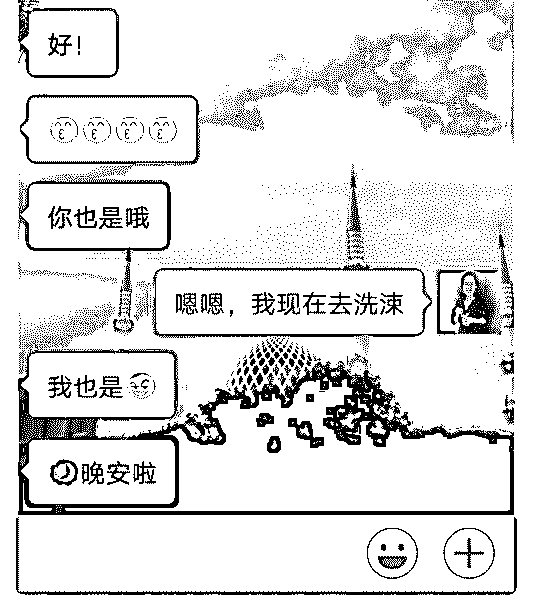

# 理想是什么？ 能当

LJ 丽洁 : 理想是什么？ 能当饭吃吗？

能～ 理想落地为目标和计划，

然后狠狠奖励自己的执行力！

2018-07-04(12 赞)

评论区：

波力 : 配文简短的分享下怎么过程的干货内容，会更好哦[偷笑]

关注公众号"懒人找资源"，星球资源一站式服务

# day 48 同

罗宾探长 : day 48 同频相吸，多了一个朋友

前天晚上刷朋友圈的时候，发现一个我曾经咨询过的服装领 域的大牛情绪低落，我主动抛出橄榄枝，愿意帮她疏导情 绪。没想到她特别感动。昨晚我们沟通了 132 分钟。聊完，她 特别舒服。我没有收费，因为我把她当朋友来对待，我是可 以让朋友免费使用的。恰好，她也是。

总结：同频相吸，我可以选择让谁成为我的朋友。

2018-07-04(9 赞)

评论区：

波力 : 将常见问题写成文章，可以节约时间

罗宾探长 : 好的

关注公众号"懒人找资源"，星球资源一站式服务